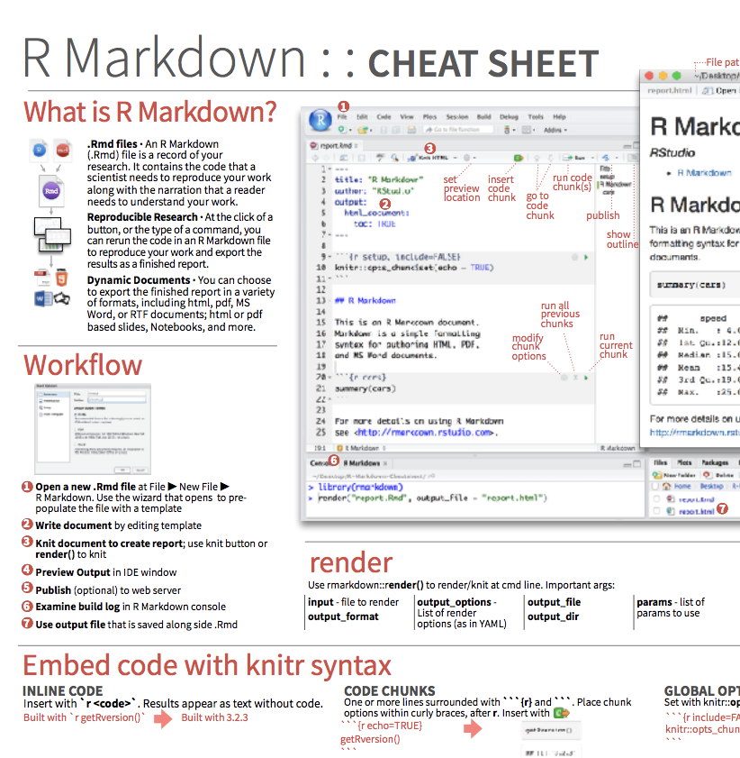

class: title-slide

```{r child = "../setup.Rmd"}

```

```{r}

library(palmerpenguins)
library(dplyr)

```


# `r rmarkdown::metadata$title`
## `r rmarkdown::metadata$subtitle` 

.bottom[

```{r, echo=FALSE}
p(rmarkdown::metadata$author)
p(rmarkdown::metadata$date)
```
]

---
class: middle

# .big[Hallo R! `r emo::ji("wave")`]

???

Hallo R! Das ist unser Thema für heute. Einige von euch haben vielleicht schon 
etwas Erfahrung mit R gesammelt und für andere ist etwas ganz Neues. 

Und das ist gut, denn dies ist ein Einsteiger Kurs und ich bin überzeut es ist
für alle etwas Neues dabei. 

---
class: middle, left
background-image: url(img/united-nations-covid-19-response-IKyhoO8giSA-unsplash.jpg)
background-position: right
background-size: contain

# .big[Hallo Ihr!] 

.footnote[[Image created by Danielo Baretto](https://unsplash.com/photos/IKyhoO8giSA)]

???

Und Hallo Ihr! Leider lernen wir uns in diesem Kurs nur virtuell kennen, aber
es bringt auch ein paar interessante neue Möglichkeiten. 

Ich freue mich auf jeden Fall darauf euch in den nächsten 7 Wochen kennenzulernen und euch auf 
Reise zu Data Science mit R begleiten zu dürfen.


---
class: left
background-image: url(img/goals.jpg)
background-position: right
background-size: contain

# Ziele für heute 

.pull-left[

Am Ende des Tages:

- haben wir uns kennengelernt
- habt ihr die Werkzeugkiste kennengelernt
- könnt ihr beschreiben was die Ziele des Kurses sind
- könnt ihr einen ersten Plot erstellen

.footnote[Photo by: [Muzammil Soorma](https://unsplash.com/photos/6M_Wiwi1LQQ)]

]

???

Heute geht es vor Allem um's Kennenlernen. Wir machen uns miteinander und der
Arbeitsumgebung vertraut. Ihr bereitet euer erstes kleines RMarkdown Dokument vor.


---
# Kennenlernen

.fyi[

  Stellt euch jeweils gegenseitig in 2er Gruppen vor (pro Person 2 Minuten)
  
  - Mögliche Fragen
    - In welcher Verwaltungseinheit bist du? 
    - Was für Erfahrungen hast du mit R?
    - Welche Ziele hast du für den Kurs?
    - Was machst du gern ausserhalb der Arbeit? 
]

```{r, echo = FALSE}

countdown(
  minutes = 5, seconds = 0,
  left = 0, right = 0,
  padding = "10px", margin = "5%",
  font_size = "2em"
)

```

---
# Kennenlernen

.fyi[
  
  In der Gruppe: Stellt eure Arbeitsparter_in vor
  
]

---
class: left
background-image: url(img/lars_schoebitz_profile_photo.jpg)
background-position: right
background-size: contain

# Wer bin ich?

- Lars Schöbitz
    - Umweltingenieur
    - Toiletten-Forscher
    - Datenwissenschaftler
- R Nutzer seit 2016
- R Trainer seit 2020
- Website: [lse.de](https://www.lse.de?utm_source=Slides&utm_medium=rstatsZH)
- Twitter: [@larnsce](https://twitter.com/larnsce)

???
Kurz zu mir: Mein Name ist Lars Schöbitz. Ich freue mich wenn ihr mich Lars nennt und hoffe es geht okay, dass ich euch Dutze.

Ich habe mal Umwelt- Hygiene und Sicherheitstechnik an einer Fachhochschule in Deutschland studiert und bin über Umwege im jahr 2012 in der Schweiz gelandet.

Hier habe ich dann 5 Jahre lang am Wasserforschungsinstitut Eawag gearbeitet und mich vor Allem mit der Sanitärversorgung im globalen Süden beschäftigt. Die Fäkalschlammbehandlung aus Toilettensystemen die nicht an die Kanalisation angeschlossen sind war mein Spezialgebiet.

Neuerdings darf ich mich auch Datenwissenschaftler nennen, da ich ein Praktikum als Data Scientist im statistischen Amt gemacht habe. 

Ich nutze R seit etwa vier Jahren. Mein Einstieg war ein 2-tägiger Workshop aber der Grossteil meiner Kompetenzen ist selbständig erworben. 

Seit letztem Jahr  Monaten bin ich nun offiziel als R Trainer zertifiziert. Später noch etwas mehr dazu.

---
class: inverse, middle

# .big[Kursinfo]

---
# Kursinfo 

- **Unterricht:** 3 Stunden Sessions (Pause jede Stunde)
- **Übungen:** Praktika während der Session
- **Hausaufgaben:** Einzureichen bis zum nächsten Kurstag
- **Persönliches Tutoring:** Sprechstunden ausserhalb der Kurstage
- **Abschluss Projekt:** 
    - Team Arbeit mit Daten eurer Wahl
    - Bericht (1 Seite) 
    - 5 Minuten Präsentation
- **Zertifikat:** Bestätigung über Teilnahme und Aufwand

---
class: inverse, middle

# .big[Werkzeugkiste `r emo::ji("toolbox")`]

---
# Wekzeugkiste

.pull-left[

# **Kursarbeit**

- Zoom
- Slack
- (Google Docs)
- https://rstatszh.github.io/website/
]

.pull-right[

# Data Science

**Programmieren**

- R
- RStudio (Cloud)
- tidyverse
- R Markdown

**Versionskontrolle und Kollaboration**

- Git
- GitHub

]

---
# Zoom - Unsere Konferenzplatform

**Tipps für die Nutzung**

- Das Mikrofon auf stumm schalten
- Wenn ihr mögt, das Video gern einschalten
- Zoom Chat für Fragen

--
- Bei Fragen, bitte "Hand heben" 
- Nutzt die Reaktionen für Feedback

```{r, echo=FALSE, out.width="70%"}


```

???
Wir versuchen es erstmal mit dem Mikrofon auf stumm, aber ich bin euch dankbar
wenn ihr euer Video nutzen mögt. Dann habe ich nicht das Gefühl in einen leeren
Raum zu sprechen.

Probleme mit Zoom kennen wir alle nur zu gut diese Tage. Wenn es etwas nicht 
klappt oder ihr eine Frage habt, dann habt bitte die Hand oder schreibt es in 
den Chat. 

Das könnt ihr unten im Reaktionen Feld machen. Dies werde ich immer mal wieder auch für Feedback
von euch nutzen.

---
class: left
background-image: url(img/kommunikation.jpg)
background-position: right
background-size: contain

# Slack

Unser Channel für die Kommunikation

**Was gehört hinein?**

- Fragen
- Unterstützung beim Programmieren
- Technische Probleme
- Ankündigungen
- Unterhaltungen

.footnote[Photo by: [Steve Halama](https://unsplash.com/@steve3p_0)]

???

Ihr könnt mich für Fragen auch auf Slack anschreiben. 

Dort ist es etwas einfacher für mich euch folgen zu können und zu helfen. 
Ihr könnt es direkt in unseren Channel posten. Bei einer Error 
Nachricht zum Beispiel.

Aber, wichtiger als der passende Kanal ist mir, dass ihr Fragen stellt. Egal wo.
  

---
# Google Docs

Unser geteiltes Notizbuch (ein Experiment)

**Wozu nutzen wir es?**

- Für bestimmte Übungen und Aufgaben
- Zum Teilen von Bildern

???
Noch bin ich mit nicht sicher ob auch Google Docs zum Einsatz kommt. Es wäre 
eher experimentell. 

---
# KeyCastr

.pull-left[

- MacOS 
- Schweizer Keyboard Layout
- cmd ⌘ (Mac) = Ctrl (Windows)
-  ⌥ (Mac) = Alt (Windows)
]

.pull-right[

```{r, out.width="40%"}


```

]

--

.fyi[
Wer von euch nutzt Windows? Antwortet mit "ja" als Reaktion in Zoom.
]

???
Ich nutze ein MacBook und ein schweizer Keyboard Layout. Wenn ich live code
schreibe werdet ihr unten rechts im Bildschirmrand die Tasten sehen welche
ich gedrückt habe. 

Bei wichtigen Tastaturkürzeln, werde ich auch immer für
Windows wiederholen was dies bedeutet. 

Kurze Umfrage: Bitte mit ja antworten wenn ihr Windows nutzt.

---
class: inverse, middle

#.big[Data Science]

---
# Data Science - Lernziele

Am Ende dieses Kurses kannst du:

- (Daten)projekte reproduzierbar publizieren
- kollaborativ mit git und GitHub arbeiten
- das Konzept von tidy data verstehen und anwenden

--
- explorative Datenanalysen durchführen (einfache lineare Modellierung machen hier einen kleinen Teil aus)
- dir selbst und Anderen helfen mehr über die grosse Welt der Möglichkeiten für Data Science mit R zu lernen

???
Du wirst am Ende des Kurses Wissen aus Daten generieren können. Dies wirst du reproduzierbar und kollaborativ machen und dabei das Konzept von tidy data verstehen und anwenden.

Unsere Analysen werden überwiegend explorativ und deskriptiv sein. Wir decken ein bisschen Material zu einfachen lineren Modellen ab, aber dies macht nur einen kleinen Teil aus. 

Ich bin selbst nicht sehr erfahren auf dem Gebiet, aber bin überzeugt, dass ihr am Ende des Kurses die Fähigkeiten haben werdet euch in bestimme andere Bereiche weiter zu entwickeln.

---
class: middle

# .big[Reproduzierbare Datenanalyse]

---

.fyi[

- Denkt über folgende Frage für 2 Minuten nach
- Danach, teilt eure Ansichten in 2er Gruppen für 5 Minuten
- Wichtig: Wir haben alle ein anderes mentales Modell

**Frage:**
Was macht eine Datenanalyse reproduzierbar?
]

```{r, echo = FALSE}

countdown(
  minutes = 2, seconds = 0,
  left = 0, right = 0,
  padding = "10px", margin = "5%",
  font_size = "2em"
)

```

---

.fyi[

- Denkt über folgende Frage für 2 Minuten nach
- Danach, teilt eure Ansichten in 2er Gruppen für 5 Minuten
- Wichtig: Wir haben alle ein anderes mentales Modell

**Frage:**
Was macht eine Datenanalyse reproduzierbar?
]

**Kurzfristige Ziele**

- Können Tabellen und Grafiken aus den Daten und dem Code neu erstellt (reproduziert) werden?
- Kann Code aus einem Skript in einem Anderen wieder verwendet wenden?
- Stimmt meine Arbeitsumgebung mit der meiner Kolleg_innen überein?

---
class: left
background-position: right
background-size: contain

# rstatsZH - moderne Nutzer_innen 

Moderne Nutzer_innen zu sein bedeutet, Fähigkeiten, Gewohnheiten und Denkweisen für eine reproduzierbare und kollaborative Arbeitsweise zu entwickeln.

Wir lernen:

1. Coding mit bewährten Verfahren und Skripts (R/RStudio/tidyverse)
2. Reproduzierbare Dokumente schreiben und veröffentlichen (R Markdown)
3. Kollaboratives Arbeiten und Versionsverwaltung (Git/GitHub)

???

Als Zusammenfassung könnt seid ihr am Ende dieses Kurses moderne Nutzer_innen

Modern, da es in diesem Kurs nicht darum geht den Umgang mit R zu lernen. 

- Wir lernen ein gesamtes Ökosystem an Werkzeugen und Praktiken kennen, welche uns helfen werden gute Gewohnheiten für eine reproduzierbare und kollaborative Arbeitsweise zu entwickeln
    
   -> Entscheidene Kompetenzen eines modernen Analytikers

- Und dabei geht es nicht nur um Fähigkeiten, sondern auch um Denkweisen
    - Darüber wie wir Daten formen, Daten organisieren und Daten analysieren
    - Und wie das was wir jetzt tun unser analytisches Leben in der Zukunft besser machen kann. 

---
class: middle, inverse

# .big[R and RStudio]

???
Also, steigen wir ein in unsere Data Science Tools

---
# R und RStudio

.pull-left[

```{r echo=FALSE, out.width="25%"}
knitr::include_graphics("img/r-logo.png")
```
- R ist eine freie (open-source) Programmiersprache, erschienen in 1993
- R ist eine Arbeitsumgebung für statistische Analysen und Grafiken 
- R kann mit *packages* erweitert werden 

]

.pull-right[

```{r echo=FALSE, out.width="50%"}
knitr::include_graphics("img/RStudio-Logo-Gray.png")
```

- RStudio ist eine grafische Benutzeroberfläche, welche auch integrierte Entwicklunsumgebung (i.e. **IDE** - integrated development environment) genannt wird
- RStudio IDE wird entwickelt von [RStudio, PBC](https://blog.rstudio.com/2020/01/29/rstudio-pbc/) (Public Benefit Corporation), eine US-amerikanische Firma
]

???
R gibt es schon eine ganze Weile. Um genau zu sein seit 1993. Es ist die Programmiersprache, die wir nutzen.
Die Stärke von R ist, dass es durch sogenannte Packages beliebig erweitert werden, sodass man heute so 
ziemlich alles denkbare in R machen kann.

Diese Folien sind in R geschrieben. Die Webseite für den Kurs ist mit R geschrieben. Ihr könnt interkative 
Grafiken erstellen, eure Emails aus R versenden, räumliche Analysen machen oder auch hochkomplexe machine learning Algorhitmen anwenden. Die Möglichkeiten sind grenzenlos.

RStudio ist eine grafische Benutzeroberfläche. Wenn R der Motor ist, dann ist RStudio das Dashboard. Es wird entwickelt von der RStudio PBC, eine public-benefit corporation. Falls euch interessiert was das bedeutet ist hier ein Link.

---
# R packages

- **Packages** sind die grundlegenden Einheiten von reproduzierbarem R-Code
- Packages enthalten wiederverwendbare R Funktionen, die Dokumentation welche beschreibt wie sie verwendet werden, und Beispieldaten
- Mit Stand Februar 2021 gibt es mehr als 17'000 R-Pakate auf **CRAN** (dem Comprehensive R Archive Network)<sup>1</sup>
- Wir werden mit einem kleinen (aber wichtigen) Teil 

.footnote[
<sup>1</sup> [CRAN contributed packages](https://cran.r-project.org/web/packages/).
]

???


---
background-image: url(img/code_hero.jpg)
background-size: contain

# R Community

.footnote[Artwork by [@allison_horst](https://www.allisonhorst.com/)]

???
Was R wirklich ausmacht, ist die Community. Wir werden uns im Laufe des Kurses
noch etwas mehr damit beschäftigen, aber es ist wirklich sehr einzigartig in der
Tech Welt, wie einladend  R Community ist und was alles bewegt wird um mehr 
Diversität in den Sektor zu bringen und Diskriminieung zu bekämpfen. 


---
background-image: url(img/welcome_to_rstats_twitter.png)
background-size: contain
background-position: right

# R Community

- Twitter: #rstats
- Online learning community [@R4DScommunity](https://twitter.com/R4DScommunity)
- Minority R Users [@miR_community](https://twitter.com/miR_community)
- We are [@R-Ladies](https://twitter.com/WeAreRLadies)
- Zurich R User Group [@ZurichRUsers](https://twitter.com/ZurichRUsers)
- [RStudio Community](https://community.rstudio.com/)

.footnote[Artwork by [@allison_horst](https://www.allisonhorst.com/)]

???
Noch nicht auf Twitter? Jetzt wäre ein guter Zeitpunkt. Der Hashtag rstats ist
sehr beliebt. Nutzt diesen und teilt eure Fragen und Erfahrungen. Ich garantiere
es wird jemand antworten. 

Dann gibt verschiedene Communities, einige organiseren sich auf Slack, so wie
die R for Data Science online learning community oder Minority R Users, eine 
Community die dazu dient unterrepräsentierte Minderheiten zusammenzubringen
und zu unterstützen. Teilnehmen und unterstützen können Alle.

Die R-Ladies sind zu einer weltweiten Bewegung herangewachsen und auch hier in 
Züri gibt es eine R User Group.

Zuletzt noch die RStudio Community, ein Forum welches auch für Fragen genutzt 
werden kann.

---
background-image: url(img/inclusion.jpg)
background-size: contain
background-position: right

# Verhaltenskodex

- Diversität und Inklusion
- Namen und Pronomen
- Lernprozess

.footnote[Photo by: [Sharon McCutcheon](https://unsplash.com/@sharonmccutcheon)]

???
Diversität und Inklusion sind auch mir sehr wichtig und mit einem 
Verhaltenskodex für unsere gemeinsame Zusammenarbeit versuche ich dies
zu unterstützen. Bitte nehmt euch etwas Zeit diesen zu lesen. Ihr findet den
Verhaltenskodex auf der Webseite für den Kurs.

Ich spreche euch basierend auf eurem Namen an, lasst mich wissen falls du 
einen anderen Namen und Pronomen bevorzugst.

Ich bin selbst in einem Prozess mehr pber verschiedene Perspektiven und 
Identitäten zu lernen. Sollte ich im Unterricht etwas sagen, dass dir Unbehagen
bereitet, lass es mich bitte wissen.

---
class: middle, inverse 

# .big[Tour: R, RStudio, R Markdown]

???
Steigen wir ein

---
# Praktikum - Willkommen

.note[

- Öffne rstudio.cloud und login (Link ist im Zoom Chat) 
- Unter "Projects", klicke auf **Start** neben **prak-00-willkommen**
- Folge meinen Anweisungen im Zoom Video
]

---
# R Markdown Hilfe
 
.pull-left[
.center[
.midi[R Markdown Cheat Sheet  
`Help -> Cheatsheets`]
]
```{r echo=FALSE, out.width="80%"}

```
]
.pull-right[
.center[
.midi[Markdown Quick Reference  
`Help -> Markdown Quick Reference`]
]
```{r echo=FALSE, out.width="80%"}
knitr::include_graphics("img/md-cheatsheet.png")
```
]

---
# Wie nutzen wir R Markdown?

- Jede Aufgabe / Bericht / Projekt / etc. ist ein R Markdown Dokument
- Du wirst immer eine Vorlage für ein R Markdown Dokument haben, mit der du beginnen kannst.
- Die Menge an vorgebenen Hilfen in der Vorlage wird im Laufe des Kurses abnehmen

---
class: left
background-image: url(img/coffee-break.jpg)
background-position: right
background-size: contain

# Pause 

```{r, echo = FALSE}

countdown(
  minutes = 5, seconds = 0,
  left = 0, right = 0,
  padding = "15px", margin = "5%",
  font_size = "4em"
)

```

.footnote[Photo by: [Blake Wisz](https://unsplash.com/@blakewisz)]

---
# Frage: Wobei handelt es sich um eine Zahl?

.fyi[

Wobei handelt es sich um eine Zahl:

1. 10
2. ten
3. "ten"
4. "10"

Schickt die Antwort in den Zoom Chat.

]

---
# Frage: Wobei handelt es sich um eine Zahl?

.fyi[

1. 10 `r emo::ji("party_popper")`
2. ten --- **Objekt**
3. "ten" --- **Wort (string)**
4. "10" --- **Wort (string)**

]
---
class: middle

# .big[R - Wesentliches]

---
# R - Wesentliches

**Funktionen**

- Funktionen sind (häufig) Verben, gefolgt vom dem worauf sie angewendet werden 

```{r eval=FALSE, echo = TRUE}
mach_dies(mit_dem)
mach_dies(mit_dem, auf_das, mit_diesen)
```

--
**Packages**

- Packages werden einmalig der Funktion `install.packages` installiert und einmal pro Sitzung mit der `library` Funktion geladen: 

```{r eval=FALSE, echo = TRUE}
install.packages("package_name")
library(package_name)
```

---
# R - Wesentliches

- Auf Spalten (Variablen) in Dataframes wird mit `$` zugegriffen:

```{r, eval=FALSE, echo=TRUE}

# Beispiel
dataframe$var_name

# Praxis 
penguins$species

```

--

- Auf die Dokumentation von Objekten, Packages, Funktionen, etc. kann mit `?` zugegriffen werden

```{r eval=FALSE}
?mean
```

---
# [tidyverse.org](https://www.tidyverse.org/)

.pull-left[

- Ein logisch zusammenhängendes System von R Packages zur
  - Daten Aufbereitung
  - Daten Exploration
  - Daten Visualisierung
  - Daten Modellierung
- Eine Designphilosophie, Grammatik und Daten Struktur
- Entwickelt um Produktivität zu unterstützen
]

.pull-right[
```{r, out.width="80%"}
knitr::include_graphics("img/tidyverse.png")
```

]

---
# Buch - R for Data Science

.pull-left[

- Das Buch für den Kurs
- Kostenfrei auf [https://r4ds.had.co.nz/](https://r4ds.had.co.nz/)
- Geschrieben von Hadley Wickham
- Nutzt die Philosophie des Tidyverse

] 

.pull-right[

[
```{r, out.width="60%"}

knitr::include_graphics("img/r4ds.jpg")

```
](https://r4ds.had.co.nz/)

]

.footnote[[Hadley Wickham & Garret Grolemund - R for Data Science](https://r4ds.had.co.nz/)]

???

Dementsprechend orientiert sich der Kurs auch an dem von ihm geschriebenen Buch "R for Data Science". Das Buch ist online kostenfrei verfügbar. Während des Kurses wird es uns als Text Buch zur Seite stehen. 

---
class: middle

# .huge[Praktikum]

---
# Praktikum - Daten Visualisierung

.note[

**Breakout rooms (2er Gruppen)**

- Eine Person teilt den Bildschirm
- Öffne "Projects" in RStudio Cloud Workspace
- Klicke auf **Start** neben **prak-01-visualisieren**

]

```{r}

countdown(
  minutes = 30, seconds = 0,
  left = 0, right = 0,
  padding = "15px", margin = "5%",
  font_size = "4em"
)

```

---
class: left
background-image: url(img/deep-breath.jpg)
background-position: right
background-size: contain

# Pause 

```{r, echo = FALSE}

countdown(
  minutes = 7, seconds = 30,
  left = 0, right = 0,
  padding = "5px", margin = "5%",
  font_size = "4em"
)

```

.footnote[Photo by [Brett Jordan](https://unsplash.com/@brett_jordan)]


---
# Praktikum - Daten Visualisierung

.note[

.huge[Bericht]
- Hat die Zeit gereicht?
- Was hat Schwierigkeiten bereitet?
- Was habt ihr gelernt?

]

---
class: inverse, middle

# .big[Werkzeugkiste `r emo::ji("toolbox")`]

---
# Wekzeugkiste

.gray[
.pull-left[

# **Kursarbeit**

- Zoom
- Slack
- Google Docs
- .gray[https://statistikzh.github.io/rstatsZH/]
]
]

.pull-right[

# Data Science

**Programmieren**

- .gray[R]
- .gray[RStudio (Cloud)]
- .gray[tidyverse]
- .gray[R Markdown]

**Versionskontrolle und Kollaboration**

- **.pink[Git]**
- **.pink[GitHub]**

]

---
class: middle, inverse

# .big[Git und GitHub]

---
# Git und GitHub

.pull-left[
```{r echo=FALSE, out.width="25%"}
knitr::include_graphics("img/git-logo.png")
```
- Git ist ein System zur Versionsverwaltung - ähnlich wie "Track Changes" in Micorsoft Word
- Es ist nicht das einzige System, aber ein sehr beliebtes
]
.pull-right[
```{r echo=FALSE, out.width="25%"}
knitr::include_graphics("img/github-logo.png")
```
- GitHub ist das Zuhause für deine Git-basierten Projekte im Internet - ähnlich wie Dropbox
- Wir werden GitHub als Plattform für das Webhosting und die Zusammenarbeit nutzen (und als unser Kursmanagement System!)
]

---
# Versionierung

```{r echo=FALSE, fig.align = "center", out.width = "70%"}
knitr::include_graphics("img/lego-steps.png")
```

???

Bei einer Versionierung können wir die Lego Analogie neben. Jeder wichtige Schritt
in einem Lego Projekt beschreibt eine bestimmt Version.

---
# Versionierung

## mit (von Menschen) lesbaren Nachrichten

```{r echo=FALSE, fig.align = "center", out.width = "60%"}
knitr::include_graphics("img/lego-steps-commit-messages.png")
```

---
# Warum ist Versionsverwaltung nützlich?

```{r echo=FALSE, fig.align = "center", out.width="35%"}
knitr::include_graphics("img/phd_comics_vc.gif")
```

---
class: left, middle

#.huge[Tour: GitHub]

---
# Wie nutzen wir Git und GitHub?

```{r echo=FALSE, out.width="100%"}
knitr::include_graphics("img/whole-game-01.png")
```

---
# Wie nutzen wir Git und GitHub?

```{r echo=FALSE, out.width="100%"}
knitr::include_graphics("img/whole-game-02.png")
```

---
# Wie nutzen wir Git und GitHub?

```{r echo=FALSE, out.width="100%"}
knitr::include_graphics("img/whole-game-03.png")
```

---
# Wie nutzen wir Git und GitHub?

```{r echo=FALSE, out.width="100%"}
knitr::include_graphics("img/whole-game-04.png")
```

---
class: middle

# .big[Hausaufgabe]

---
# Hausaufgabe

.note[

- Öffnet jetzt eure E-Mail Inbox
- Bestätigt mir im Zoom Chat, dass ihr eine Email mit Betreff **"rstatsZH - Lars hat das Repo ha01-GitHubName"** erhalten habt
- Die Anweisungen für die Heausaufgabe 01 findet ihr oben rechts auf unserer Kurswebseite
- Kontaktiert mich unter der Woche jederzeit auf Slack 

]

---
class: middle

# .big[Feedback]

---
class: left
background-image: url(img/tor.jpg)
background-position: right
background-size: contain

# Ziele erreicht? 

Bitte ausfüllen: [kutt.it/rstatszh-eval](https://kutt.it/rstatszh-eval)

.pull-left[

.footnote[Photo by: [Virgil Cayasa](https://unsplash.com/@virgilcayasa)]

]

---
# `r emo::ji("sunflower")` Danke 

Für die Aufmerksamkeit!

Für die R packages [{xaringan}](https://github.com/yihui/xaringan) und [{xaringanthemer}](https://github.com/gadenbuie/xaringanthemer) mit welchen die Folien geschrieben wurden.

Eine PDF Version der Folien kann hier heruntergeladen werden: https://github.com/rstatsZH/website/raw/master/slides/e1_d01-willkommen/e1_d01-willkommen.pdf

`r hr()`

Für [Data Science in a Box](https://datasciencebox.org/) und [Remaster the Tidyverse](https://github.com/rstudio-education/remaster-the-tidyverse), von welchen ich Materialien für diesen Kurs nutze und welche genau wie diese Folien mit [Creative Commons Attribution Share Alike 4.0 International](https://creativecommons.org/licenses/by-sa/4.0/) lizensiert sind.