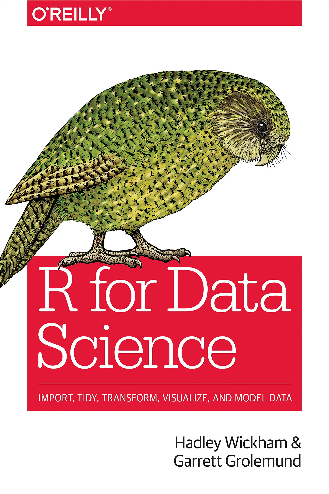

class: title-slide

```{r child = "../setup.Rmd"}

```

```{r}

library(palmerpenguins)
library(dplyr)

```


# `r rmarkdown::metadata$title`
## `r rmarkdown::metadata$subtitle` 

.bottom[

```{r, echo=FALSE}
p(rmarkdown::metadata$author)
p(rmarkdown::metadata$date)
```
]

---
class: middle

# .big[Hallo R! `r emo::ji("wave")`]

---
class: left
background-image: url(img/united-nations-covid-19-response-IKyhoO8giSA-unsplash.jpg)
background-position: right
background-size: contain

# .big[Hallo Ihr!] 

.footnote[[Image created by Danielo Baretto](https://unsplash.com/photos/IKyhoO8giSA)]

---
class: left
background-image: url(img/goals.jpg)
background-position: right
background-size: contain

# Ziele für heute 

.pull-left[

Am Ende des Tages:

- haben wir uns kennengelernt
- habt ihr die Werkzeugkiste kennengelernt
- könnt ihr beschreiben was die Ziele des Kurses sind
- könnt ihr einen ersten Plot erstellen

.footnote[Photo by: [Muzammil Soorma](https://unsplash.com/photos/6M_Wiwi1LQQ)]

]

???

Heute geht es vor Allem um's Kennenlernen. Wir machen uns miteinander und der
Arbeitsumgebung vertraut. Ihr bereitet euer erstes kleines RMarkdown Dokument vor.


---
# Kennenlernen

.fyi[

  Stellt euch jeweils gegenseitig in 2er Gruppen vor (pro Person 2 Minuten)
  
  - Mögliche Fragen
    - In welcher Verwaltungseinheit bist du? 
    - Was für Erfahrungen hast du mit R?
    - Welche Ziele hast du für den Kurs?
    - Was machst du gern ausserhalb der Arbeit? 
]

```{r, echo = FALSE}

countdown(
  minutes = 2, seconds = 0,
  left = 0, right = 0,
  padding = "10px", margin = "5%",
  font_size = "2em"
)

```

---
# Kennenlernen

.fyi[
  
  In der Gruppe: Stellt eure Arbeitsparter_in vor
  
]


---
class: left
background-image: url(img/lars_schoebitz_profile_photo.jpg)
background-position: right
background-size: contain

# Wer bin ich?

- Lars Schöbitz
    - Umweltingenieur
    - Toiletten-Forscher
    - Datenwissenschaftler
- R Nutzer seit 2016
- R Trainer seit 2020
- Website: [lse.de](https://www.lse.de?utm_source=Slides&utm_medium=rstatsZH)
- Twitter: [@larnsce](https://twitter.com/larnsce)

???
Kurz zu mir: Mein Name ist Lars Schöbitz. Ich freue mich wenn ihr mich Lars nennt und hoffe es geht okay, dass ich euch Dutze.

Ich habe mal Umwelt- Hygiene und Sicherheitstechnik an einer Fachhochschule in Deutschland studiert und bin über Umwege im jahr 2012 in der Schweiz gelandet.

Hier habe ich dann 5 Jahre lang am Wasserforschungsinstitut Eawag gearbeitet und mich vor Allem mit der Sanitärversorgung im globalen Süden beschäftigt. Die Fäkalschlammbehandlung aus Toilettensystemen die nicht an die Kanalisation angeschlossen sind war mein Spezialgebiet.

Neuerdings darf ich mich auch Datenwissenschaftler nennen, da ich ein Praktikum als Data Scientist im statistischen Amt gemacht habe. 

Ich nutze R seit etwa vier Jahren. Mein Einstieg war ein 2-tägiger Workshop aber der Grossteil meiner Kompetenzen ist selbständig erworben. 

Seit letztem Jahr  Monaten bin ich nun offiziel als R Trainer zertifiziert. Später noch etwas mehr dazu.

---
class: inverse, middle

# .big[Werkzeugkiste `r emo::ji("toolbox")`]

---
# Wekzeugkiste

.pull-left[

# **Kursarbeit**

- Zoom
- Slack
- (Google Docs)
- https://statistikzh.github.io/rstatsZH/
]

.pull-right[

# Data Science

**Programmieren**

- R
- RStudio (Cloud)
- tidyverse
- R Markdown

**Versionskontrolle und Kollaboration**

- Git
- GitHub

]

---
# Zoom

Unsere Konferenzplatform

**Tipps für die Nutzung**

- Das Mikrofon auf stumm schalten
- Wenn ihr mögt, das Video gern einschalten
- Das Fenster in welchem ich zu sehen bin "pinnen"
- Wir nutzen den Zoom Chat nur für Kleinigkeiten  

---
class: left
background-image: url(img/kommunikation.jpg)
background-position: right
background-size: contain

# Slack

Unser Channel für die Kommunikation

**Was gehört hinein?**

- Ankündigungen
- Unterhaltungen
- Fragen
- Unterstützung beim Programmieren

.footnote[Photo by: [Steve Halama](https://unsplash.com/@steve3p_0)]

---
# Google Docs

Unser geteiltes Notizbuch (ein Experiment)

**Wozu nutzen wir es?**

- Für bestimmte Übungen und Aufgaben
- Zum Teilen von Bildern

---
# Data Science - Lernziele

Am Ende des Kurses wirst du:

--
- Wissen aus Daten generieren

--
- **reproduzierbar**, Wissen aus Daten generieren

--
- reproduzierbar, **und mit modernen Werkzeugen und Techniken**, Wissen aus Daten generieren

--
- reproduzierbar, **kollaborativ**, und mit modernen Werkzeugen und Techniken, Wissen aus Daten generieren

--
- reproduzierbar **(mit literate programming und Versionsverwaltung)**, kollaborativ, und mit modernen Werkzeugen und Techniken, Wissen aus Daten generieren

---
class: middle

# .big[Reproduzierbare Datenanalyse]

---

.fyi[
**Frage:**
Was macht eine Datenanalyse reproduzierbar?
]

--
**Kurzfristige Ziele**

- Können Tabellen und Grafiken aus den Daten und dem Code neu erstellt (reproduziert) werden?
- Kann Code aus einem Skript in einem Anderen wieder verwendet wenden?
- Stimmt meine Arbeitsumgebung mit der meiner Kolleg_innen überein?

---
class: left
background-position: right
background-size: contain

# rstatsZH - moderner NutzeR 

Ein **moderner NutzeR** zu werden bedeutet, Fähigkeiten, Gewohnheiten und Denkweisen für eine reproduzierbare und kollaborative Arbeitsweise zu entwickeln.

Wir lernen:

1. Coding mit bewährten Verfahren und Skripts (R/RStudio/tidyverse)
2. Reproduzierbare Dokumente schreiben und veröffentlichen (R Markdown)
3. Kollaboratives Arbeiten und Versionsverwaltung (Git/GitHub)

???

In diesem Kurs geht es nicht nur darum R zu lernen. 

- Wir lernen ein gesamtes Ökosystem an Werkzeugen und Praktiken kennen, welche uns helfen werden gute Gewohnheiten für eine reproduzierbare und kooperative Arbeitsweise zu entwickeln
    
   -> Entscheidene Kompetenzen eines modernen Analytikers

- Wir werden Fähigkeiten erlernen, welche schrittweise in Eure bestehenden Arbeitsabläufe integriert werden können

- Dabei geht es allerdings nicht nur um Fähigkeiten, sondern auch um Denkweisen
    - Darüber wie wir Daten formen, Daten organisieren und Daten analysieren
    - Und wie das was wir jetzt tun unser analytisches Leben in der Zukunft besser machen kann. 

---

class: middle

# .big[R and RStudio]

---
# R und RStudio

.pull-left[

```{r echo=FALSE, out.width="25%"}
knitr::include_graphics("img/r-logo.png")
```
- R ist eine freie (open-source) Programmiersprache, erschienen in 1993
- R ist eine Arbeitsumgebung für statistische Analysen und Grafiken 
- R kann mit *packages* erweitert werden 

]

.pull-right[

```{r echo=FALSE, out.width="50%"}
knitr::include_graphics("img/RStudio-Logo-Gray.png")
```

- RStudio ist eine grafische Benutzeroberfläche, welche auch integrierte Entwicklunsumgebung (i.e. **IDE** - integrated development environment) genannt wird
- RStudio IDE wird entwickelt von [RStudio, PBC](https://blog.rstudio.com/2020/01/29/rstudio-pbc/) (Public Benefit Corporation), eine US-amerikanische Firma
]

---
# R packages

- **Packages** sind die grundlegenden Einheiten von reproduzierbarem R-Code
- Packages enthalten wiederverwendbare R Funktionen, die Dokumentation welche beschreibt wie sie verwendet werden, und Beispieldaten
- Mit Stand Februar 2021 gibt es mehr als 17'000 R-Pakate auf **CRAN** (dem Comprehensive R Archive Network)<sup>1</sup>
- Wir werden mit einem kleinen (aber wichtigen) Teil 

.footnote[
<sup>1</sup> [CRAN contributed packages](https://cran.r-project.org/web/packages/).
]

---
class: middle

# .big[Tour: R, RStudio, R Markdown]


---
# Praktikum - Willkommen

.note[

- Öffne rstudio.cloud und login (Link ist im Zoom Chat) 
- Unter "Projects", klicke auf **Start** neben **prak-00-willkommen**
- Folge meinen Anweisungen im Zoom Video
]

---
# R Markdown Hilfe

.pull-left[
.center[
.midi[R Markdown Cheat Sheet  
`Help -> Cheatsheets`]
]
```{r echo=FALSE, out.width="80%"}
knitr::include_graphics("img/rmd-cheatsheet.png")
```
]
.pull-right[
.center[
.midi[Markdown Quick Reference  
`Help -> Markdown Quick Reference`]
]
```{r echo=FALSE, out.width="80%"}
knitr::include_graphics("img/md-cheatsheet.png")
```
]

---
# Wie nutzen wir R Markdown?

- Jede Aufgabe / Bericht / Projekt / etc. ist ein R Markdown Dokument
- Du wirst immer eine Vorlage für ein R Markdown Dokument haben, mit der du beginnen kannst.
- Die Menge an vorgebenen Hilfen in der Vorlage wird im Laufe des Kurses abnehmen

---
class: left
background-image: url(img/coffee-break.jpg)
background-position: right
background-size: contain

# Pause 

```{r, echo = FALSE}

countdown(
  minutes = 5, seconds = 0,
  left = 0, right = 0,
  padding = "15px", margin = "5%",
  font_size = "4em"
)

```

.footnote[Photo by: [Blake Wisz](https://unsplash.com/@blakewisz)]

---
# Frage: Wobei handelt es sich um eine Zahl?

.fyi[

Wobei handelt es sich um eine Zahl:

1. 10
2. ten
3. "ten"
4. "10"

Schickt die Antwort in den Zoom Chat.

]

---
# Frage: Wobei handelt es sich um eine Zahl?

.fyi[

1. 10 `r emo::ji("party_popper")`
2. ten --- **Objekt**
3. "ten" --- **Wort (string)**
4. "10" --- **Wort (string)**

]
---
class: middle

# .big[R - Wesentliches]

---
# R - Wesentliches

**Funktionen**

- Funktionen sind (häufig) Verben, gefolgt vom dem worauf sie angewendet werden 

```{r eval=FALSE, echo = TRUE}
mach_dies(mit_dem)
mach_dies(mit_dem, auf_das, mit_diesen)
```

--
**Packages**

- Packages werden einmalig der Funktion `install.packages` installiert und einmal pro Sitzung mit der `library` Funktion geladen: 

```{r eval=FALSE, echo = TRUE}
install.packages("package_name")
library(package_name)
```

---
# R - Wesentliches

- Auf Spalten (Variablen) in Dataframes wird mit `$` zugegriffen:

```{r, eval=FALSE, echo=TRUE}

# Beispiel
dataframe$var_name

# Praxis 
penguins$species

```

--

- Auf die Dokumentation von Objekten, Packages, Funktionen, etc. kann mit `?` zugegriffen werden

```{r eval=FALSE}
?mean
```

---
# [tidyverse.org](https://www.tidyverse.org/)

.pull-left[

- Ein logisch zusammenhängendes System von R Packages zur
  - Daten Aufbereitung
  - Daten Exploration
  - Daten Visualisierung
  - Daten Modellierung
- Eine Designphilosophie, Grammatik und Daten Struktur
- Entwickelt um Produktivität zu unterstützen
]

.pull-right[
```{r, out.width="80%"}
knitr::include_graphics("img/tidyverse.png")
```

]

---
# Buch - R for Data Science

.pull-left[

- Das Buch für den Kurs
- Kostenfrei auf [https://r4ds.had.co.nz/](https://r4ds.had.co.nz/)
- Geschrieben von Hadley Wickham
- Nutzt die Philosophie des Tidyverse

] 

.pull-right[

[
```{r, out.width="60%"}



```
](https://r4ds.had.co.nz/)

]

.footnote[[Hadley Wickham & Garret Grolemund - R for Data Science](https://r4ds.had.co.nz/)]

???

Dementsprechend orientiert sich der Kurs auch an dem von ihm geschriebenen Buch "R for Data Science". Das Buch ist online kostenfrei verfügbar. Während des Kurses wird es uns als Text Buch zur Seite stehen. 

---
class: middle

# .huge[Praktikum]

---
# Praktikum - Daten Visualisierung

.note[

**Breakout rooms (2er Gruppen)**

- Eine Person teilt den Bildschirm
- Öffne "Projects" in RStudio Cloud Workspace
- Klicke auf **Start** neben **prak-01-visualisieren**

]

```{r}

countdown(
  minutes = 20, seconds = 0,
  left = 0, right = 0,
  padding = "15px", margin = "5%",
  font_size = "4em"
)

```

---
class: left
background-image: url(img/deep-breath.jpg)
background-position: right
background-size: contain

# Pause 

```{r, echo = FALSE}

countdown(
  minutes = 7, seconds = 30,
  left = 0, right = 0,
  padding = "5px", margin = "5%",
  font_size = "4em"
)

```

.footnote[Photo by [Brett Jordan](https://unsplash.com/@brett_jordan)]


---
# Praktikum - Daten Visualisierung

.note[

.huge[Bericht]
- Hat die Zeit gereicht?
- Was hat Schwierigkeiten bereitet?
- Was habt ihr gelernt?

]

---
class: inverse, middle

# .big[Werkzeugkiste `r emo::ji("toolbox")`]

---
# Wekzeugkiste

.gray[
.pull-left[

# **Kursarbeit**

- Zoom
- Slack
- Google Docs
- .gray[https://statistikzh.github.io/rstatsZH/]
]
]

.pull-right[

# Data Science

**Programmieren**

- .gray[R]
- .gray[RStudio (Cloud)]
- .gray[tidyverse]
- .gray[R Markdown]

**Versionskontrolle und Kollaboration**

- **.pink[Git]**
- **.pink[GitHub]**

]

---
class: middle

# .big[Git und GitHub]

---
# Git und GitHub

.pull-left[
```{r echo=FALSE, out.width="25%"}
knitr::include_graphics("img/git-logo.png")
```
- Git ist ein System zur Versionsverwaltung - ähnlich wie "Track Changes" in Micorsoft Word
- Es ist nicht das einzige System, aber ein sehr beliebtes
]
.pull-right[
```{r echo=FALSE, out.width="25%"}
knitr::include_graphics("img/github-logo.png")
```
- GitHub ist das Zuhause für deine Git-basierten Projekte im Internet - ähnlich wie Dropbox
- Wir werden GitHub als Plattform für das Webhosting und die Zusammenarbeit nutzen (und als unser Kursmanagement System!)
]

---
# Versionierung

```{r echo=FALSE, fig.align = "center", out.width = "70%"}
knitr::include_graphics("img/lego-steps.png")
```

???

Bei einer Versionierung können wir die Lego Analogie neben. Jeder wichtige Schritt
in einem Lego Projekt beschreibt eine bestimmt Version.

---
# Versionierung

## mit (von Menschen) lesbaren Nachrichten

```{r echo=FALSE, fig.align = "center", out.width = "60%"}

```

---
# Warum ist Versionsverwaltung nützlich?

```{r echo=FALSE, fig.align = "center", out.width="35%"}
knitr::include_graphics("img/phd_comics_vc.gif")
```

---
# Wie nutzen wir Git und GitHub?

```{r echo=FALSE, out.width="100%"}
knitr::include_graphics("img/whole-game-01.png")
```

---
# Wie nutzen wir Git und GitHub?

```{r echo=FALSE, out.width="100%"}
knitr::include_graphics("img/whole-game-02.png")
```

---
# Wie nutzen wir Git und GitHub?

```{r echo=FALSE, out.width="100%"}
knitr::include_graphics("img/whole-game-03.png")
```

---
# Wie nutzen wir Git und GitHub?

```{r echo=FALSE, out.width="100%"}
knitr::include_graphics("img/whole-game-04.png")
```

---
# Git and GitHub Tipps

- Es gibt etliche Git-Befehle 
- Nur sehr wenige Leute kennen sie alle 
- 99.9% der Zeit werden wir git add, commit, push und pull verwenden

--
- Wir arbeiten mit Git und GitHub über die RStudio IDE
- Es ist auch möglich mit der Command Line zu arbeiten (dies kannst du einfach überspringen)

--
- Es gibt eine großartige Quelle für die Arbeit mit Git und R: [happygitwithr.com](http://happygitwithr.com/)

???

Einige der Inhalte gehen über den Rahmen dieses Kurses hinaus, aber es ist ein guter Ort, um nach Hilfe zu suchen.

---
class: middle

# .big[Heimarbeit]

---
# Heimarbeit

.note[

- Öffnet jetzt eure E-Mail Inbox
- Bestätigt mir im Zoom Chat, dass ihr eine Email mit Betreff **"rstatsZH - Lars hat das Repo ha01-GitHubName"** erhalten habt
- Kontaktiert mich unter der Woche jederzeit auf Slack 

]

---
# `r emo::ji("sunflower")` Danke 

Für die Aufmerksamkeit!

Für die R packages [{xaringan}](https://github.com/yihui/xaringan) und [{xaringanthemer}](https://github.com/gadenbuie/xaringanthemer) mit welchen die Folien geschrieben wurden.

`r hr()`

Für [Data Science in a Box](https://datasciencebox.org/) und [Remaster the Tidyverse](https://github.com/rstudio-education/remaster-the-tidyverse), von welchen ich Materialien für diesen Kurs nutze und welche genau wie diese Folien mit [Creative Commons Attribution Share Alike 4.0 International](https://creativecommons.org/licenses/by-sa/4.0/) lizensiert sind.