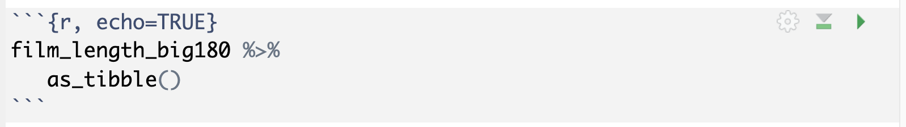

class: title-slide

```{r child = "../setup.Rmd"}

```

```{r}

library(dplyr)
library(ggplot2)
library(readr)
library(tidyr)
library(forcats)

```


# `r rmarkdown::metadata$title`
## `r rmarkdown::metadata$subtitle` 

.bottom[

```{r, echo=FALSE}
p(rmarkdown::metadata$author)
p(rmarkdown::metadata$date)

```
]

---
# Datenbanken - SQL queries in R

- `DBI` Package: https://dbi.r-dbi.org/
- `dbplyr` Package: https://dbplyr.tidyverse.org/index.html

---
# DBI - Mit einer Datenbank verbinden

Argumente variieren je nach Datenbank, aber das erste Argument ist immer das Datenbank Backend.

```{r, echo=TRUE}

library(DBI)

con <- dbConnect(
   
   # Hier wird das Backend definiert
   RMariaDB::MariaDB(),
   
   host = "relational.fit.cvut.cz", 
   port = 3306,
   username = "guest",
   
   # Niemals Passwort in Skript speichern
   password = rstudioapi::askForPassword("Datenbank Passwort"), #<<
   dbname = "sakila"
)

```

---
# DBI - Tabellen in Datenbank anzeigen

```{r, echo=TRUE}
dbListTables(con)
```

---
# DBI - Spaltennamen einer Tabelle anzeigen

```{r, echo=TRUE}
dbListFields(con, "film")
```

---
# SQL Queries in R Markdown Dateien

1. Datenbank Verbindung: Code-chunk mit `sql connection=con` starten
2. Daten Output: Resultierende Daten mit `output.var = "NAME"` als Objekt im Environment speichern
3. SQL Code schreiben

```{r}
knitr::include_graphics("img/sql-chunk-output.png")
```

```{sql connection=con, output.var="film_length_big180"}
SELECT film_id, title, length
FROM film 
WHERE length > 180
```

---
# SQL Query - Mit Daten weiter arbeiten

1. Objekt mit Funktion `as_tibble()` in einen Tibble umwandeln

```{r}

```

```{r, echo=FALSE}
film_length_big180 %>% 
   as_tibble()
```

---
# dbplyr - Mit Tabelle in Datenbank verbinden

```{r, echo=TRUE}
film_tab <- tbl(con, "film")
film_tab
```

---
# dbplyr - Queries als dplyr code

```{r, echo=TRUE}
film_tab %>% 
   select(film_id, title, length) %>% 
   filter(length > 180)
```

---
# dbplyr - Resultierende Daten aus Datenbank holen

```{r, echo=TRUE}
film_tab %>% 
   select(film_id, title, length) %>% 
   filter(length > 180) %>% 
   collect() #<<
```

---
# dbplyr - Queries als dplyr code

```{r, echo=TRUE}

film_tab %>% 
   summarise(min_rate = min(rental_rate),
             max_rate = max(rental_rate),
             mean_rate = mean(rental_rate)) %>% 
   collect()

```

---
# R Packages für andere Datentypen

- **googlesheets4:** Google Sheets
- **haven**: SPSS, Stata, und SAS Dateien
- **jsonline**: JSON
- **xml2**: xml
- **rvest**: web scraping
- **httr**: web APIs
- **sparklyr**: data loaded into spark
