<script async defer data-domain="rstatszh.github.io/website" src="https://plausible.io/js/plausible.js"></script>

Das Hauptziel dieser Hausaufgabe ist es, dich mit R und RStudio bekannt zu machen. Ein zusätzliches Ziel ist es, dich in Git und GitHub einzuführen, das Kollaborations- und Versionskontrollsystem, das wir während des Kurses benutzen werden.

Ich ermutige dich im Laufe der Übungen über das hinauszugehen was die Übungen vorgeben. Die Bereitschaft zu experimentieren wird dich zu einer besseren Programmierin machen. Bevor wir soweit sind, ist es wichtig, dass du dir ein paar grundlegende Kenntnisse in R aneignest.

Heute beginnen wir mit den grundlegenden Bausteinen von R und RStudio: die Benutzeroberfläche, das Einlesen von Daten und grundlegende Befehle.

Dieses erste Hausaufgabe wird von dir allein durchgeführt. In zukünfitgen Hausaufgabeen (oder auch Praktika) wirst du lernen, wie du auf GitHub in kleinen Teams zusammenarbeitest und einen Bericht für dein Team erstellst.

# Verbindung zu GitHub und RStudio Cloud aufbauen

Du solltest eine Einladung erhalten haben, um der GitHub Organisation für diesen Kurs beizutreten. Diese Einladung musst du annehmen, bevor du mit dem nächsten Schritt fortfährst.

- Öffne deine Email welche du für deinen GitHub Konto hinterlegt hast
- Klicke auf "Join"

```{r github-org-1, echo=FALSE}
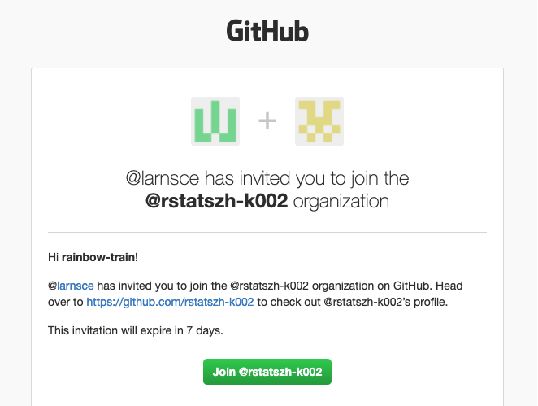
```

Um deine RStudio und GitHub Konten zu verbinden, befolge die folgenden Schritte:

- Öffne rstudio.cloud und login mit deinem Benutzerkonto (nutze GitHub)
- Klicke auf deinen Namen in der oberen rechten Ecke, um das rechte Menü zu öffnen.
- Klicke dann auf "Authentication".

```{r github-auth-1, echo = FALSE}
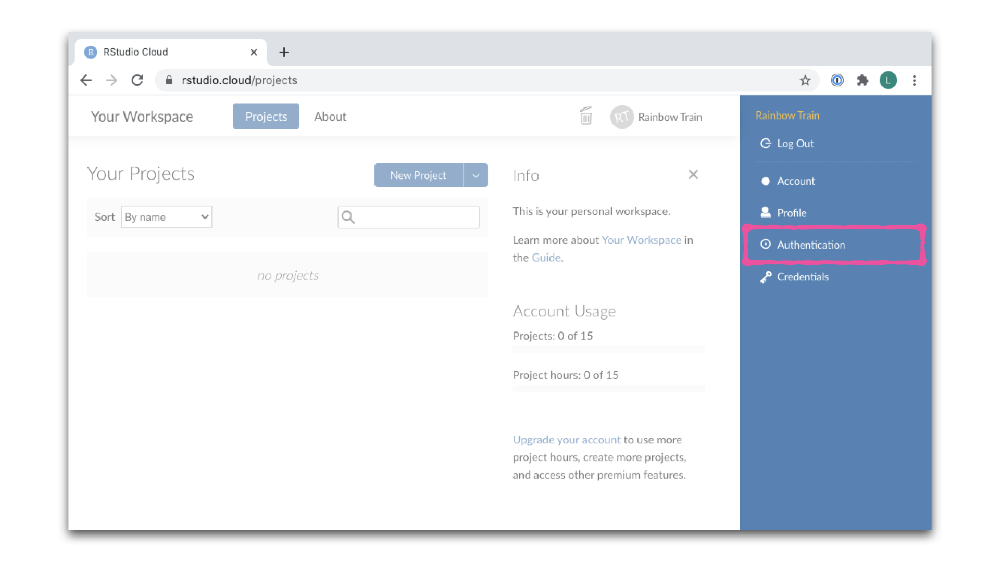
```
- Aktiviere im Fenster Authentifizierung das Kontrollkästchen für *Enabled* neben GitHub.

```{r github-auth-2, echo = FALSE}
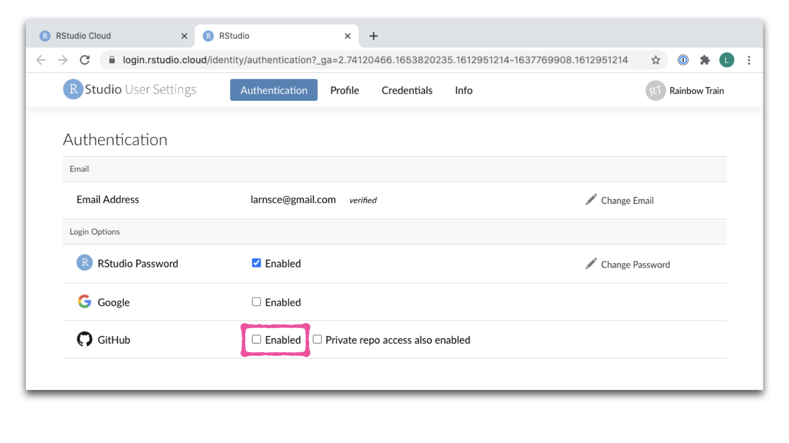
```

- Im nächsten Fenster klickst du auf das grüne Kästchen mit der Aufschrift "Authorize rstudio".

```{r github-auth-3, echo = FALSE}
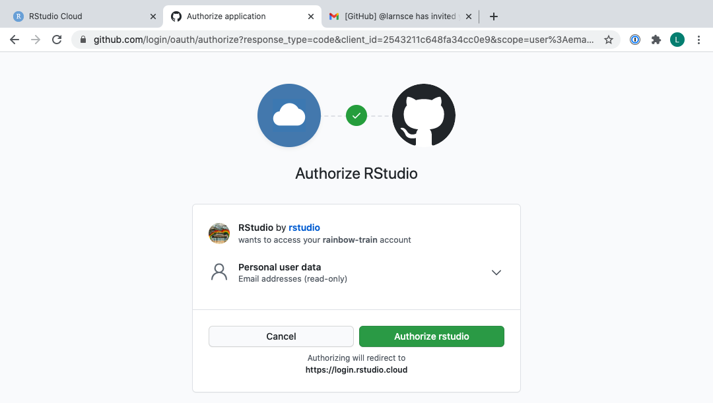
```

- Zurück im Authentifizierungsfenster in RStudio Cloud aktivierst du nun auch das Kästchen *Private repo access also enabled*

```{r, echo=FALSE}

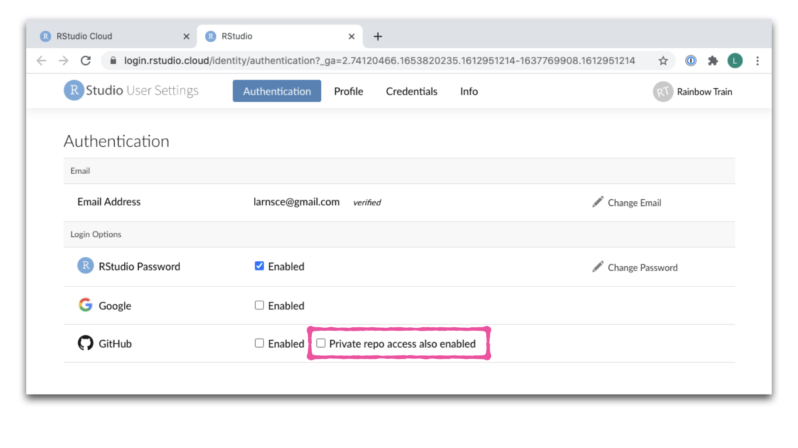

```

- **Wichtig**: Falls Feld *Organisation access* noch kein grünes Häkchen neben deinem Kursnamen auftaucht, klickst du nun zunächst auf "Request" neben deinem Kursnamen und folgend auf "Request approval from owners". 
- _Hinweis:_ Sollte hier kein Kurs auftauchen, könnte dies bedeueten, dass du die GitHub-Einladung zum Kurs noch nicht angenommen hast und du solltest zurückgehen und dies überprüfen und nacholen. Falls du keine Einladung hast, kontaktiere mich.
- Nun noch auf das grüne Feld "Authorize rstudio" und nach Eingabe deines Passworts bist du bereit.

```{r github-auth-4, echo = FALSE}
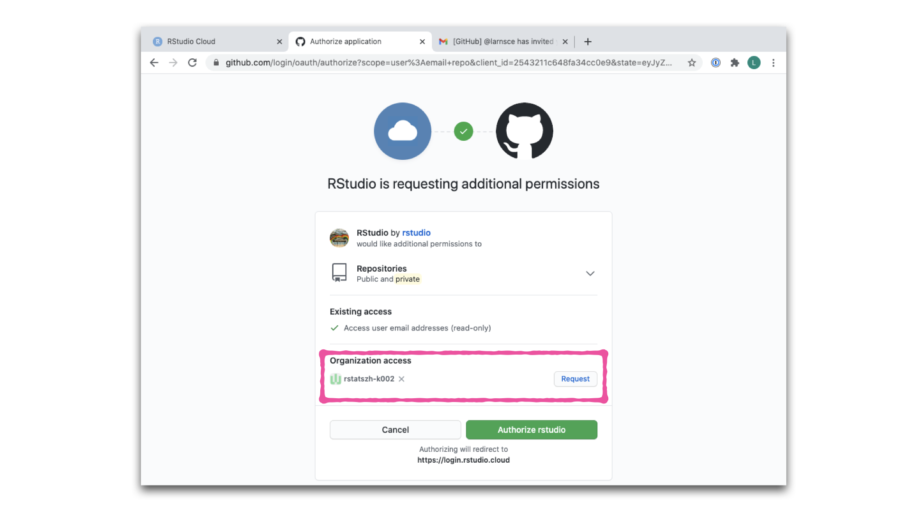
```
- Sobald du fertig bist, sollten in RStudio Cloud beide Kästchen markiert sein.

```{r github-auth-5, echo = FALSE}
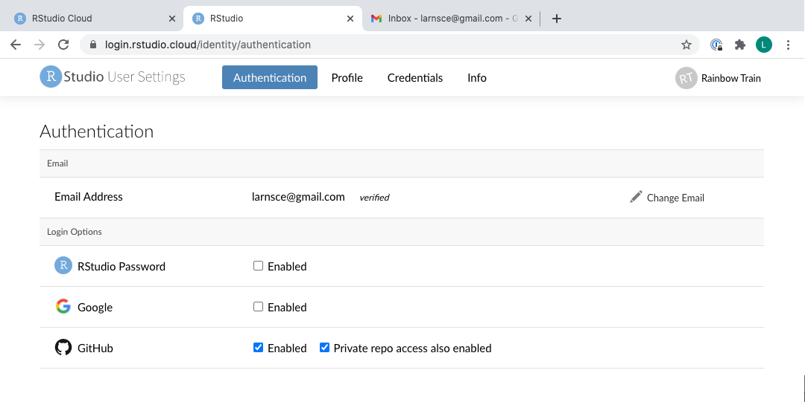
```
- Um zu bestätigen, dass du deine GitHub- und RStudio-Cloud-Konten erfolgreich verknüpft hast, wähle [GitHub settings \> Applications](https://github.com/settings/applications). Du solltest RStudio als autorisierte App unter *Authorized OAuth Apps* aufgelistet sehen. Falls nicht, ist dies ein guter Zeitpunkt, um eine Frage zu stellen.

```{r github-auth-6, echo = FALSE}
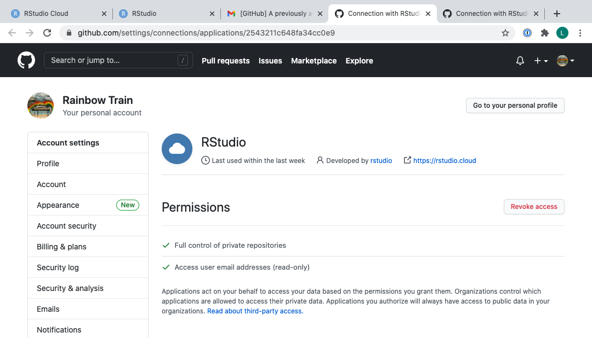
```

# Erste Schritte

Jede deiner Aufgaben wird mit den folgenden Schritten beginnen, welche hier im Detail beschrieben sind. In Zukunft wird jede Aufgabe mit einem Abschnitt "Erste Schritte" beginnen, aber mit etwas weniger Details. Du kannst jedoch jederzeit auf diese Hausaufgabe zurückgreifen, um eine detaillierte Liste der Schritte zu erhalten, die notwendig sind, um mit einer Aufgabe zu beginnen.

- Klicke auf den Link welchen ich in einer E-Mail mit dem Betreff (Lars hat das Repo XYZ-Dein-GitHub-Name auf GitHub erstellt) mit dir geteilt habe
- Dies führt dich zu deinem persönlichen GitHub Repository (im Folgenden "Repo" genannt) 
- Dieses Repository enthält eine R Markdown (ha-01.Rmd) Vorlage, auf der du aufbauen kannst, um die Aufgabe zu lösen.
- Auf GitHub klickst du auf den grünen **Code** Button und wählst **HTTPS** wie im Bild unten. Klicke auf das Klemmbrett-Symbol, um die Repo-URL zu kopieren.

```{r clone-repo-link, fig.margin = TRUE, echo = FALSE, fig.width=3}
knitr::include_graphics("img/clone-repo-link.png")
```

- Öffne nun RStudio Cloud und den Workspace für den Kurs. Klicke auf den Abwärtspfeil und erstelle ein **New Project from Git Repository**.

```{r new-project-from-gh, fig.margin = TRUE, echo = FALSE, fig.width=3}
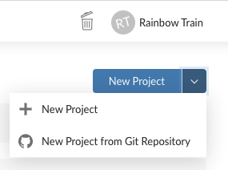
```

- Füge die URL aus deinem Repo oben in das Dialogfeld ein und stelle sicher, dass das Häkchen bei "Packages" gesetzt ist.

```{r paste-gh-repo-url, fig.margin = TRUE, echo = FALSE, fig.width=5}
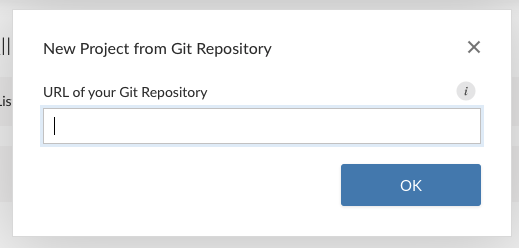
```

```{r arrow-base-proejct, echo=FALSE}

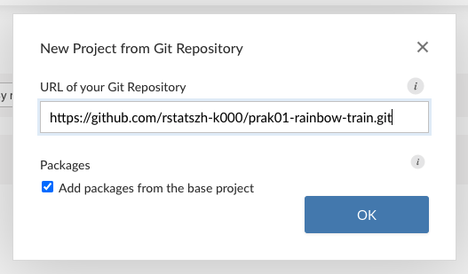

```

- Klicke auf OK, habe etwas Geduld, und du bist bereit zum logslegen!

## Aufwärmen

Bevor wir uns die Daten anschauen, machen wir noch ein paar Aufwärmübungen um die R Markdown vorzustellen. 

### YAML

- Im RStudio Cloud Workspace für den Kurs, klicke auf "Projects"
- Öffne dein Projekt in dem du darauf klickst (ha01-GitHubName)
- Öffne die R Markdown (ha-01.Rmd) Datei in deinem Projekt (**Tipp:** Sie befindet sich in dem Ansichtsfenster unten rechts unter dem Reiter "Files")
- Ändere den Autorennamen zu deinem Namen, füge ein Datum hinzu und stricke ('knit') das Dokument.

```{r,  echo = FALSE}
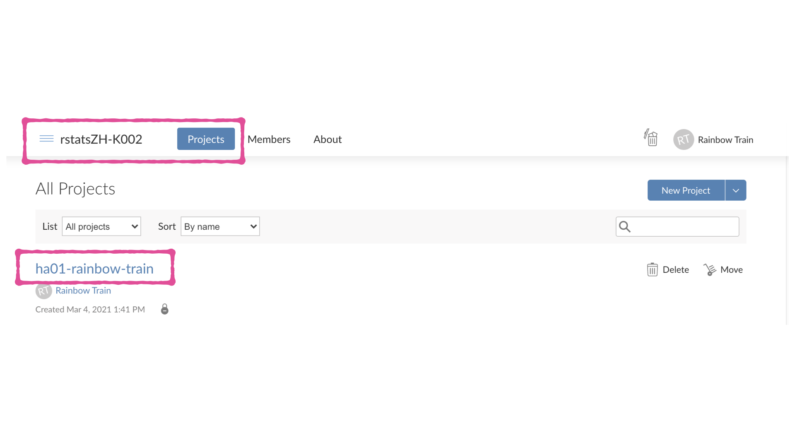
```

```{r, echo = FALSE}
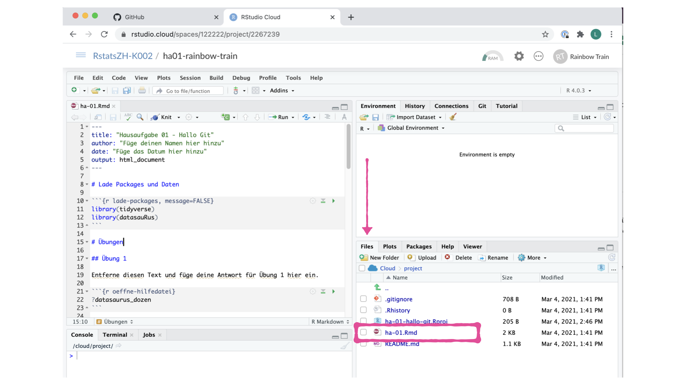
```

Der obere Teil deiner R Markdown Datei (zwischen den drei gestrichelten Linien) wird YAML genannt. Es steht für "YAML Ain't Markup Language". Es ist ein menschenfreundlicher Standard zur Serialisierung von Daten für alle Programmiersprachen. Alles, was du wissen musst, ist, dass dieser Bereich YAML genannt wird (wir werden ihn als solchen bezeichnen) und dass er Metainformationen über dein Dokument enthält.

### Änderungen schreiben (commit)

In deinem RStudio, öffne das Fenster mit dem Titel Git im Ansichtsfenster oben rechts.

Wenn du Änderungen an deiner Rmd-Datei gemacht hast, solltest du nun hier den Dateinamen sehen. Wähle die Datei aus der Liste aus indem du sie anklickst. Dann klicke auf **Diff** über den Dateinamen.

Ein neues Fenster öffnet sich welche dir die *Diff*erenz zwischen dem letzten commit-Zustand des Dokuments (rot) und dem aktuellen aktuellen Zustand zeigt (grün), welcher deine Änderungen beinhaltet.

Wenn du mit diesen Änderungen zufrieden bist, klicke auf das Kontrollkästchen neben dem Dateinamen um einen Haken zu setzen und schreibe "Aktualisiere Autorenname und Datum" in das Feld **Commit message**. Klicke anschliessend auf **Commit**.

```{r update-author-name-commit, fig.fullwidth=TRUE, echo = FALSE}
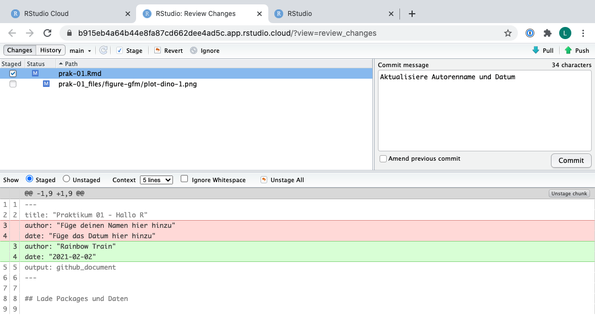
```

Du musst nicht nach jeder Änderung committen, sondern Zustände, die *für dich bedeutsam* sind, um sie zu überprüfen, zu vergleichen oder wiederherzustellen.

In den ersten paar Aufgaben werden wir dir genau sagen, wann und mit welchem Text du committen solltest. Im weiteren Verlauf des Kurses wirst du diese Entscheidungen dann selbst treffen.

### Änderungen schieben (push)

Jetzt, wo du ein Update gemacht und diese Änderung committed hast, ist es an der Zeit, diese Änderungen ins Web zu pushen!

Oder genauer gesagt, in dein Repo auf GitHub. Warum das? Damit Andere deine Änderungen sehen können. Und mit Anderen meinen wir das Kursteam (deine Repos in diesem Kurs sind für dich und uns privat).

Doch bevor du dies ausführen kannst, musst du noch einen GitHub Personal Access Token (PAT) setzen und für dich speichern. GitHub erlaubt diesen Zugang über externe Applikationen seit dem 13. August 2021 nicht mehr über das Benutzerpasswort. Die Anweisungen um einen PAT zu erstellen findest du hier:

https://github.com/rstatsZH/kochbuch/tree/main/05-github-pat

Um deine Änderungen nun auf GitHub zu pushen, klicke auf **Push**. Daraufhin erscheint ein Dialogfenster, in dem du zuerst deinen Benutzernamen und dann deinen erstellen Personal Access Token (PAT). 

```{r, echo=FALSE}

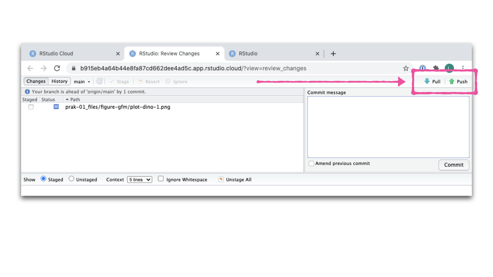

```

## R Packages

In dieser Hausaufgabe werden wir mit zwei R Packages arbeiten: **datasauRus**, welches den Datensatz enthält, den wir verwenden werden und **tidyverse**. Diese Packages sind bereits für dich installiert. Du kannst sie laden indem du den folgenden Code-chunk in deiner R Markdown Datei ausführst.

```{r message=FALSE}
library(tidyverse) 
library(datasauRus)
```

Beachte, dass die Packages auch mit den gleichen Befehlen in deinem R Markdown Dokument geladen werden.

## Daten

Der Datensatz, mit dem wir heute arbeiten werden, heißt `datasaurus_dozen` und befindet sich im R Package `datasauRus`. Eigentlich enthält dieser einzelne Datensatz 13 weitere Datensätze, die uns zeigen sollen, warum Datenvisualisierung wichtig ist und wie zusammenfassende Statistiken allein irreführend sein können. Die verschiedenen Datensätze sind durch die Variable `dataset` (Spalte) gekennzeichnet.

Um mehr über das Dataset herauszufinden, gib folgendes in deine Console ein: `?datasaurus_dozen`. Ein Fragezeichen vor dem Namen eines Objekts ruft immer dessen Hilfedatei auf. Ich habe für dich auch einen Code-chunk hinzugefügt welcher den Code enthält um die Hilfe-Datei für `datasaurus_dozen` zu öffnen.

# Übungen

## Übung 1

- Öffne die Hilfedatei für `datasaurus_dozen`
- Wie viele Zeilen und wie viele Spalten hat der Datensatz `datasaurus_dozen`? 
- Was sind die Variablen, die im Dataframe enthalten sind? 
- Füge deine Antworten zu deinem R Markdown Bericht hinzu.

Schauen wir uns an, was diese Datensätze sind. Dazu können wir eine *Häufigkeitstabelle* (frequency table) der dataset Variable erstellen:

```{r}

datasaurus_dozen %>% 
  group_by(dataset) %>% 
  count() 

```

Der ursprüngliche Datasaurus (`dino`) wurde von Alberto Cairo in [diesem großartigen Blogpost](http://www.thefunctionalart.com/2016/08/download-datasaurus-never-trust-summary.html) erstellt. Das andere Dutzend wurde mit Hilfe von Simulated Annealing generiert und der Prozess wird in dem Paper *Same Stats, Different Graphs: Generating Datasets with Varied Appearance and Identical Statistics through Simulated Annealing*^[Matejka, Justin, and George Fitzmaurice. "Same stats, different graphs: Generating datasets with varied appearance and identical statistics through simulated annealing." Proceedings of the 2017 CHI Conference on Human Factors in Computing Systems. ACM, 2017.] von Justin Matejka und George Fitzmaurice beschrieben. In dem Paper simulieren die Autoren eine Vielzahl von Datensätzen, die die gleichen zusammenfassenden Statistiken wie der Datasaurus haben, aber sehr unterschiedliche Verteilungen aufweisen.

🧶 ✅ ⬆️ *Knit, commit und push deine Änderungen auf GitHub mit der Commit-Nachricht "Füge Antwort für Übung 1 hinzu." Achte darauf, alle geänderten Dateien zu committen und zu pushen, damit dein Git-Fenster danach aufgeräumt ist.*

## Übung 2

Unten findest du den Code, den du brauchst, um diese nächste Übunge zu lösen. Die Antworten für 1 und 2 sind schon gegeben und auch in deiner R Markdown Datei enthalten.

1. Plot `y` gegen `x` für den `dino` Datensatz (Code ist in R Markdown Datei)
2. Berechne dann den Korrelationskoeffizienten zwischen "x" und "y" für diesen Datensatz. (Code ist in R Markdown Datei)
3. Klicke auf `knit` um das Dokument zu stricken

**Code vorlesen**

Hier siehst du neuen Code, welchen wir noch nicht im Kurs behandelt haben. Dieser kann folgendermassen gelesen werden:

Beginne mit dem `datasaurus_dozen` und leite es in die Funktion `filter`, um nach Beobachtungen zu filtern, bei denen `dataset == "dino"` ist. Speichere den resultierenden gefilterten Dataframe als einen Dataframe namens `dino_data`.

```{r}

dino_data <- datasaurus_dozen %>%
  filter(dataset == "dino")

```

Hier geht eine ganze Menge vor sich, also lassen wir es langsam angehen und nehmen es Schritt für Schritt auseinander.

Erstens, der Pipe-Operator: `%>%`, nimmt das, was davor kommt und sendet es als erstes Argument an das, was danach kommt. Hier sagen wir also, dass wir den `datasaurus_dozen` Dataframe nach Beobachtungen filtern, bei denen `dataset == "dino"` ist.

Zweitens, der Zuweisungsoperator: `<-`, weist dem gefilterten Dataframe den Namen `dino_data` zu.

Als nächstes wollen wir diese Daten visualisieren. Dafür verwenden wir die Funktion `ggplot()`. Das erste Argument sind die Daten, die wir visualisieren wollen. Als nächstes definieren wir die `aes`thetischen Mappings (visuelle Eigenschaften). In anderen Worten, die Spalten der Daten, die auf bestimmte visuelle Eigenschaften  des Plots abgebildet werden, z.B. wird die `x`-Achse die Variable namens `x` und die `y`-Achse die Variable namens `y` repräsentieren.

Dann fügen wir eine weitere Ebene zu diesem Diagramm hinzu, in der wir definieren, welche geometrischen Formen wir verwenden wollen, um jede Beobachtung in den Daten darzustellen. In diesem Fall wollen wir, dass es sich um Punkte handelt, daher `geom_point()`.

```{r fig.fullwidth=TRUE}
ggplot(data = dino_data, mapping = aes(x = x, y = y)) +
  geom_point()
```

Nächste Woche wirst du mehr über die Philosophie der Datenvisualisierung in Layern erfahren. Für den Moment kannst du dem Code folgen, welcher dir zur Verfügung gestellt wird.

Für den zweiten Teil dieser Übungen müssen wir eine zusammenfassende Statistik berechnen: den Korrelationskoeffizienten. Der Korrelationskoeffizient, in der Statistik oft als $r$ bezeichnet, misst den linearen Zusammenhang zwischen zwei Variablen.

Du wirst sehen, dass einige der Variablenpaare, die wir darstellen, keinen linearen Zusammenhang zwischen ihnen haben. Das ist genau der Grund, warum wir zuerst visualisieren wollen: visualisieren, um die Form der Beziehung zu beurteilen, und $r$ nur berechnen, wenn es relevant ist.

In diesem Fall macht die Berechnung eines Korrelationskoeffizienten wirklich keinen Sinn, da die Beziehung zwischen `x` und `y` definitiv nicht linear ist - sie ist dinosaurierhaft!

Aber zur Veranschaulichung lass uns den Korrelationskoeffizienten zwischen "x" und "y" berechnen.

- Beginne mit `dino_data` und berechne eine zusammenfassende Statistik, die wir `r` nennen werden, als die Beziehung (`cor`) zwischen `x` und `y`.

```{r}
dino_data %>%
  summarize(r = cor(x, y))
```

🧶 ✅ ⬆️ *Knit, commit, und pushe deine Änderungen auf GitHub mit der Commit-Nachricht "Füge Antwort für Übung 2 hinzu." Achte darauf, alle geänderten Dateien zu committen und zu pushen, damit dein Git-Fenster danach aufgeräumt ist.*

## Übung 3

1. Plotte `y` gegen `x` für den `star` Datensatz. 

Du kannst (und solltest) den Code, den wir oben genutzt, wiederverwenden, ersetze den Namen des Datensatzes durch den gewünschten Datensatz. Berechne dann den Korrelationskoeffizienten zwischen "x" und "y" für diesen Datensatz. Wie ist dieser Wert im Vergleich zu `r` von `dino`?

🧶 ✅ ⬆️ *Dies ist ein weiterer guter Ort, um zu pausieren, zu stricken (knit), Änderungen mit der Commit-Nachricht "Füge Antwort für Übung 3 hinzu." zu committen und zu pushen. Achte darauf, alle geänderten Dateien zu committen und zu pushen, damit dein Git-Fenster danach aufgeräumt ist.*

## Übung 4

1. Plotte `y` gegen `x` für den `circle` Datensatz. 

Du kannst (und solltest) den Code, den wir oben genutzt, wiederverwenden, ersetze den Namen des Datensatzes durch den gewünschten Datensatz. Berechne dann den Korrelationskoeffizienten zwischen "x" und "y" für diesen Datensatz. Wie ist dieser Wert im Vergleich zu `r` von `dino`?

🧶 ✅ ⬆️ *Du kannst erneut pausieren, die Änderungen mit der Commit-Nachricht "Füge Antwort für Übung 4 hinzu." committen und pushen. Achte darauf, alle geänderten Dateien zu committen und zu pushen, damit dein Git-Fenster danach aufgeräumt ist.*

Super! Ich hoffe, dass du es schaffst in der Hausaufgabe bis hierhin zu kommen. Die nächsten beiden Übungen sind Bonus Übungen falls du Lust hast noch etwas weiter zu arbeiten.

## Übung 5 (Bonus)

Zum Schluss wollen wir alle Datensätze auf einmal darstellen. Um dies zu tun, werden wir Method für eine Facettierung nutzen.

Mit einer Facette (facet) durich die Variable `dataset`, platzieren wir die Plots in einem Raster aus drei Spalten, entfernen die Legende und geben der Variable `dataset` eine visuelle Eigenschaft (aesthetic) indem wir es dem Argument 'color' zuordnen.


```{r all-viz, eval=FALSE, fig.fullwidth=TRUE}

ggplot(datasaurus_dozen, aes(x = x, y = y, color = dataset))+
  geom_point()+
  facet_wrap(~ dataset, ncol = 3) +
  theme(legend.position = "none")

```

Und wir können die Funktion `group_by()` in Kombination mit der Funktion `summarize()` verwenden, um alle zusammenfassenden Korrelationskoeffizienten zu erzeugen.

```{r all-r, eval=FALSE}
datasaurus_dozen %>%
  group_by(dataset) %>%
  summarize(r = cor(x, y)) 
```

*Bravo, du bist fertig! Übertrage alle verbleibenden Änderungen, verwende die Commit-Nachricht "Fertig mit Hausaufgabe 1! *" und pushe. Achte darauf, alle geänderten Dateien zu committen und zu pushen, damit dein Git-Fenster danach aufgeräumt ist. Bevor du die Aufgabe beendest, stelle sicher, dass alle Dokumente in deinem GitHub Repository aktualisiert sind.