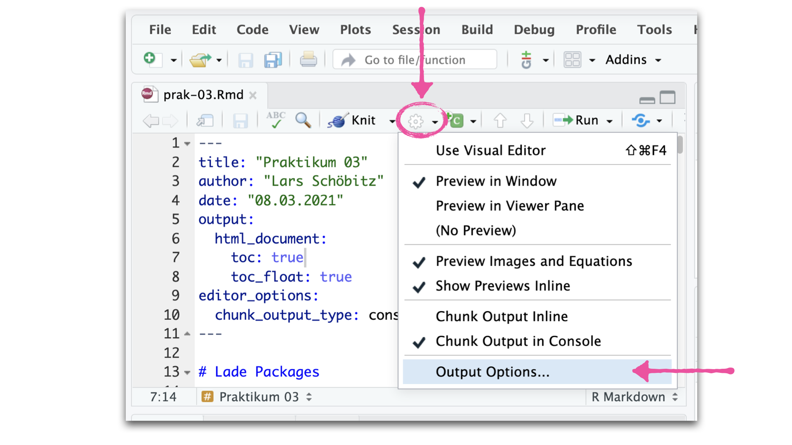
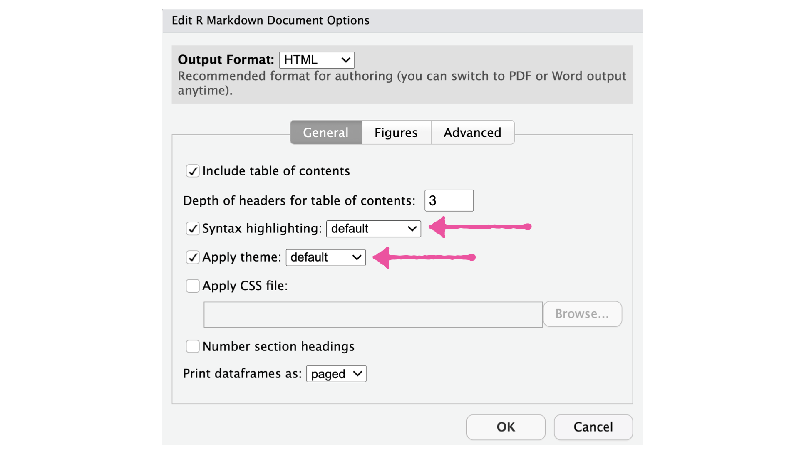

<script async defer data-domain="rstatszh.github.io/website" src="https://plausible.io/js/plausible.js"></script>

```{r setup, include=FALSE}
knitr::opts_chunk$set(echo = TRUE)
```

<script async defer data-domain="rstatszh.github.io/website" src="https://plausible.io/js/plausible.js"></script>

Visualisierung ist ein wichtiges Werkzeug um Daten zu erkunden. In den seltensten Fällen kommen Daten jedoch in genau der Form welche benötigt wird um hilfreiche Visualisierungen zu erstellen. Es werden oftmals neue Variablen erstellt, Zusammenfassungen erzeugt, oder möglicherweise werden Variablen umbenannt und umgeordnet, damit effizient damit gearbeitet werden kann. Das R Package `{dplyr}` aus der Sammlung der `{tidyverse}` Packages ist genau für diese Arbeit gemacht wurden, welche auch oft als Data Tansformation, Data Manipulation, oder auch Data Wrangling betitelt wird. 

# Ziele

Diese Hausaufgabe hat die folgenden Ziele:

- Erfahrungen mit den Hauptfunktionen des `{dplyr}` Package sammeln
- Übungen aus dem Buch [R for Data Science](https://r4ds.had.co.nz/) lösen
- Bei Fragen unseren Slack Channel für den Kurs nutzen

# Erste Schritte

Öffne deine Email Inbox und suche nach der Email mit dem Link für das GitHub Repo zu dieser Hausaufgabe (ha-03-hallo-dplyr). Alternativ kannst du GitHub öffnen und in unserer GitHub Organisation nach dem Repo mit deinem Namen suchen.

Folge den Schritten aus Hausaufgabe 1 oder den Folien der Woche 2 um das GitHub Repo in deine RStudio Cloud zu clonen. 

# Packages

In dieser Hausaufgabe nutzen wir das `{dplyr}` Package und ein weiteres Daten Package names `{nycflights13}` um wesentliche Konzepte aus der letzten Lektionen zu üben. Das Package ist noch nicht installiert und ihr müsst dies in einem ersten Schritt selbst machen.

`r emo::ji("exclamation_mark")` 1. Installiere das `{nycflights13}` R package mit der Funktion `install.packages("")`

```{r}

library(dplyr)
library(nycflights13)

```

# Data

Wir nutzen den Dataframe `flights` aus dem `{nycflights13}` R Package. Die Rohdaten für diesen Datensatz stammen aus dem [United States Department of Transportation - Bureau of Transportation Statistics](https://www.transtats.bts.gov/) und wurden für das Buch R for Data Science aufbereitet und als Daten Package bereitgestellt.

Der Datensatz enthält alle 336.776 Flüge, die in 2013 von New York City abgegegangen sind. Der Datensatz beinhaltet 19 Variablen, welche im Detail der Hilfedatei beschrieben sind und mit `?flights` aufgerufen werden können. 

```{r}

glimpse(flights)

```

Das Daten Package beinhaltet noch vier weitere nützliche Datensätze:

- *`airlines`*: Beinhaltet den Namen der Fluggesellschaft für die Variable `carrier` aus dem `flights` Datensatz 
- *`airports`*: Beinhaltet Metadaten zu den einzelnen Flughäfen in der Variable `dest` aus dem `flights` Datensatz
- *`planes`*: Beinhaltet Metadaten zu den einzelnen Flugzeugen in der Variable `tailnum` aus dem `flights` Datensatz
- *`weather`*: Beinhaltet stündliche meterologische Daten für die Flughäfen LGA (La Guardia), JFK (John F Kennedy Intl) und EWR (Newark Liberty Intl). 

Du kannst mehr über die Datensätze in der Hilfedatei lernen oder diese mit der `View()` Funktion öffnen und erkunden.

```{r, eval=FALSE}

View(airlines)
View(airports)
View(planes)
View(weather)

```

# Übungen

## Aufwärmen 1

1. Öffne die R Markdown Datei für die Übunge
2. Aktualisiere den YAML Header in dem du deinen Namen und das Datum hinzufügst
3. Passe das Aussehen des Dokuments über die "Output Options" an (siehe Screenshots)

🧶 ✅ ⬆️ *Knit, commit und push deine Änderungen auf GitHub mit einer Commit-Nachricht deiner Wahl. Achte darauf, alle geänderten Dateien zu committen und zu pushen, damit dein Git-Fenster danach aufgeräumt ist.*

```{r, echo=FALSE}



```

```{r, echo=FALSE}



```

## Übung 1 - dplyr::filter()

1. Lese das [Kapitel 5.1 - Introduction](https://r4ds.had.co.nz/transform.html#introduction-2) aus dem Buch R for Data Science, mache dir Notizen und schreibe dir Fragen auf wenn du etwas nicht nachvollziehen kannst. Stelle deine Fragen in unserem Slack Channel für den Kurs.

2. Lese das [Kapitel 5.2 - Filter rows with `filter()`](https://r4ds.had.co.nz/transform.html#filter-rows-with-filter) aus dem Buch R for Data Science, mache dir Notizen und schreibe dir Fragen auf wenn du etwas nicht nachvollziehen kannst. Stelle deine Fragen in unserem Slack Channel für den Kurs.

3. Arbeite durch die Übungen aus [Kapitel 5.2.4 - Exercises](https://r4ds.had.co.nz/transform.html#exercises-8). Stelle Fragen in unserem Slack Channel für den Kurs.

🧶 ✅ ⬆️ *Knit, commit und push deine Änderungen auf GitHub mit einer Commit-Nachricht deiner Wahl. Achte darauf, alle geänderten Dateien zu committen und zu pushen, damit dein Git-Fenster danach aufgeräumt ist.*

## Übung 2 - dplyr::arrange()

1. Lese das [Kapitel 5.3 - Arrange rows with `arrange()`](https://r4ds.had.co.nz/transform.html#arrange-rows-with-arrange) aus dem Buch R for Data Science, mache dir Notizen und schreibe dir Fragen auf wenn du etwas nicht nachvollziehen kannst. Stelle deine Fragen in unserem Slack Channel für den Kurs.

2. Arbeite durch die Übungen aus [Kapitel 5.3.1 - Exercises](https://r4ds.had.co.nz/transform.html#exercises-9). Stelle Fragen in unserem Slack Channel für den Kurs.

🧶 ✅ ⬆️ *Knit, commit und push deine Änderungen auf GitHub mit einer Commit-Nachricht deiner Wahl. Achte darauf, alle geänderten Dateien zu committen und zu pushen, damit dein Git-Fenster danach aufgeräumt ist.*

## Übung 3 - dplyr::select()

1. Lese das [Kapitel 5.4 - Select columns with `select()`](https://r4ds.had.co.nz/transform.html#select) aus dem Buch R for Data Science, mache dir Notizen und schreibe dir Fragen auf wenn du etwas nicht nachvollziehen kannst. Stelle deine Fragen in unserem Slack Channel für den Kurs.

2. Arbeite durch die Übungen aus [Kapitel 5.4.1 - Exercises](https://r4ds.had.co.nz/transform.html#exercises-10). Stelle Fragen in unserem Slack Channel für den Kurs.

🧶 ✅ ⬆️ *Knit, commit und push deine Änderungen auf GitHub mit einer Commit-Nachricht deiner Wahl. Achte darauf, alle geänderten Dateien zu committen und zu pushen, damit dein Git-Fenster danach aufgeräumt ist.*

## Übung 4 - dplyr::mutate() (Bonus)

1. Lese das [Kapitel 5.5 - Add new variables with `mutate()`](https://r4ds.had.co.nz/transform.html#add-new-variables-with-mutate) aus dem Buch R for Data Science, mache dir Notizen und schreibe dir Fragen auf wenn du etwas nicht nachvollziehen kannst. Stelle deine Fragen in unserem Slack Channel für den Kurs.

2. Arbeite durch die Übungen aus [Kapitel 5.5.2 - Exercises](https://r4ds.had.co.nz/transform.html#exercises-11). Stelle Fragen in unserem Slack Channel für den Kurs.

🧶 ✅ ⬆️ *Knit, commit und push deine Änderungen auf GitHub mit einer Commit-Nachricht deiner Wahl. Achte darauf, alle geänderten Dateien zu committen und zu pushen, damit dein Git-Fenster danach aufgeräumt ist.*