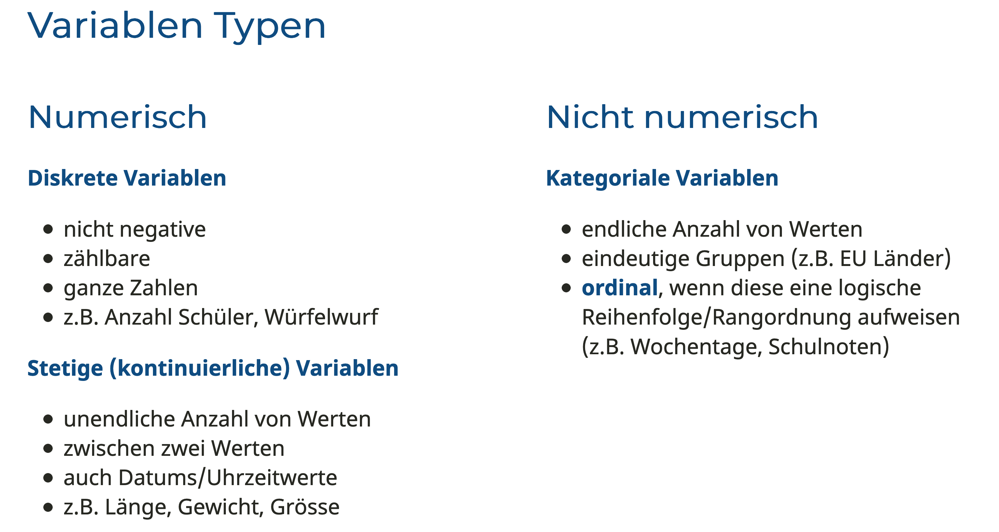

<script async defer data-domain="rstatszh.github.io/website" src="https://plausible.io/js/plausible.js"></script>

```{r setup, include=FALSE}
knitr::opts_chunk$set(echo = TRUE)
```

In dieser Hausaufgabe nutzen wir Daten aus der Bildungsstatistik des Kantons Zürich und werden diese mit uns bekannten Werkzeugen erkunden und visualisieren. 

# Ziele

Diese Hausaufgabe hat die folgenden Ziele:

- Erfahrungen mit den Hauptfunktionen des `{dplyr}` Package sammeln
- Die Elemente einer vorgegebenen `{ggplot2}´ Visualisierung zu identifizieren und diese zu rekunstrieren

# Erste Schritte

Öffne deine Email Inbox und suche nach der Email mit dem Link für das GitHub Repo zu dieser Hausaufgabe (ha-04-mehr-dplyr). Alternativ kannst du GitHub öffnen und in unserer GitHub Organisation nach dem Repo mit deinem Namen suchen.

Folge den Schritten aus Hausaufgabe 1 oder den Folien der Woche 2 um das GitHub Repo in deine RStudio Cloud zu clonen. 

# Packages

In dieser Hausaufgabe werden wir weiterhin hauptsächlich das R Package `{dplyr}` aus der Sammlung der `{tidyverse}` Packages nutzen. Zusätzlich nutzen wir vereinzelt Funktionen aus R Packages, welche du noch nicht kennegelernt hast.

```{r lade-packages, message=FALSE}

library(dplyr)
library(ggplot2)
library(readr)
library(tidyr)  # Neu in dieser Hausaufgabe

```

# Data 

## Übersicht über alle Lernenden im Kanton Zürich

Ein Datensatz publiziert von der [Bildungsstatitik Kanton Zürich](https://pub.bista.zh.ch/de/). Der Datensatz ist öffentlich [auf opendata.swiss verfügbar](https://opendata.swiss/de/dataset/ubersicht-uber-alle-lernenden-im-kanton-zurich) und wird auch auf einer Seite der Bildungsstatistik selbst mit [Visualisierungen dargestellt](https://pub.bista.zh.ch/de/zahlen-und-fakten/sdl/uebersicht-ueber-alle-lernenden/auswertungen-in-absoluten-zahlen/).

# Aufwärmen 

1. Öffne die R Markdown Datei für die Übung
2. Stricke die Datei zu einer HTML Datei
3. Aktualisiere den YAML Header in dem du deinen Namen und das Datum hinzufügst
4. Passe das Aussehen des Dokuments über die "Output Options" an 
5. Stricke das Dokument erneut

🧶 ✅ ⬆️ *Knit, commit und push deine Änderungen auf GitHub mit einer Commit-Nachricht deiner Wahl. Achte darauf, alle geänderten Dateien zu committen und zu pushen, damit dein Git-Fenster danach aufgeräumt ist.*

# Übungen - Lernende im Kanton Zürich

## Übung 1 - Daten Importieren

Ich habe die Daten für dich bereits importiert, auf das Jahr 2019 eingeschränkt und die NAs entfernt. Wir werden in allen folgenden Übungen, bis auf Übung 6 dem Objekt `lernende2019` arbeiten.

```{r daten-importieren}
# Der Link zu den Daten wird hier als Objekt gespeichert 
# und taucht oben rechts in deinem  "Environment" auf
link <- "https://www.web.statistik.zh.ch/ogd/data/bista/ZH_Uebersicht_alle_Lernende.csv"

# Hier wird nun das Objekt "link" genutzt um die CSV zu lesen
lernende <- read_csv(file = link, 
                     locale = locale(encoding = "ISO-8859-1"))
```

```{r daten-eingrenzen}

# Ich habe die Daten hier auf das Jahr 2019 gefilterert und NAs entfernt
lernende2019 <- lernende %>% 
   filter(Jahr == 2019) %>% 
   drop_na() # Die letzte Zeile 1960 weisst eine Zeile mit NAs auf

```

## Übung 2 - Daten beschreiben

In dieser Übung geht es darum die Daten zu erkunden und zu beschreiben. Dazu schauen wir uns auch nochmals die Variablen Typen innerhalb des Dataframes `lernende2019` an. 

Variablen können ganz allgemein in numerische und nicht-numerische unterteilt werden. Innerhalb der numerischen Variablen, wird zwischen diskreten und kontinuierlichen Variablen unterschieden.

**Diskrete Variablen** sind numerische Variablen, die zwischen zwei beliebigen Werten eine zählbare Anzahl von nicht negativen Werten aufweisen. Eine diskrete Variable ist immer numerisch. Beispiele: Die Anzahl Schüler in der Primarschule oder das Ergebnis eines Wurfs eines Würfels. 

**Stetige (kontinuierliche) Variablen** sind numerische Variablen, die zwischen zwei beliebigen Werten eine unendliche Anzahl von Werten aufweisen. Stetige Variablen können aus numerischen oder Datums-/Uhrzeitwerten bestehen. Beispiel: die Länge eines Teils oder Datum und Uhrzeit eines Zahlungseingangs

Nicht-numerische Variablen werden auch als kategoriale Variablen bezeichnet. 

**Kategoriale Variablen** umfassen eine endliche Anzahl von Kategorien oder eindeutigen Gruppen. Kategoriale Daten müssen nicht zwangsläufig eine logische Reihenfolge aufweisen (z.B. Materialtyp, Zahlungsmethode, Automarke). Wenn die Daten eine logische Reihenfolge aufweisen, dann werden sie auch als ordinal bezeichnet (z.B. Wochentage, Schulnoten).  

```{r, echo=FALSE}



```

Die Fragen für diese Übungen sind in der Vorlage für die Hausaufgabe hinterlegt.

## Übung 3 - Daten visualisieren

Ich habe hier einen Plot mit dem Dataframe `lernende2019` vorbereitet. In dieser Übung geht es darum, dass du die einzelnen Elemente des Plots (x-Achse, y-Achse, etc.) studierst und versuchst den Plot selnst zu rekonstruieren.

 **Tipp: Nutze `geom_col()` und nicht `geom_bar()`**

```{r, echo=FALSE}

ggplot(lernende2019, aes(x = Stufe, y = Anzahl, fill = Staatsangehoerigkeit)) +
   geom_col() +
   coord_flip() +
   scale_y_continuous(breaks = seq(0, 100000, 10000)) +
   scale_fill_viridis_d() +
   labs(title = "Anzahl Schüler_innen",
        subtitle = "Kanton Zürich, 2019",
        fill = "Staatsangehörigkeit",
        caption = "Daten: https://opendata.swiss/de/dataset/ubersicht-uber-alle-lernenden-im-kanton-zurich") +
   theme_minimal() +
   theme(legend.position = "bottom", panel.grid.major.y = element_blank())

```

## Übung 4 - Daten eingrenzen

Die Übung ist in der Vorlage für die Hausaufgabe beschrieben.

## Übung 5 - Daten zusammenfassen

In den folgenden zwei Code-chunks findest du jeweils eine Code Sequenz, welche eine Häufigkeitstabelle mit den Spalten `Schultyp` und `n` erstellt. 

```{r, echo=TRUE, eval=FALSE}
# Häufigkeitstabelle 1 - Zusammenfassen mit count()
lernende2019 %>% 
   count(Schultyp)
```


```{r, echo=TRUE, eval=FALSE}
# Häufigkeitstabelle 2 - Zusammfassen mit group_by %>% summarise()
lernende2019 %>% 
   group_by(Schultyp) %>% 
   summarise(
      n = n()
   )
```

**Versuche den Code so anzupassen dass du folgendes Ergebnis erreichst:**

```{r, echo=FALSE, eval=TRUE}

lernende2019 %>% 
   count(Schultyp, wt = Anzahl)

```

## Übung 6 - Kurzanalyse 

Der Code für diese Aufgabe ist vorbereitet. Es geht hier darum die Lücken auszufüllen. Jede Lücke hat einen Platzhalter mit drei Unterstrichen ___, unabhänig davon wie viele Zeichen ersetzt werden sollen. Die Beschreibung der einzelnen Schritte ist in der Vorlage für die Hausaufgabe.

```{r, eval=FALSE, echo=TRUE}

lernende ___  
   drop____ %>% 
   group_by(___) %>% 
   summarise(
      Total = ___(___)
   ) %>% 
   mutate(
      Differenz = Total - ___(Total)
   ) %>% 
   mutate(
      Veraenderung = case_when(
         Differenz > ___ ~ "Zunahme",
         Differenz < ___ ~ "Abnahme"
      )
   )


```

🧶 ✅ ⬆️ *Knit, commit und push deine Änderungen auf GitHub mit einer Commit-Nachricht deiner Wahl. Achte darauf, alle geänderten Dateien zu committen und zu pushen, damit dein Git-Fenster danach aufgeräumt ist.*


