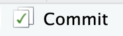

<script async defer data-domain="rstatszh.github.io/website" src="https://plausible.io/js/plausible.js"></script>

```{r setup, include=FALSE}
knitr::opts_chunk$set(echo = FALSE)
```

```{r}

library(knitr)

```


BLah Blah

# Ziele

Diese Hausaufgabe hat die folgende Ziele:

- Ein Git Repository auf GitHub selbst erstellen 
- Ein selbst erstelltes Git Repository aus GitHub in die eigene Arbeitsumgebung klonen
- Ein öffentliches Git Repository aus GitHub in die eigene Arbeitsumgebung klonen
- Eine Fork von einem öffentlichem GitHub Repository zu erstellen
- Die Begriffe "add", "commit, "push", und "pull" unterscheiden können

# Erste Schritte

Heute wirst du zum ersten Mal ein Projekt selbst erstellen. Dies bedeutet, ich habe keine Vorlage für dich vorbereitet welche aus GitHub in den Arbeitsbereich für die den Kurs gebracht wird. Die typischen ersten Schritte fallen deshalb hier weg und wir steigen direkt mit den Übungen ein.

# Übungen

## Übung 1 - Erstelle ein eigenes Git Repository

Im folgenden sind alle nötigen Schritte mit Beschreibung und Screenshots dokumentiert. Solltest du an einem Schritt nicht weiterkommen, dann melde dich bitte umgehend auf Slack. 

1. Öffne die GitHub website: github.com
2. Klicke auf das schwarze Dreieck neben deinem Benutzernamen und in dem Dropdown Menü, wähle die GitHub Organisation für deinen Kurs aus

```{r}
include_graphics(here::here("img/github-to-project/github-to-project.001.png"))
```

3. Klicke auf den grünen Button mit der Aufschrift "New" um ein neues Repository zu starten

```{r}
include_graphics(here::here("img/github-to-project/github-to-project.002.png"))
```

4. Gib dem Respository den folgenden Namen und ersetze "GITHUB_BENUTZERNAME" mit deinem GitHub Benutzernamen:

`mein-erstes-repo-GITHUB_BENUTZERNAME`

**Beachte:** Namen für Repositories sollten kurz und ohne Leerzeichen sein. Der Name sollte für dich bedeutend sein und gegebenenfalls den Namen des Projektes an welchem du arbeitest widerspiegeln. 

5. (optional): Gib dem Repository eine Beschreibung im Feld "Description"

```{r}
include_graphics(here::here("img/github-to-project/github-to-project.003.png"))
```

6. Wähle die Option "Public" aus. Dein Repository ist damit öffentlich sichtbar.
7. Setze das Häkchen neben "Add .gitignore" und klicke auf das Feld ".gitignore template: None"
8. Schreibe im Feld  "Filter ignores" den Buchstaben "R"
9. Klicke auf das blau hinterlegte Feld mit dem Buchstaben "R"

**Beachte:** Die Datei `.gitignore` definiert welche Dateien und/oder Ordner innerhalb eines Projektes **nicht** mit Git "verfolgt" werden sollen (ignoriert werden). Dies bedeutet, diese Dateien und/oder Ordner tauchen nicht auf GitHub auf. Sie sind nur lokal auf deinem Arbeitsgerät zu finden. Oft sind dies Konfigurationsdateien mit sensitiven Informationen oder Dateien die Nebenprodukte von der Arbeit mit R sind. Aber, dies können auch sensitive Daten innerhalb eines Projektes sein, welche nicht auf GitHub geteilt werden sollen, wobei jedoch der Code geteilt werden soll. 

```{r}
include_graphics(here::here("img/github-to-project/github-to-project.004.png"))
```

10. Setze **kein** Häkchen bei "Add a README file" und "Choose a license" und klicke auf "Create repository"

```{r}
include_graphics(here::here("img/github-to-project/github-to-project.005.png"))
```

Bewundere dein neues Repo und sei nicht eingeschüchtert von dem schwer nach zu vollziehbaren Text.

11. Klicke auf das Klemmbrett-Symbol um den Link zu deinem neuen Respository in die Zwischenablage zu kopieren

```{r}
include_graphics(here::here("img/github-to-project/github-to-project.006.png"))
```

12. Öffne die Website rstudio.cloud und logge dich wie gewöhnlich mit deinen GitHub Zugangsadaten ein

**Achtung:** Falls du dies noch nicht eingerichtet hast, siehe [Hausaufgabe 01 - Verbindung zu GitHub und RStudio Cloud aufbauen](https://rstatszh.github.io/website/ha-01-hallo-git.html#verbindung-zu-github-und-rstudio-cloud-aufbauen).

```{r}
include_graphics(here::here("img/github-to-project/github-to-project.007.png"))
```

13. Öffne den Arbeitsbereich für deinen Kurs

```{r}
include_graphics(here::here("img/github-to-project/github-to-project.008.png"))
```

14. Klicke auf den Pfeil nach unten auf dem Button "New Project"
15. Klicke auf "New Project from Git Repository"

```{r}
include_graphics(here::here("img/github-to-project/github-to-project.009.png"))
```

16. Füge den Link, welchen du von GitHub in deine Zwischenablage kopiert hast, hier in das Fenster "URL of your Git Repository" ein.
17. Lasse das Häkchen unter "Packages" gesetzt und klicke auf "OK"

```{r}
include_graphics(here::here("img/github-to-project/github-to-project.010.png"))
```

Bewundere dein aus GitHub selbst erstelltes Projekt. 

18. Im Fenster unten rechts öffne den Reiter "Files" und klicke auf die Datei `.gitignore` um diese oben rechts im Code Editor zu öffnen.

Scroll durch die Datei und beachte, dass auf Zeile 2 die Datei `.Rhistory` ignoriert wird.

19. Schliesse die `.gitignore` Datei wieder in dem du auf das kleine "x" neben dem Dateinamen oben rechts im Code Editor klickst 

```{r}
include_graphics(here::here("img/github-to-project/github-to-project.011.png"))
```

20. Öffne den "Git" Reiter im Fenster oben rechts

**Beachte:** Hier ist die Datei "project.Rproj" aufgetaucht. Die zwei gelben Fragezeichen unter "Status" bedeuten, dass diese Datei noch nicht von Git "verfolgt" wird. Die Datei wurde neu erstellt als du in RStudio Cloud auf "New Project" geklickt hast. Die Datei `.gitignore` taucht hier nicht auf. Git "verfolgt" diese Datei bereits, da wir sie beim Erstellen des Repositories auf GitHub hinzugefügt haben. Auch die Datei `.Rhistory` taucht nicht auf, da wir in der `.gitignore` Datei definiert haben diese nicht zu "verfolgen". 

```{r}
include_graphics(here::here("img/github-to-project/github-to-project.012.png"))
```

21. Setze nun den Haken unter "Staged" und klicke auf den "Commit" Button woraufhin sich ein neues Fenster öffnet. 

```{r, out.width="10%"}

```


**Beachte:** Der Status ändert sich zu einem grünen A welches für "add" steht. Du hast Git nun signalisiert, dass diese Datei zu dem Git Repository hinzugefügt werden soll. Der Haken unter staged, bedeutet, dass diese Datei im nächsten Commit enthalten sein soll. 

```{r}
include_graphics(here::here("img/github-to-project/github-to-project.013.png"))
```

22. Im Feld "Commit message", schreibe: "R Project gestartet"
23. Klicke auf den "Commit" Button unter dem Feld, welches die Commit Nachricht enthält. Ein neues Fenster öffnet sich.

```{r}
include_graphics(here::here("img/github-to-project/github-to-project.014.png"))
```


24. Schliesse das neue Fenster indem du auf den "Close" Button klickst. Schliesse auch den Browser Tab, welches sich geöffnet hatte um die Commit Nachricht zu schreiben. 


```{r}
include_graphics(here::here("img/github-to-project/github-to-project.015.png"))
```

24. Zurück im Browser Tab mit dem geöffneten RStudio Projekt, öffne erneut die Datei `.gitignore`. Scroll ganz an das Ende der Datei auf die Zeile 40 und füge eine neue Zeile ein indem du auf die Enter Taste auf deiner Tastatur drückst. Füge Text mit einem # hinzu und schreibe "# Ignoriere folgende Dateien". Auf einer neuen Zeile, schreibe `*.csv`. Speicher die Datei in dem du das Tastaturkürzel "Ctrl + S (Windows)" nutzt oder auf: File -> Save in RStudio klickst

```{r}
include_graphics(here::here("img/github-to-project/github-to-project.016.png"))
```

**Beachte:** Du sagst Git hier, dass alle Dateien in deinem Projekt mit der Endung `.csv` ignoriert werden sollen. 

25. Öffne den Git Reiter im Fenster oben rechts, setzte den Haken bei staged um die Veränderungen im nächsten Commit hinzuzfügen, und klicke auf den Commit Button. 

```{r}
include_graphics(here::here("img/github-to-project/github-to-project.017.png"))
```


**Beachte:** Hier ist die Datei ".gitignore" aufgetaucht. Falls nicht, dann klicke auf den "Aktualisieren Button" ganz rechts neben "main". Das blaue M steht für "modified" (de: verändert). Git verfolgt diese Datei bereits und hat hier gemerkt, dass Veränderung an der Datei gemacht wurden.  Der Status ändert sich nicht, aber das blaue M bewegt sich etwas nach links. Die Dateu ist erneut "staged" und Git wird damit signalisiert, dass diese im nächsten Commit enthalten sein soll. 

Schaue nun in das untere Fenster, welches in dem grünen Bereich die Veränderungen anzeigt, welche du an der `.gitignore` Datei gemacht hast.

```{r}
include_graphics(here::here("img/github-to-project/github-to-project.018.png"))
```

26. Im Feld "Commit message", schreibe: "Ignoriere CSV Dateien"
27. Klicke auf den "Commit" Button unter dem Feld, welches die Commit Nachricht enthält. Ein neues Fenster öffnet sich. Schliesse das neue Fenster indem du auf den "Close" Button klickst. Mache **keinen push**. 

```{r}
include_graphics(here::here("img/github-to-project/github-to-project.019.png"))
```

28. Erstelle eine neue Markdown Datei (**Achtung:** Nicht R Markdown): File -> New File -> Markdown File, und speicher die Datei mit dem Tastaturkürzel "Ctrl + S" (Windows) oder: File -> Save. Ein neues Fenster öffnet sich.

```{r}
include_graphics(here::here("img/github-to-project/github-to-project.020.png"))
```

29. Im Feld "File name:", schreibe "README" 
30. Klicke auf den Save Button

```{r}
include_graphics(here::here("img/github-to-project/github-to-project.021.png"))
```

**Beachte:** Im Fenster oben rechts unter dem Git Reiter ist nun die Datei "README.md" nun mit zwei gelben Fragezeichen hinter "Status" aufgetaucht. Du hast bereits gelernt, was dies bedeutet. Kannst du dich erinnern? 

31. Gehe erneut durch die Schritte Add, Commit, und wähle "README hinzugefügt" als Commit message. Mache jedoch mache weiterhin **keinen push**.

```{r}
include_graphics(here::here("img/github-to-project/github-to-project.022.png"))
```

32. Zurück im Browser Tab mit dem geöffneten RStudio Projekt, schreibe nun einen Text deiner Wahl in deine README Datei. Anschliessend, klicke auf den "Preview" Button um dir eine Vorschau deiner README Datei anzusehen.

```{r}
include_graphics(here::here("img/github-to-project/github-to-project.023.png"))
```

33. Öffne den "Git" Reiter im Fenster oben rechts. Setze den Haken **nur** neben der `README.md` Datei und mache einen Commit mit einer Commit Nachricht deiner Wahl. Mache jedoch mache weiterhin **keinen push**.

```{r}
include_graphics(here::here("img/github-to-project/github-to-project.024.png"))
```

**Beachte:** Die `README.md` Datei wird mit einem blauen M als "modified" angezeigt. Git "verfolgt" diese bereits und hat gemerkt, dass du Veränderungen gemacht hast. Neu taucht hier die `README.html` Datei auf. Diese ist enstanden nachdem du auf den Preview Button geklickt hast. 

34. Zurück im Browser Tab mit dem geöffneten RStudio Projekt, öffne die `.gitignore` Datei. Auf einer neuen Zeile, schreibe `README.html`. Speicher die `.gitingore` Datei

```{r}
include_graphics(here::here("img/github-to-project/github-to-project.025.png"))
```


35. Im Git Fenster oben rechts, klicke auf den Aktualisieren Button. Die `README.html` ist hier nun verschwunden und die `.gitignore` Datei taucht hier wieder auf. Warum? Setze den Haken neben `.gitignore` und mache einen Commit mit der Commit Nachricht "Ignoriere README.html". Mache jedoch mache weiterhin **keinen push**. 

```{r}
include_graphics(here::here("img/github-to-project/github-to-project.026.png"))
```

36. Klicke nun auf den "Push" Button (grüner Pfeil der nach oben zeigt) um deine Veränderung auf GitHub zu pushen.

**Beachte:** Im Git Fenster oben rechts siehst du nun eine Zeile mit dem Text `Your branch is ahead of 'origin/main' by 5 commits.` Dies bedeutet: Git hat bei dir lokal in deinem Projekt fünf Commits registriert, welche noch nicht auf GitHub sind. 

```{r}
include_graphics(here::here("img/github-to-project/github-to-project.027.png"))
```

37. Gehe zurück zu deinem Repo auf github.com, aktualisiere die Seite, und schau dich etwas um. Versuche auf die Dinge zu klicken die du wieder erkennen kannst. Unten ein paar Beispiele zum darauf klicken.

```{r}
include_graphics(here::here("img/github-to-project/github-to-project.028.png"))
```

38. Klicke auf den "Settings" Button um die Einstellungen für das Repository zu öffnen

```{r}
include_graphics(here::here("img/github-to-project/github-to-project.029.png"))
```

39. Klicke auf "Manage access" links in der Auswahlleiste
40. Klicke auf den Button "Invite teams or people"

```{r}
include_graphics(here::here("img/github-to-project/github-to-project.030.png"))
```

41. Im sich öffnenden Fenster schreibe: "larnsce" 
42. Klicke auf den blau hinterlegten Bereich
43. Im sich öffnenden Fenster, setzte den blauen Kreis auf "Admin" und klicke auf "Add larnsce to this repository"

```{r}
include_graphics(here::here("img/github-to-project/github-to-project.031.png"))
```

**Beachte:** Das Repository ist "public" und damit öffentlich sichbar. Jede Person kann dieses Repository "clonen" und damit in RStudio weiterarbeiten. So wie du es am Anfang gemacht hast um es in die RStudio Cloud zu bringen. Aber: Nicht jede Person kann auch wieder zurück auf diese Repository "pushen" und damit Veränderung an deiner Version machen. Du hast mich gerade als Admin hinzugefüght, damit ich jegliche Zugangsrechte habe. Wenn du gemeinsam mit Personen aktiv an einem Repository arbeitest, empfiehlt es sich diesen mindestens die Rolle mit "Write" Zugang zu geben. Dies ermöglicht es wieder auf das Repo zu "pushen".


## Übung 2 - Klone ein öffentliches Git Repository

Letzte Woche haben wir im Kurs eine Demonstrationseinheit zu Vektoren gemacht (Demonstration 2). Für diese Einheit hatte ich keine Vorlage für dich bereitgestellt und dich darum gebeten nicht selbst aktiv mitzuschreiben. Die Demonstration 2 ist als öffentliches Git Repository auf GitHub publiziert. Dies bedeutet, dass du dir sämtlichen Code aus den Übungen selbst in deine Arbeitsumgebung klonen kannst.

1. Öffne das Repository auf GitHub: https://github.com/rstatsZH/demo-02-vektoren und nutze die dir bekannten Schritte um dieses Repository (rstatsZH/demo-02-vektoren) in die Arbeitsumgebung für den Kurs (RStudio Cloud Workspace rstatsZH-K00X) zu klonen.

```{r}
include_graphics(here::here("img/github-to-project/github-to-project.032.png"))
```

3. Öffne die R Markdown Datei "demo-02-solutions.Rmd" 
4. Stricke die R Markdown Datei "demo-02-solutions.Rmd"
5. Öffne das Git Fentser oben rechts, und:
    - add "demo-02-solutions.html"
    - commit "demo-02-solutions.html"
6. Push deine Veränderungen auf zurück auf GitHub. Was sagt die Fehlermeldung? Was könnte dies bedeuten und wie könnte dies behoben werden?

## Übung 3 - Fork ein öffentliches Git Repository

In Übung 1 hast du gelernt wie man jemanden als Collaborator zu einem Git Repository auf GitHub hinzufügt. In Übung 2 hast du gesehen, was passiert wenn du ein öffentliches GitHub Respository klonst aber selbst kein Collaborator bist. Diese Übung soll dir nun zeigen, wie du mit einem öffentlichen Repository selsbtständig weiterarbeiten kannst und deine Veränderung zurück auf GitHub pushen kannst.

1. Öffne das Repository auf GitHub: https://github.com/rstatsZH/demo-02-vektoren und klicke auf den "Fork" Button. Ein neues Fenster öffnet sich. 

```{r}
include_graphics(here::here("img/github-to-project/github-to-project.033.png"))
```

2. Klicke auf deinen Benutzernamen. 

```{r}
include_graphics(here::here("img/github-to-project/github-to-project.034.png"))
```

3. Schau dir den Namen des Repository genau an. Was könnte dies bedeuten?

```{r}
include_graphics(here::here("img/github-to-project/github-to-project.035.png"))
```

4. Nutze die dir bekannten Schritte um dieses Repository (DEINNAME/demo-02-vektoren) in die Arbeitsumgebung für den Kurs (RStudio Cloud Workspace rstatsZH-K00X) zu klonen  
5. Öffne die die R Markdown Datei "demo-02-solutions.Rmd" 
6. Stricke die R Markdown Datei "demo-02-solutions.Rmd"
7. Öffne das Git Fentser oben rechts, und:
    - add "demo-02-solutions.html"
    - commit "demo-02-solutions.html"
8. Push deine Veränderungen auf zurück auf GitHub.

# Grosses "Danke Schön" und Gratulation!

Du hast soeben den Grundstein für ein Verständnis über kollaboratives Arbeiten mit Git und GitHub gelegt. Danke, dass du die mehr als 50 Schritte durchgegangen bist! Es ist weiterhin völlig normal wenn sich das was dort im Hintergund passiert fremd und ungeheuerlich anfühlt. Erst wenn diese Schritte dutzende Male durchgeführt wurden und effektiv mit Anderen an Projekten gearbeitet wird, bildet sich ein Verständnis für die Prozesse die dort im Hintergrund laufen.
