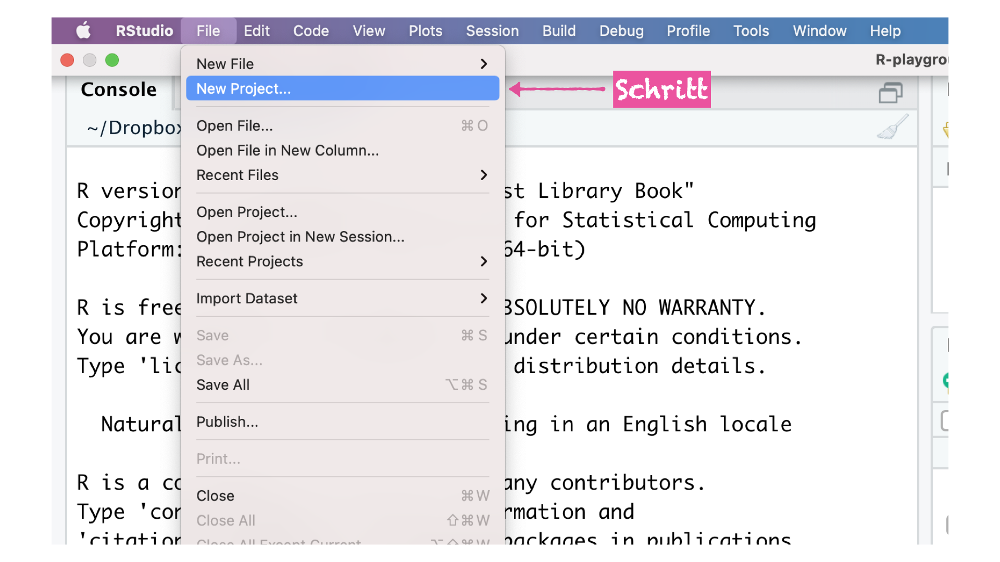
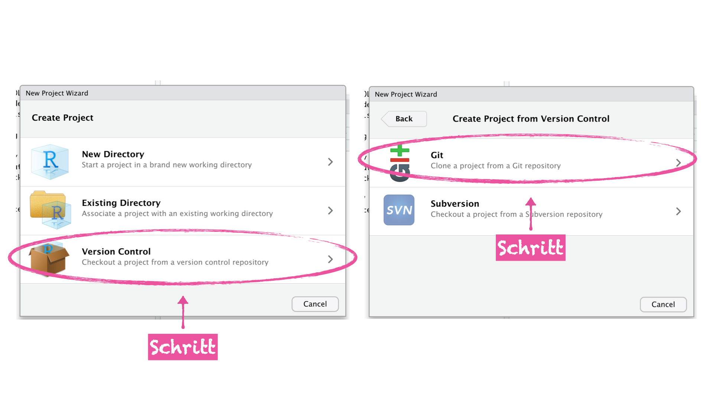
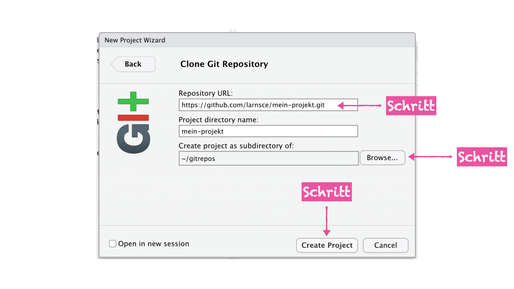
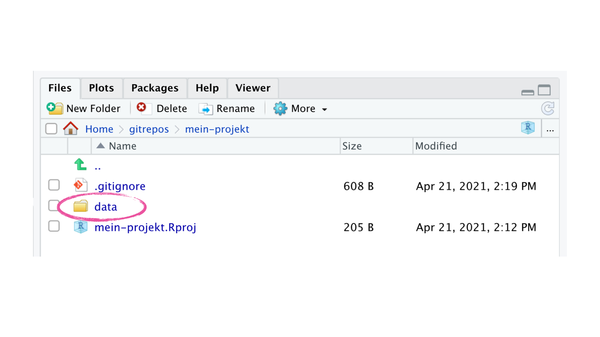
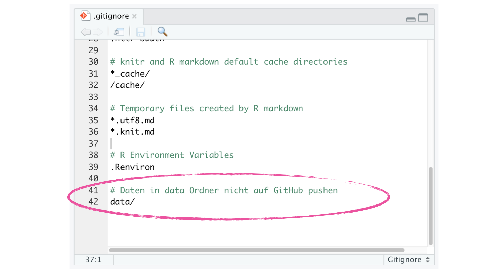

<script async defer data-domain="rstatszh.github.io/website" src="https://plausible.io/js/plausible.js"></script>

```{r setup, include=FALSE}
knitr::opts_chunk$set(echo = FALSE)
```

```{r}
library(knitr)
library(dplyr)
library(tidyr)
library(readr)
library(ggplot2)
library(forcats)
library(DBI)
library(palmerpenguins)
```


# Ziele

Diese Hausaufgabe hat die folgende Ziele:

- Ein RStudio Project mittels eines selbst erstellten GitHub Repositories auf dem eigenen Arbeitsgerät starten
- Daten für eine Projektarbeit identifizieren 
- Mehr Erfahrungen mit dem Tranformieren und Visualisieren von Daten sammeln
- SQL Befehle in Code-chunks innerhalb einer R Markdown Datei ausführen 

# Erste Schritte

Diese Hausaufgabe besteht aus drei Teilen:

1. Abschluss Projektarbeit (Pflicht)
2. Daten über Treibhausgase in der Stadt Zürich (Zum Teil Bonusmaterial)
3. SQL Befehle in R Markdown (Falls es relevant fpr deine Arbeit ist)

Öffne deine Email Inbox und suche nach der Email mit dem Link für das GitHub Repo zu dieser Hausaufgabe (ha-06-projekarbeit). 

# Übungen - Teil 1 - Projektarbeit

Im Anschluss an die sieben Kurseinheiten bekommt ihr die Gelegenheit als Teil eines kleinen Abschlussprojektes Unterstützung zu erhalten. 

Dafür braucht es ein paar Vorraussetzungen:

1. R, RStudio und Git sind auf euren Arbeitsgeräten installiert
2. Daten für die Projektarbeit sind ausgewählt
3. Ein öffentliches (public) GitHub Repository wurde erstellt **oder** ein geschlossenes (private) GitHub Repository wurde erstellt zu welchem der GitHub Benutzer larnsce als Collaborator hinzugefügt wurde.

**Beachte:** Auch Projekte mit sensitiven und schützenswerten Daten können öffentlich publiziert werden. Dazu werden Ordner und/oder Dateien mit den zu schützenden Daten in der `.gitignore` Datei hinzugefügt. Somit wird erreicht, dass die Daten nicht zugänglich sind, jedoch der Code für die Arbeit mit den Daten, was deutlich zu einer transparenten Arbeitsweise beiträgt auch wenn die Ergebnisse nicht reproduzierbar sind. Dabei wird empfohlen sich innerhalb der Verwaltungseinheit mit den zuständigen Mitarbeiter_innen für Datenschutz in Verbindung zu setzen. 

4. Das GitHub Repository auf das eigene Arbeitsgerät klonen und daraus ein RStudio Project machen

Diese Übung soll sicherstellen, dass all diese Vorraussetzungen erfüllt sind.

## Installation von R, RStudio und Git

1. Falls die Software noch nicht vorhanden ist, wende dich an die IT Unterstützung um die nötige Software installiert zu bekommen. Du kannst in der Zwischenzeit bis zu dem Punkt fortfahren an dem ich dich bitte RStudio auf deinem Arbeitsgerät zu öffnen.

Liste mit Software für IT: https://github.com/rstatsZH/kochbuch/tree/main/01-Installation

## Daten für das Projekt

Ideale Daten für das Projekt gibt es nicht, jedoch ist es sinnvoll nicht unbedingt Daten auszuwählen welche streng vertraulich sind, oder Daten welche Teil eines sehr grossen Projektes sind. Bereits öffentlich verfügbare Daten sind wertvoll wenn es euch wichtig ist das Projekt öffentlich und reproduzierbar zu publizieren. Das wichtigste Kritierium an die Daten ist jedoch, dass ihr Interesse daran habt den Datensatz zu erkunden und Fragen zu stellen und zu beantworten.

1. Einen Datensatz, oder mehrere Datensätze, für das Projekt identifizieren.

## GitHub Repository erstellen

Wie das geht hast du in [Übung 1 der Hausaufgabe aus Woche 5](https://rstatszh.github.io/website/ha-05-erstes-projekt.html#%C3%BCbung-1---erstelle-ein-eigenes-git-repository) gelernt. Falls du Schwierigkeiten hast meiner Anleitung zu folgen, melde dich umgehend und ich kann dich unterstützen. 

Abweichend von der Anleitung ist Folgendes:

- 1. + 2. Schritt: Diese Schritte kannst du überspringen und das neue Repository unter deinem Benutzernamen erstellen. Beginne also mit dem 3. Schritt und erstelle ein neues Repository in deinem persönlichen Benutzer Account.
- 4. Schritt: Überlege dir hier einen eigenen, sinnvollen Namen für das Repository
- 6. Schritt: Entscheide hier selbst darüber ob du das Repository öffentlich (public) oder geschlossen (private) zugänglich machen möchtest. 

Auch wird dieses Mal kein Project in der RStudio Cloud erstellt, sondern auf deinem eigenen Arbeitsgerät. Überspringe deshalb die Schritte 12 bis 17 und ersetze diese durch Folgendes:

- Öffne RStudio auf deinem Arbeitsgerät
- Klicke auf File > New Project. Ein neues Fenster öffnet sich.

```{r}

```

- Klicke auf "Version Control", dann klicke auf "Git"

```{r}

```

- Füge die URL aus deiner Zwischenablage im Feld "Repository URL" ein. Im Feld "Project directory name:" wird der Name des Repositories übernommen. 


- Wähle über den Button "Browse..." den Ordner auf deinem Arbeitsgerät aus, in dem du das Repository speichern möchtest (**Tipp:** Ich empfehle einen Ordner names "gitrepos" zu erstellen, welcher sich so nah wie möglich am Stammpfad des Laufwerks (Lokaler Datenträger) auf deinem Arbeitsgerät befindet. Im Windows Betriebssystem ist dies üblicherweise "C:". As bietet sich an, an dem Ort 'C:\gitrepos' nur Ordner anzulegen, welche auch ein Git Repository sind. Dies erlaubt eine saubere Trennung zwischen allgemeinen Ordnern auf deinem Arbeitsgerät und solchen die ein Git Repository sind. 

```{r}

```


- Klicke auf "Create Project", was für dich die folgenden drei Dinge erstellt
- ein Ordner auf deinem Arbeitsgerät
- ein lokales Git Repository welches mit einem remote GitHub Repository verbunden ist
- ein RStudio Project
- Betrachte dein offenes RStudio Project
- Folge nun noch den Schritten 38 bis 43 aus der Hausaufgabe 5.

Als nächstes könntest du mittels eines Dateimanagers (z.B. Windows File Explorer) deine Daten für das Projekt in dieses Repository kopieren. Es empfiehlt sich dazu innerhalb des Repositories einen Ordner namens "data" zu erstellen und die Daten dort abzulegen.

```{r}

```

Wie du nun weiter machst ist dir überlassen. Möchtest du nicht, dass die Daten welche lokal gespeichert sind auf GitHub auftauchen? Dann füge den Pfad an dem diese liegen zu deiner `.gitignore` Datei hinzu (siehe Screenshot und ersetze den Namen data ggf. durch den Namen den du für diesen Ordner gewählt hast. 

```{r}

```

Auch ist es nützlich eine README.md Datei zu erstellen und diese im Stammpfad des Repositories zu speichern. In der README kannst du dein Projekt beschreiben oder wichtige Vorraussetzungen für die Nutzung und Wiederverwendbarkeit deklarieren (Lizenzen). 

Sobald du zufrieden bist mit dem Aufbau deines Projektordners kannst du deine Veränderung mittels den dir bekannten Schritten und unter dem Git Reiter oben rechts in RStudio zurück auf GitHub pushen. 

# Übungen - Teil 2 - Treibhausgase 

## Übung 1 - Daten importieren

1. Importiere Die CSV Ressource aus dem folgendenden Metadateneintrag in deine Arbeitsumgebung: https://opendata.swiss/de/dataset/treibhausgasemissionen-stadt-zurich-ohne-klimakorrektur-1990-20163

Dir sind zwei Wege bekannt um dies zu erreichen. Schau bei Bedarf im Praktikum 8 oder im Praktikum 9 nach. Den Namen für das Objekt in deiner Arbeitsumgebung (Environment) kannst du selbst auswählen.

2. Strick das Dokument und dann: git add, commit, push alle Veränderung zurück auf GitHub

```{r}

```

## Übung 2 - Daten transformieren und visualisieren

### 1. Pivoting

Die Daten sind derzeit in einem weiten Format. Das Ziel ist die Daten in ein langes Format zu bringen wobei nur die Spalte Jahr beibehalten wird und alle Spalten von Strom bis Heizoel_EL gedreht werden. Ich habe dir hier bereits etwas Code mit Lücken als Hilfestellung vorbereitet.

1. Erstelle ein neues Objekt in deiner Arbeitsumgebung (Environment), welches im langen Format ist in dem du die Lücken ausfüllst. Den Namen für das Objekt kannst du selbst auswählen.
2. Strick das Dokument und dann: git add, commit, push alle Veränderung zurück auf GitHub

```{r, eval=FALSE}

___ <- ___ %>% 
  ____longer(
    
    # In diesem Argument werden die Spalten ausgewählt welche gedreht werden
    ___ = !Jahr,            
    
    # In diesem Argument wird der Name für die neue Spalte definiert, welche
    # die Namen aus den zuvor ausgewählten Spalten enthält
    ___ = "Energietraeger", 
    
    # In diesem Argument wird der Name für die neue Spalte definiert, welche
    # die Werte aus den zuvor ausgewählten Spalten enhält
    ___ = "Emissionen"
  )

```

### 2. Daten zusammenfassen und neue Variable erstellen

1. Wieviele Spalten und Reihen hat das neue Objekt welches du im Schritt zuvor erstellt hast? **Beachte:** Falls dies **nicht** 3 Spalten und 216 Reihen sind, gehe nochmals zur vorherigen Übung und überprüfe deinen Code

2. Starte mit dem neu erstellten Objekt im langen Format, und erstelle eine Code Sequenz, in welcher:

- die Funktion `group_by()` die Daten nach dem Jahr gruppiert
- die Funktion `summarise()` die Summe der Emmissionen pro Jahr zu berechnet
- die Funktionen `mutate()` und `lag()` die Differenz der Summen zwischen den Jahren berechnen

3. Speicher das Ergebnis als ein neues Objekt in deiner Arbeitsumgebung (Environment) mit einem Namen deiner Wahl

### 3. Daten visualisieren 1

1. Starte mit dem Objekt, welches du in Schritt 3 der vorheringen Übung erstellt hast
2. Erstelle ein Säulendiagram und lege das Jahr auf die x-Achse und die Differenz der Emissionen zwischen den Jahren auf die y-Achse
3. **Bonus:** Warum ist auf der x-Achse immer nur für alle zehn Jahre ein Tick mit Beschriftung?  
4. **Bonus:** Wandle den Typen der Variable "Jahr" in eine Variable mit dem Typ Faktor um bevor du den Plot erstellst
5. **Bonus:** Passe das Layout des Plots beliebig an

### 4. Daten visualisieren 2 (Bonus)

1. Nutze das Objekt welches du in "2.1 Pivoting" erstellt hast, und:
- Nutze die Funktion `group_by()` um die Daten nach dem Jahr zu gruppieren
- Nutze die Funktion `filter()` um in der Spalte Jahr nur das Jahr 1990 und das Jahr 2016 anzuzeigen
- Wieviele Wege fallen dir ein um auf das Ergebnis zu kommen?
2. Speicher das Ergebnis als ein neues Objekt in deiner Arbeitsumgebung (Environment) mit einem Namen deiner Wahl
3. Reproduziere folgendes verbundenes Säulendiagramm

```{r}

ghg <- read_csv("https://data.stadt-zuerich.ch/dataset/ugz_treibhausgasbilanz/download/ugz_treibhausgasbilanz.csv")

ghg_long <- ghg %>% 
  pivot_longer(cols = !Jahr,
               names_to = "Energietraeger",
               values_to = "Emissionen") 

ghg_long %>% 
  filter(Jahr == max(Jahr) | Jahr == min(Jahr)) %>% 
  
  ## plot
  ggplot(mapping = aes(x = Jahr,                    
                       y = Emissionen,                  
                       color = Energietraeger))  +   
  
  geom_line(size = 1) + 
  geom_point(size = 3) +
  
  # Plot Styling ab hier  
  labs(title = "Treibhausgasemissionen in der Stadt Zürich, 1990 und 2016",
       subtitle = "inklusive internationalem Flugverkehr, ohne Klimakorrektur",
       y = "Treibhausgasemissionen [t CO2eq/Person]",
       x = NULL,
       caption = "Daten: https://data.stadt-zuerich.ch/dataset/ugz_treibhausgasbilanz",
       fill = "Energieträger") +
  scale_x_continuous(limits = c(1990, 2016), 
                     breaks = c(1990, 2016)) +
  scale_color_brewer(type = "qual") +
  theme_minimal() +
  theme(panel.grid.minor = element_blank())

```

# Übungen - Teil 3 - SQL Befehle in R

In R Markdown Dokumenten kann Code aus verschiedenen Programmiersprachen ausgeführt werden. Dies wird mittels der Code-chunks gesteuert und es erlaubt Nutzer_innen die Effizienz von SQL Datenbanken mit den Stärken von R zu verbinden.

## Übung 0 - Verbindung zu einer Datenbank herstellen

In dieser Übung nutzen wir die Verbindung zu einer Datenbank welche ich mittels des folgenden Codes erstellt habe. In der Praxis wird hier die Verbindung zu der Datenbank erstellt, welche von der Verwaltungseinheit gepflegt wird.

Der Name des Objektes mit der Verbindung zur Datenbank ist hier `con`, es kann jedoch ein beliebiger Name gewählt werden.

```{r}
library(DBI)

con <- DBI::dbConnect(RSQLite::SQLite(), ":memory:")
```

## Übung 1 - Verbindung zu einer Tabelle herstellen

Ich habe auch mittels des folgenden Codes den `penguins` Datensatz aus dem `palmerpenguins` Package in die Datenbank kopiert. Die Tabelle ist jetzt in unserer Datenbank hinterlegt.

1. Führe den Code-chunk aus

```{r}
copy_to(con, penguins)
```

2. Führe den Befehl `dbListTables(con)` im folgenden R Code-chunk aus
3. Führe den Befehl `dbListFields(con, "penguins)` im folgenden R Code-chunk us

```{r, eval=FALSE}
dbListTables(con)
dbListFields(con, "penguins")
```

## Übung 2 - SQL Code-chunk einfügen

1. Klicke auf das kleine grüne C+ im oberen Bereich des Fensters. Ein Dropdown Menü öffnet sich. 
2. Klicke auf das SQL Symbol
3. Füge das Objekt `con` hinter das "=" Zeichen im obersten Bereich des Code-chunk. Dies sollte folgendermassen aussehen: `{sql connection=con}`
4. Schreibe nun `SELECT * FROM penguins` in den Code-chunk 
5. Führe den Code-chunk aus

```{sql connection=con, eval=FALSE}
SELECT * FROM penguins
```

## Übung 3 - SQL Code schreiben

1. Füge einen SQL Code-chunk hinzu mit einer Verbindung zum Objekt `con`
2. Schreibe dir bekannten SQL Code um die durchschnittliche Schnabellänge (Variable: `bill_length_mm`) gruppiert nach den Variablen `island` und `species` zu berechnen
3. Führe den Code-chunk aus

```{sql connection=con, eval=FALSE}
SELECT species, island, AVG(bill_length_mm) AS avg_bill
FROM penguins
GROUP BY species, island
```

## Übung 4 - SQL Abruf als Objekt speichern

1. Kopiere den Code-chunk aus der vorherigen Übung
2. Füge nach "con" ein Komma ein und dann `output.var="penguins_avg"` um den Output des Code-chunks als Objekt in einer Arbeitsumgeung (Environment) zu speichern. Dies sollte folgendermassen aussehen:

`{sql connection=con, output.var="penguins_avg"}`

3. Führe den Code-chunk aus und überprüfe ob das Objekt in deiner Arbeitsumgebung (Environment) auftaucht

```{sql connection=con, output.var="penguins_avg"}
SELECT species, island, AVG(bill_length_mm) AS avg_bill
FROM penguins
GROUP BY species, island
```