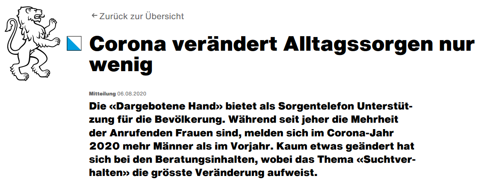
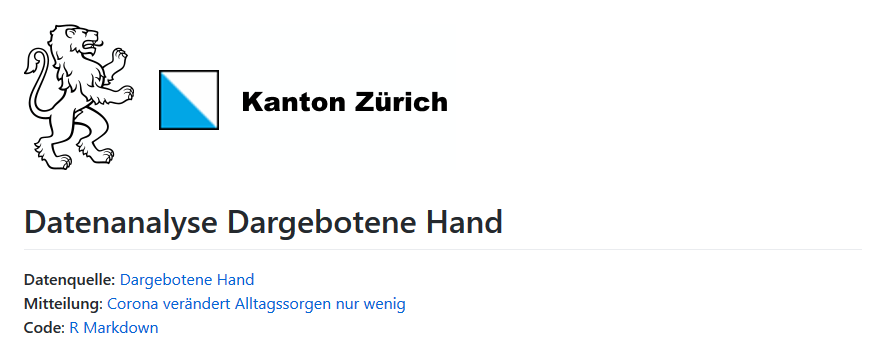
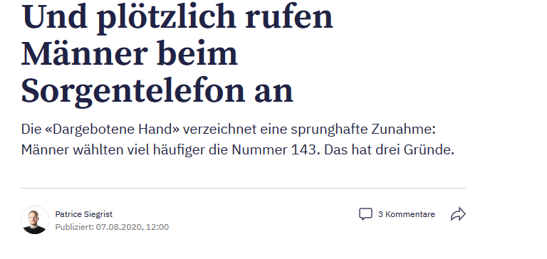
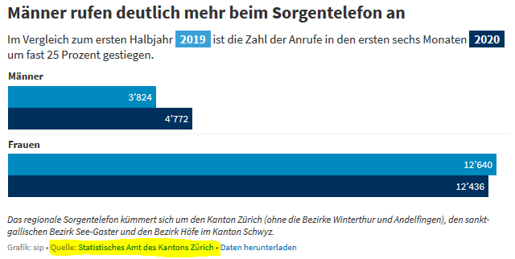

```{r child = "../setup.Rmd"}

```

class: title-slide

# `r rmarkdown::metadata$title`
## `r rmarkdown::metadata$subtitle` 

.bottom[

```{r, echo=FALSE}
p(rmarkdown::metadata$author)
p(rmarkdown::metadata$date)
```
]


```{r meta, echo=FALSE, message=FALSE, warning=FALSE}

library(metathis)

meta() %>%
  meta_general(
    description = "Ein Überblick über den Kurs 'Datenwisschenschaften mit R'",
    generator = "xaringan and remark.js"
  ) %>% 
  meta_name("github-repo" = "statistikZH/rstatsZH") %>% 
  meta_social(
    title = "rstatsZH - Datenwissenschaften mit R",
    url = "",
    og_author = "Lars Schöbitz",    
    twitter_card_type = "summary_large_image",
    twitter_creator = "@larnsce"
  )
```

???

Mein kurzer Vortrag wird euch einen zusammenfassenden Überblick über das Angebot geben, welches wir derzeit am Statistischen Amt ausarbeiten. 

Es ist eines unserer Ziele die Zusammenarbeit mit anderen Stellen im Kanton gezielt durch ein Weiterbildungsprogramm zu Datenwissenschaften zu verbessern und vielleicht sogar zu ermöglichen. 

Nebst der statistischen Grundversorgung arbeiten wir seit einigen Jahren gezielt daran Behördendaten öffentlich verfügbar zu machen. Und dabei sind wir immer wieder auf der Suche nach mutigen Kollegen, die diesen Weg mit uns gehen.

Aber, nun erstmal fokussieren wir uns erstmal auf den Kurs: rstatsZH - Datenwissenschaften mit R

---
class: left
background-image: url(img/lars_schoebitz_profile_photo.jpg)
background-position: right
background-size: contain

# Hallo Zusammen `r emo::ji("wave")`

- Lars Schöbitz
    - Umweltingenieur
    - Toiletten-Forscher
    - Datenwissenschaftler
- R Nutzer seit 2016
- R Trainer seit 2020
- Twitter: [https://twitter.com/larnsce](https://twitter.com/larnsce)

???
Kurz zu mir: Mein Name ist Lars Schöbitz. Ich freue mich wenn ihr mich Lars nennt und hoffe es geht okay, dass ich euch Dutze.

Ich habe mal Umwelt- Hygiene und Sicherheitstechnik an einer Fachhochschule in Deutschland studiert und bin über Umwege im jahr 2012 in der Schweiz gelandet.

Hier habe ich dann 5 Jahre lang am Wasserforschungsinstitut Eawag gearbeitet und mich vor Allem mit der Sanitärversorgung im globalen Süden beschäftigt. Die Fäkalschlammbehandlung aus Toilettensystemen die nicht an die Kanalisation angeschlossen sind war mein Spezialgebiet.

Neuerdings darf ich mich auch Datenwissenschaftler nennen, da ich ein Praktikum als Data Scientist im statistischen Amt gemacht habe. 

Ich nutze R seit etwa vier Jahren. Mein Einstieg war ein 2-tägiger Workshop aber der Grossteil meiner Kompetenzen ist selbständig erworben. 

Seit etwa zwei Monaten bin ich nun offiziel als R Trainer zertifiziert. Später noch etwas mehr dazu.

---
class: left
background-position: right
background-size: contain

# rstatsZH - moderner NutzeR 

Ein **moderner NutzeR** zu werden bedeutet, Fähigkeiten, Gewohnheiten und Denkweisen für eine reproduzierbare und kooperative Arbeitsweise zu entwickeln.

Wir lernen:

1. Coding mit bewährten Verfahren (R/RStudio/tidyverse)
2. Kooperatives Arbeiten (Git/GitHub)
3. Reproduzierbare Dokumente schreiben und veröffentlichen (R Markdown)


???

In diesem Kurs geht es nicht nur darum R zu lernen. 

- Wir lernen ein gesamtes Ökosystem an Werkzeugen und Praktiken kennen, welche uns helfen werden gute Gewohnheiten für eine reproduzierbare und kooperative Arbeitsweise zu entwickeln
    
   -> Entscheidene Kompetenzen eines modernen Analytikers

- Wir werden Fähigkeiten erlernen, welche schrittweise in Eure bestehenden Arbeitsabläufe integriert werden können

- Dabei geht es allerdings nicht nur um Fähigkeiten, sondern auch um Denkweisen
    - Darüber wie wir Daten formen, Daten organisieren und Daten analysieren
    - Und wie das was wir jetzt tun unser analytisches Leben in der Zukunft besser machen kann. 
    
---
# Bewährte Verfahren

.pull-left[

## R - der Motor

```{r, out.width="50%"}


```

]

.pull-right[

## RStudio IDE - das Dashboard

```{r, out.width="50%"}


```

]

.footnote[Images by rawpixel.com]

???

Wir werden die Kombination aus R und der RStudio IDE nutzen. 

R ist die eigentliche Programmiersprache in welcher wir Code schreiben. Wenn wir die Analogie eines Autos nutzen, dann ist R der Motor. 

Die RStudio IDE (integratred development environment oder integrierte Entwicklungsumgebung) ist eine Art Benutzeroberfläche welche das Programmieren in R erleichtet. In einem Auto wäre dies das Dashboard bzw. die Konsole. 

---
# Bewährte Verfahren - Tidyverse

.pull-left[

- Ein logisch zusammenhängendes System zur
  - Daten Aufbereitung
  - Daten Exploration
  - Daten Visualisierung
  - Daten Modellierung
- Eine Designphilosophie, Grammatik und Daten Struktur
- Entwickelt um Produktivität zu unterstützen
- Haupt Entwickler: Hadley Wickham
]

.pull-right[
```{r, out.width="80%"}
knitr::include_graphics("img/tidyverse.png")
```

]

???

Tidyverse steht für eine Sammlung an sogenannten Paketen welche das Arbeiten in R deutlich erleichtern und nutzerfreundlicher machen. In dem letzten 5 Jahren hat die Programmiersprache R durch diese Pakete eine regelrechte Revolution erfahren. 

Was diese Philosophie so effektiv machen ist das hinter den Paketen ein gemeinsames nutzerzentriertes Design steht welches intuitiv ist. Es geht darum Software-Entwickler_innen produktiver zu machen. 

Der Haupt Entwickler Hadley Wickham ist ein regelrechter Star in der R Community und hat eine Menge bewegt.

---
# Bewährte Verfahren - R for Data Science

.pull-left[

- Das Buch für den Kurs
- Kostenfrei
- Geschrieben von Hadley Wickham
- Nutzt die Philosophie des Tidyverse

] 

.pull-right[

```{r, out.width="60%"}

knitr::include_graphics("img/r4ds.jpg")

```

]

.footnote[[Hadley Wickham & Garret Grolemund - R for Data Science](https://r4ds.had.co.nz/)]

???

Dementsprechend orientiert sich der Kurs auch an dem von ihm geschriebenen Buch "R for Data Science". Das Buch ist online kostenfrei verfügbar. Während des Kurses wird es uns als Text Buch zur Seite stehen. 

---
# Kollaboratives Arbeiten - Git/GitHub/R Markdown

.pull-left[

```{r}
icon::fa_git(size = 5)
```


```{r}
icon::fa_github(size = 5)
```

]

.pull-right[


```{r, out.width="50%"}


```

]

???

Git als freie Software gibt es schon seit 2005. Und obwohl es in der Software Entwickler Szene seitdem als ein wichtiges Werkzeug genutzt wird, ist erst durch Platformen wie GitHub ein regelrechter Hype entstanden welcher dazu geführt hat dass die Arbeit mit Git heutzutage deutlich verbreiteter ist und ihre Anwendung nicht nur unter Software Entwicklern findet.

Gemeinsam mit R Markdown, einem Dokumenten Format welches es erlaub R Code mit Text zu kombinieren, lässt sich so reproduzierbar und transparent arbeiten.

Wir werden diese modernen Werkzeuge für die Zusammenarbeit von Beginn an nutzen. Wir werden lernen wie wir diese Werkzeug produktiv Schritt für Schritt in unsere Arbeitsabläufe integrieren können. 

---
# Reproduzierbarkeit - Ein Beispiel

```{r}



```


.footnote[[Mitteilung: Corona verändert Alltagssorgen nur wenig](https://www.zh.ch/de/news-uebersicht/mitteilungen/2020/politik-staat/statistik/corona-veraendert-alltagssorgen-nur-wenig.html)]

???

Hier noch ein Beispiel für die Reproduzierbarkeit aus dem Statistischen Amt. 

Eines der Ziele des Projektes Gesellschaftsmonitoring COVID-19 ist es Thematische Analysen zum Einfluss auf die Gesellschaft zu erarbeiten. 

In diesem Zusammenhang haben wir im Statistischen Amt Daten von der Dargebotenen Hand erhalten welche Details zum Alter, Geschlecht der Anrufenden, und den Gesprächsinhalten beinhalten. 

Das End-Produkt ist eine Mitteleiung im ZH Web, jedoch haben wir auch die bereinigten Roh-Daten und den Quellcode auf GitHub veröffentlicht. 

---
# Reproduzierbarkeit - Ein Beispiel

```{r}



```

.footnote[[GitHub repository: statistikZH/covid19monitoring_social_Tel143](https://github.com/statistikZH/covid19monitoring_social_Tel143)]

???

Das GitHub Repository enthält die Daten und den Quellcode um die Mitteilung zu reproduzieren. 

Zum Einen bedeutet dies, dass sobald neue Daten von der Dargebotenen Hand vorliegen diese nur in die vorhandene RMarkdown Datei geladen werden brauchen um die Grafiken und Ergebnisse zu aktualisieren.

Zum Anderen bedeutet dies, dass die publizierten Daten und der Quellcode von Anderen wieder verwendet und weiter entwickelt werden kann. In diesem Fall ist dies sogar passiert.

---
# Reproduzierbarkeit - Ein Beispiel

```{r}

```


.footnote[[Tagesanzeiger Artikel: Und plötzlich rufen Männer beim Sorgentelefon an](https://www.tagesanzeiger.ch/und-ploetzlich-rufen-maenner-beim-sorgentelefon-an-823601903971)]

???

Nicht einmal ein Tag war vergangen bis die Medien uns angerufen haben aus Interesse an dem Artikel. Gemeinsam mit der Dargebotenen Hand konnten wir Fragen dazu beantworten. 

Als Statistisches Amt müssen wir eine neutrale Haltung bei der Interpretation der Ergebnisse einnehmen. Die Medien haben jedoch mehr Spielraum und so konnte der Tagesanzeiger innerhalb weniger Stunden einen eigenen Artikel publizieren, welcher einen weniger neutralen Blickwinkel auf die Interpretation der Daten legt. 

All dies war möglich, da sowohl die Rohdaten als auch der Quellcode gut dokumentiert auf GitHub geteilt wurden. Für uns ein voller Erfolg.

---
# Reproduzierbarkeit - Ein Beispiel

```{r, out.width="90%"}

```

.footnote[[Tagesanzeiger Artikel: Und plötzlich rufen Männer beim Sorgentelefon an](https://github.com/statistikZH/covid19monitoring_social_Tel143)]


---
class: middle, center, inverse

.big[# Der Kurs]

---
background-image: url(img/r_first_then.png)
background-position: center
background-size: contain

---
background-image: url(img/r_rollercoaster.png)
background-position: center
background-size: contain

.footnote[Artwork by [@Alison_Horst](https://github.com/allisonhorst/stats-illustrations)]

---
class: left
background-image: url(img/code_hero.jpg)
background-position: right
background-size: contain

# rstatsZH - moderner NutzeR

Wir werden **die Denkweise** aufbauen...  

.small[
...zu erwarten, dass das, was ihr tun wollt, möglich ist.  
...Vertrauen zu haben, dass ihr es finden könnt.  
...mit der unterstützenden Gemeinschaft weiter zu lernen.  
...Andere zu befähigen.  
]

---
# Warum dieser Kurs?

.pull-left[
- [RStudio Instructor](https://education.rstudio.com/trainers/#intro) Ausbildung
- Gezieltes Training angepasst an die Teilnehmer_innen
- Moderne und bewährte Lehrmethoden 
    - Live Coding statt starre Folien    
    - Gemeinsames Programmieren
    - Zielgerichtete formative Fragestellungen
]

.pull-right[

[
```{r, out.width="80%"}

```
](https://education.rstudio.com/trainers/)

]

---
# Warum dieser Kurs?

.pull-left[
- Persönliches Tutoring 
    - Unterstützung bei eigenen Fragestellungen
    - Unterstützung bei Übungen
- Gemeinschaftliche und langfristige Zusammenarbeit
- Freundliche und offene Zusammenarbeit 
    - [Contributor Covenant Verhaltenskodex](https://www.contributor-covenant.org/de/version/1/4/code-of-conduct/)
]

.pull-right[

[
```{r, out.width="80%"}

```
](https://education.rstudio.com/trainers/)

]

---
# Kursrahmen

- **Kosten:** 1450.00 CHF
- **Level:** Einsteiger 
- **Zeitraum:** Flexibel (siehe [Google Form für die Kursplanung](https://forms.gle/tYtUNKG4tYB8ZQhm8))
- **Aufwand:** 3 Stunden Unterricht pro Woche + Übungen + Tutoring
- **Ort:** Virtuell (Zoom)
- **Anzahl Teilnehmer:** Maximum 8
- **Arbeitsumgebung:** [RStudio Cloud](https://rstudio.cloud/)
- **Kommunikation:** Slack
- **Unverbindliche Anmeldung:** [ZH Web Formular](https://www.zh.ch/de/politik-staat/statistik-daten/rstatszh-data-science-mit-r-anmelden.html)

---

```{r}
knitr::include_graphics("img/monster_support.jpg")
```

.footnote[Artwork by [@Alison_Horst](https://github.com/allisonhorst/stats-illustrations)]

---
# Kurshinhalt (flexivel)

- **Woche 1:** Einführung 
  - Werkzeuge und Arbeitsumgebung kennenlernen
- **Woche 2:** Daten Visualisierung 1
- **Woche 3:** Daten Aufbereitung 
  - Daten manipulieren
  - Daten zusammenfassen (Excel Pivot-Tabellen in R)
- **Woche 4:** Daten Aufbereitung 
  - Konzept Tidy Data
  - Daten zusammenfügen (Excel VLOOKUP in R)
  - Daten Typen
- **Woche 5:** Daten Import und Visualisierung 2
- **Woche 6:** Daten Kommunikation und Web Scraping
- **Woche 7:** Funktionales Programmieren und Iteration

---

# Was sind eure Bedürfnisse? 

- Google Form für die Kursplanung: https://forms.gle/tYtUNKG4tYB8ZQhm8
- Welche Probleme möchtet ihr lernen zu lösen?
- Welche Erfahrungen bringt ihr mit?

--- 

# Danke 

Für die Aufmerksamkeit.

Für die R packages [{xaringan}](https://github.com/yihui/xaringan) und [{xaringanthemer}](https://github.com/gadenbuie/xaringanthemer) mit welchen die Folien geschrieben wurden.

`r hr()`

Quellcode der Folien und eine [PDF Version](https://github.com/statistikZH/rstatsZH/blob/main/kursmaterial/folien/e0_d01-ueberblick/e0_d01-ueberblick.pdf) sind im GitHub Repository [statistikZH/rstatsZH](https://github.com/statistikZH/rstatsZH) verfügbar.


