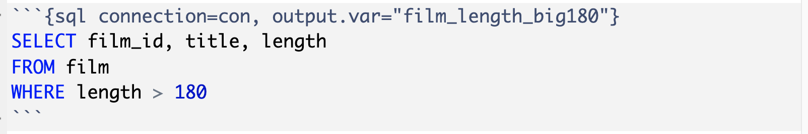

class: title-slide

```{r child = "../setup.Rmd"}

```

```{r}

library(dplyr)
library(ggplot2)
library(readr)
library(tidyr)
library(forcats)

```


# `r rmarkdown::metadata$title`
## `r rmarkdown::metadata$subtitle` 

.bottom[

```{r, echo=FALSE}
p(rmarkdown::metadata$author)
p(rmarkdown::metadata$date)

```
]

---
# Rückblick - Woche 5


---
# Hausaufgabe 5 

- ??


---
# Ziele für diese Woche

Am Ende dieser Woche könnt ihr:


---
.note[

# Demonstration 2 - Vektoren

1. Schaut mir nochmals beim Programmieren zu
2. Macht euch Notizen und stellt Fragen

]

---
class: middle, inverse

# .big[Daten importieren]

---
class: middle

# Rechteckige Daten 

.pull-left[
```{r echo=FALSE, out.width="80%"}
knitr::include_graphics("img/readr.png")
```
]
.pull-right[
```{r echo=FALSE, out.width="80%"}
knitr::include_graphics("img/readxl.png")
```
]

---
.pull-left[
## readr

- `read_csv()` - Dateien mit Kommatrennung der Spalten
- `read_csv2()` - Dateien mit Semicolon getrennten Spalten
- `read_tsv()` - Dateien mit Tab getrennten Spalten
- `read_delim()` - Dateien mit selbst definierter Trennung
]

--
.pull-right[
## readxl

- `read_excel()` - read xls or xlsx files
]

---
## Daten lesen

```{r, include=FALSE}

# Treibhausgasemissionen in der Stadt Zürich, inklusive internationalem Flugverkehr, ohne Klimakorrektur [t CO2eq/Person]

# - https://opendata.swiss/de/dataset/treibhausgasemissionen-stadt-zurich-ohne-klimakorrektur-1990-20163/resource/0c342b77-ad97-46cf-b138-cb83decf96f3

# https://data.stadt-zuerich.ch/dataset/ugz_treibhausgasbilanz

```

```{r, echo=TRUE}

treibhaus <- read_csv("data/ugz_treibhausgasbilanz.csv")
treibhaus

```

---
# Daten schreiben

## Eine Datei schreiben
```{r, echo=TRUE}

fussball_weltmeister <- tibble(
   jahr = as.integer(c(2018, 2014, 2010, 2006, 
                       2019, 2015, 2011, 2007)),
   weltmeisterschaft = c(rep("Männer", 4), rep("Frauen", 4)),
   titeltraeger = c("Frankreich", "Deutschland", "Spanien", 
                    "Italien", "USA", "USA",
                    "Japan", "Deutschland"))

write_csv(x = fussball_weltmeister, file = "data/fussball_weltmeister.csv")

```


---
## Die Datei wieder einleisen

```{r, echo=TRUE}
read_csv("data/fussball_weltmeister.csv")
```

---
class: middle, inverse

# .large[Variablen Namen]

---
# Variablen Namen

.pull-left[
```{r, echo=TRUE}

schlechte_namen <- read_csv("data/bsp_namen.csv")
names(schlechte_namen)

```

In R sind Leerzeichen in Variablen nicht erlaubt

```{r, error=TRUE, echo=TRUE}

schlechte_namen %>% 
   filter(Nachname Frau == "Meier")

```

]

.pull-right[
Möglich mit Backticks, aber mühsam

```{r, echo=TRUE}

schlechte_namen %>% 
   filter(`Nachname Frau` == "Meier")

```

]

---
# Möglichkeit 1 - Variablen namen in readr Funktion definieren

```{r, echo=TRUE}

read_csv("data/bsp_namen.csv",
         col_names = c("nachname_frau", "nachname_mann"),
         skip = 1) 

```

---
# Möglichkeit 2 - Variablen namen mit janitor Package bereinigen

- Namen werden standardmässig im sogenannten snake_case formatiert

```{r}

library(janitor)

namen <- read_csv("data/bsp_namen.csv") 

namen %>% 
   clean_names() 

```

---
class: middle, inverse

# .large[Variable Typen]

---

Welcher Variablen Typ ist die Spalte `id`?

.pull-left[
.note[ 
1. character 
2. double
3. integer
4. logical
]
]
.pull-right[
```{r echo=FALSE, out.width="80%"}
knitr::include_graphics("img/df-na.png")
```
]

---
```{r eval=FALSE, echo=TRUE}
read_csv("data/data-na.csv") 
```

```{r echo=FALSE}
read_csv("data/data-na.csv") %>% 
   print(n = 10)
```

---
# NAs beim einlesen definieren

```{r, echo=TRUE, eval=FALSE}

read_csv("data/data-na.csv", 
         na = c("NA", ".", "9999", "Not applicable"))

```

.pull-left[
```{r echo=FALSE, out.width="70%"}
knitr::include_graphics("img/df-na.png")
```
]
.pull-right[
```{r echo=FALSE,message=FALSE,}
read_csv("data/data-na.csv", 
         na = c("NA", ".", "9999",
                "Not applicable")) %>% 
   print(n = 10)
```
]

---
Welcher Variablen Typ ist die Spalte `alter`?

.pull-left[
.note[ 
1. character 
2. double
3. integer
4. logical
]
]

.pull-right[
```{r echo=FALSE, out.width="100%"}
knitr::include_graphics("img/df-na.png")
```
]

---
```{r, echo=TRUE, eval=FALSE}
dat <- read_csv("data/data-na.csv", 
                na = c("NA", ".", "9999", "Not applicable"))
dat
```

```{r, echo=FALSE, eval=TRUE}
read_csv("data/data-na.csv", 
         na = c("NA", ".", "9999", "Not applicable")) %>% 
   print(n = 10)

```

---
# Variable `alter` umwandeln - numerisch

```{r, echo=TRUE}
dat <- read_csv("data/data-na.csv", 
                na = c("NA", ".", "9999", "Not applicable"))
```

--

```{r, eval=FALSE, echo=TRUE}
dat <- dat %>% 
   mutate(alter = case_when(
      alter == "five" ~ "5",  # Wenn "alter" gleich zwanzig dann
      TRUE ~ alter)) %>% # Sonst "alter"
   mutate(alter = as.numeric(alter))
```

--

```{r}
dat %>% 
   mutate(alter = case_when(
      alter == "five" ~ "5",  # Wenn "alter" gleich zwanzig dann
      TRUE ~ alter)) %>% # Sonst "alter"
   mutate(alter = as.numeric(alter)) %>% 
   print(n = 5)

```

---
# Variable `bewertung` - Häufgkeitstabelle

.pull-left[

```{r, echo=TRUE}

dat %>% 
   count(bewertung)

```
]

.pull-right[

```{r}
knitr::include_graphics("img/df-fct.png")
```

]

---
# Variable `bewertung` - Visualisierung

```{r, echo=TRUE, out.width="80%"}

ggplot(dat, aes(x = bewertung)) +
   geom_bar() +
   coord_flip()

```

---
# Variable `bewertung` umwandeln - faktor

```{r}

vek_bewertung_lvl <-  c("trifft nicht zu", "trifft eher nicht zu",
                        "teils-teils", "trifft eher zu", "trifft zu")

dat <- dat %>% 
   mutate(bewertung = fct_relevel(bewertung, vek_bewertung_lvl))

```

---
# Variable `bewertung` - Häufgkeitstabelle

```{r, echo=TRUE}

dat %>% 
   count(bewertung)

```

---
# Variable `bewertung` - Visualisierung

```{r, echo=TRUE, out.width="80%"}

ggplot(dat, aes(x = bewertung)) +
   geom_bar() +
   coord_flip()

```

---
# Als eine Code Sequenz

```{r, echo=TRUE}
vek_bewertung_lvl <-  c("trifft nicht zu", "trifft eher nicht zu",
                        "teils-teils", "trifft eher zu", "trifft zu")

dat_clean <- read_csv("data/data-na.csv", 
                      na = c("NA", ".", "9999", "Not applicable")) %>% 
   mutate(alter = case_when(
      alter == "five" ~ "5",  # Wenn "alter" gleich zwanzig dann
      TRUE ~ alter)) %>% # Sonst "alter"
   mutate(alter = as.numeric(alter)) %>% 
   mutate(bewertung = fct_relevel(bewertung, vek_bewertung_lvl))

dat_clean %>% 
   print(n = 3)
```

---
# Daten schreiben und wieder lesen

```{r}
write_csv(dat_clean, file = "data/data-bewertung-clean.csv")

dat_clean_csv <- read_csv(file = "data/data-bewertung-clean.csv")

dat_clean_csv
```

.question[
Was ist denn nun wieder mit der Variable `bewertung` passiert?
]

---
# Funktionen: `read_rds()` und `write_rds()` 

- Zwischenergebnisse als CSV zu speichern ist unzuerverlässig, wenn bestimmte Variablen Typen beibehalten werden sollen
- `read_csv()` kann nicht wissen welche Level eine Faktor Variable hat
- Eine gute Alternative sind RDS-Dateien 
- ein R-internes Dateiformat

```{r, echo=TRUE}
write_rds(dat_clean, file = "data/data-bewertung-clean.rds")
dat_clean_rds <- read_rds(file = "data/data-bewertung-clean.rds")

dat_clean_rds
```

---
# Datenbanken - SQL queries in R

- `DBI` Package: https://dbi.r-dbi.org/
- `dbplyr` Package: https://dbplyr.tidyverse.org/index.html

---
# DBI - Mit einer Datenbank verbinden

Argumente variieren je nach Datenbank, aber das erste Argument ist immer das Datenbank Backend.

```{r, echo=TRUE}

library(DBI)

con <- dbConnect(
   
   # Hier wird das Backend definiert
   RMariaDB::MariaDB(),
   
   host = "relational.fit.cvut.cz", 
   port = 3306,
   username = "guest",
   
   # Niemals Passwort in Skript speichern
   password = rstudioapi::askForPassword("Datenbank Passwort"), 
   dbname = "sakila"
)

```

---
# DBI - Tabellen in Datenbank anzeigen

```{r, echo=TRUE}
dbListTables(con)
```

---
# DBI - Spaltennamen einer Tabelle anzeigen

```{r, echo=TRUE}
dbListFields(con, "film")
```

---
# SQL Queries in R Markdown Dateien

1. Datenbank Verbindung: Code-chunk mit `sql connection=con` starten
2. Daten Output: Resultierende Daten mit `output.var = "NAME"` als Objekt im Environment speichern
3. SQL Code schreiben

```{r}

```

```{sql connection=con, output.var="film_length_big180"}
SELECT film_id, title, length
FROM film 
WHERE length > 180
```

---
# SQL Query - Mit Daten weiter arbeiten

1. Objekt als mit Funktion `as_tibble()` in einen Tibble umwandeln

```{r}
knitr::include_graphics("img/r-chunk.png")
```

```{r, echo=FALSE}
film_length_big180 %>% 
   as_tibble()
```

---
# dbplyr - Mit Tabelle in Datenbank verbinden

```{r, echo=TRUE}
film_tab <- tbl(con, "film")
film_tab
```

---
# dbplyr - Queries als dplyr code

```{r, echo=TRUE}
film_tab %>% 
   select(film_id, title, length) %>% 
   filter(length > 180)
```

---
# dbplyr - Resultierende Daten aus Datenbank holen

```{r, echo=TRUE}
film_tab %>% 
   select(film_id, title, length) %>% 
   filter(length > 180) %>% 
   collect() #<<
```

---
# dbplyr - Queries als dplyr code

```{r}

film_tab %>% 
   summarise(min_rate = min(rental_rate),
             max_rate = max(rental_rate),
             mean_rate = mean(rental_rate)) %>% 
   collect()

```

---
# R Packages für andere Datentypen

- **googlesheets4:** Google Sheets
- **haven**: SPSS, Stata, und SAS Dateien
- **jsonline**: JSON
- **xml2**: xml
- **rvest**: web scraping
- **httr**: web APIs
- **sparklyr**: data loaded into spark

---
class: left
background-image: url(img/coffee-break.jpg)
background-position: right
background-size: contain

# Pause 

```{r, echo = FALSE}

countdown(
   minutes = 10, seconds = 0,
   left = 0, right = 0,
   padding = "15px", margin = "5%",
   font_size = "4em"
)

```

.footnote[Photo by: [Blake Wisz](https://unsplash.com/@blakewisz)]


---
class: left
background-image: url(img/coffee-break.jpg)
background-position: right
background-size: contain

# Pause 

```{r, echo = FALSE}

countdown(
   minutes = 10, seconds = 0,
   left = 0, right = 0,
   padding = "15px", margin = "5%",
   font_size = "4em"
)

```

.footnote[Photo by: [Blake Wisz](https://unsplash.com/@blakewisz)]


---
class: middle, inverse

# .big[Hausaufgabe]


---
class: middle, inverse

# .big[Feedback]

---
class: left
background-image: url(img/tor.jpg)
background-position: right
background-size: contain

# Ziele erreicht? 

Bitte ausfüllen: [kutt.it/rstatszh-eval](https://kutt.it/rstatszh-eval)

.pull-left[

.footnote[Photo by: [Virgil Cayasa](https://unsplash.com/@virgilcayasa)]

]

---
# `r emo::ji("sunflower")` Danke 

Für die Aufmerksamkeit!

Für die R packages [{xaringan}](https://github.com/yihui/xaringan) und [{xaringanthemer}](https://github.com/gadenbuie/xaringanthemer) mit welchen die Folien geschrieben wurden.

Eine PDF Version der Folien kann hier heruntergeladen werden: https://github.com/rstatsZH/website/raw/master/slides/e1_d05-vektoren/e1_d05-vektoren.pdf

`r hr()`

Für [Data Science in a Box](https://datasciencebox.org/) und [Remaster the Tidyverse](https://github.com/rstudio-education/remaster-the-tidyverse), von welchen ich Materialien für diesen Kurs nutze und welche genau wie diese Folien mit [Creative Commons Attribution Share Alike 4.0 International](https://creativecommons.org/licenses/by-sa/4.0/) lizensiert sind.