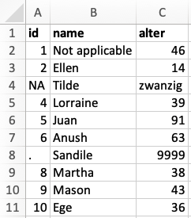
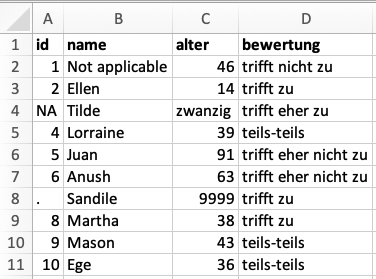

class: title-slide

```{r child = "../setup.Rmd"}

```

```{r}

library(dplyr)
library(ggplot2)
library(readr)
library(tidyr)
library(forcats)

```


# `r rmarkdown::metadata$title`
## `r rmarkdown::metadata$subtitle` 

.bottom[

```{r, echo=FALSE}
p(rmarkdown::metadata$author)
p(rmarkdown::metadata$date)

```
]

---
# Rückblick - Woche 5

- Git / GitHub
   - push / pull
   - fork
- Vektoren
   - logical
   - double
   - integer
   - character
- Funktionen zum Umgang mit einem Datum
   - `readr::parse_date()`
- Visualisierungen
   - Verbundene Streudiagramm
   - `geom_point()` + `geom_path()`

---
class: middle, inverse

# Hausaufgabe 4 - Rückblick 

---
class: middle, inverse

# Hausaufgabe 5 - Rückblick


---
# Ziele für diese Woche

Am Ende dieser Woche könnt ihr:

- Daten aus verschiedenen Formaten in R importieren
- Erkennen wann es notwendig ist Datums- und Zeitwerte aus Rohdaten in R selbst zu codieren
- Daten aus einem weiten Format in ein langes Format bringen
- Erkennen ob Daten als Tidy data klassifiert werden können 

---
.note[

# Demonstration 2 - Vektoren

1. Schaut mir nochmals beim Programmieren zu
2. Macht euch Notizen und stellt Fragen

]

---
class: middle, inverse

# .big[Daten importieren]

---
class: middle

# Rechteckige Daten 

.pull-left[
```{r echo=FALSE, out.width="80%"}
knitr::include_graphics("img/readr.png")
```
]
.pull-right[
```{r echo=FALSE, out.width="80%"}
knitr::include_graphics("img/readxl.png")
```
]

---
.pull-left[
## readr

- `read_csv()` - Dateien mit Kommatrennung der Spalten
- `read_csv2()` - Dateien mit Semicolon getrennten Spalten
- `read_tsv()` - Dateien mit Tab getrennten Spalten
- `read_delim()` - Dateien mit selbst definierter Trennung
]

--
.pull-right[
## readxl

- `read_excel()` - read xls or xlsx files
]

---
## Daten lesen

```{r, include=FALSE}

# Treibhausgasemissionen in der Stadt Zürich, inklusive internationalem Flugverkehr, ohne Klimakorrektur [t CO2eq/Person]

# - https://opendata.swiss/de/dataset/treibhausgasemissionen-stadt-zurich-ohne-klimakorrektur-1990-20163/resource/0c342b77-ad97-46cf-b138-cb83decf96f3

# https://data.stadt-zuerich.ch/dataset/ugz_treibhausgasbilanz

```

```{r, echo=TRUE}

treibhaus <- read_csv("data/ugz_treibhausgasbilanz.csv")
treibhaus

```

---
# Daten schreiben

## Eine Datei schreiben
```{r, echo=TRUE}

fussball_weltmeister <- tibble( #<<
   jahr = as.integer(c(2018, 2014, 2010, 2006, 
                       2019, 2015, 2011, 2007)),
   weltmeisterschaft = c(rep("Männer", 4), rep("Frauen", 4)),
   titeltraeger = c("Frankreich", "Deutschland", "Spanien", 
                    "Italien", "USA", "USA",
                    "Japan", "Deutschland"))

write_csv(x = fussball_weltmeister, file = "data/fussball_weltmeister.csv") #<<

```


---
## Die Datei wieder einleisen

```{r, echo=TRUE}
read_csv("data/fussball_weltmeister.csv")
```

---
class: middle, inverse

# .large[Variablen Namen]

---
# Variablen Namen

.pull-left[
```{r, echo=TRUE}
schlechte_namen <- read_csv("data/bsp_namen.csv")
names(schlechte_namen)
```

In R sind Leerzeichen in Variablen nicht erlaubt

```{r, error=TRUE, echo=TRUE}
schlechte_namen %>% 
   filter(Nachname Frau == "Meier")
```

]

--

.pull-right[
Möglich mit Backticks, aber mühsam

```{r, echo=TRUE}

schlechte_namen %>% 
   filter(`Nachname Frau` == "Meier")

```

]

---
# Möglichkeit 1 - Variablen namen in readr Funktion definieren

```{r, echo=TRUE}

read_csv("data/bsp_namen.csv",
         col_names = c("nachname_frau", "nachname_mann"),
         skip = 1) 

```

---
# Möglichkeit 2 - Variablen namen mit janitor Package bereinigen

- Namen werden standardmässig im sogenannten snake_case formatiert

```{r, echo=TRUE}
library(janitor)

namen <- read_csv("data/bsp_namen.csv") 

namen %>% 
   clean_names() 
```

---
class: middle, inverse

# .large[Variable Typen]

---

Welcher Variablen Typ ist die Spalte `id`?

.pull-left[
.note[ 
1. character 
2. double
3. integer
4. logical
]
]
.pull-right[
```{r echo=FALSE, out.width="80%"}

```
]

---
```{r eval=FALSE, echo=TRUE}
read_csv("data/data-na.csv") 
```

```{r echo=FALSE}
read_csv("data/data-na.csv") %>% 
   print(n = 10)
```

---
# NAs beim einlesen definieren

```{r, echo=TRUE, eval=FALSE}

read_csv("data/data-na.csv", 
         na = c("NA", ".", "9999", "Not applicable"))

```

.pull-left[
```{r echo=FALSE, out.width="70%"}

```
]
.pull-right[
```{r echo=FALSE,message=FALSE,}
read_csv("data/data-na.csv", 
         na = c("NA", ".", "9999",
                "Not applicable")) %>% 
   print(n = 10)
```
]

---
Welcher Variablen Typ ist die Spalte `alter`?

.pull-left[
.note[ 
1. character 
2. double
3. integer
4. logical
]
]

.pull-right[
```{r echo=FALSE, out.width="100%"}

```
]

---
```{r, echo=TRUE, eval=FALSE}
dat <- read_csv("data/data-na.csv", 
                na = c("NA", ".", "9999", "Not applicable"))
dat
```

```{r, echo=FALSE, eval=TRUE}
read_csv("data/data-na.csv", 
         na = c("NA", ".", "9999", "Not applicable")) %>% 
   print(n = 10)

```

---
# Variable `alter` umwandeln - numerisch

```{r, echo=TRUE}
dat <- read_csv("data/data-na.csv", 
                na = c("NA", ".", "9999", "Not applicable"))
```

--

```{r, eval=FALSE, echo=TRUE}
dat <- dat %>% 
   mutate(alter = case_when(
      alter == "zwanzig" ~ "20",        # Wenn "alter" gleich zwanzig dann "20"
      TRUE ~ alter)) %>%                # Sonst "alter"
   mutate(alter = as.numeric(alter))    # Unwandlung in den Typ numerisch
```

--

```{r}
dat %>% 
   mutate(alter = case_when(
      alter == "zwanzig" ~ "20",        # Wenn "alter" gleich zwanzig dann "20"
      TRUE ~ alter)) %>%                # Sonst "alter"
   mutate(alter = as.numeric(alter)) %>%    # Unwandlung in den Typ numerisch
   print(n = 5)
```

---
# Variable `bewertung` - Häufgkeitstabelle

.pull-left[

```{r, echo=TRUE}

dat %>% 
   count(bewertung)

```
]

.pull-right[

```{r}

```

]

---
# Variable `bewertung` - Visualisierung

```{r, echo=TRUE, out.width="80%"}

ggplot(dat, aes(x = bewertung)) +
   geom_bar() +
   coord_flip()

```

---
# Variable `bewertung` umwandeln - faktor

```{r, echo=TRUE}
vek_bewertung_lvl <-  c("trifft nicht zu", "trifft eher nicht zu",
                        "teils-teils", "trifft eher zu", "trifft zu")

dat <- dat %>% 
   mutate(bewertung = fct_relevel(bewertung, vek_bewertung_lvl))
```

---
# Variable `bewertung` - Häufgkeitstabelle

```{r, echo=TRUE}
dat %>% 
   count(bewertung)
```

---
# Variable `bewertung` - Visualisierung

```{r, echo=TRUE, out.width="80%"}

ggplot(dat, aes(x = bewertung)) +
   geom_bar() +
   coord_flip()

```

---
# Als eine Code Sequenz

```{r, echo=TRUE}
vek_bewertung_lvl <-  c("trifft nicht zu", "trifft eher nicht zu",
                        "teils-teils", "trifft eher zu", "trifft zu")

dat_clean <- read_csv("data/data-na.csv", 
                      na = c("NA", ".", "9999", "Not applicable")) %>% 
   mutate(alter = case_when(
      alter == "zwanzig" ~ "20",       # Wenn "alter" gleich zwanzig dann "20"
      TRUE ~ alter)) %>%                      # Sonst "alter"
   mutate(alter = as.numeric(alter)) %>%      # Unwandlung in den Typ numerisch
   mutate(bewertung = fct_relevel(bewertung,  # Umwandlung in den Typ faktor
                                  vek_bewertung_lvl)) # Mit definierten Levels

```

---
# Daten schreiben und wieder lesen

.question[
Was ist denn nun wieder mit der Variable `bewertung` passiert?
]

```{r, echo=TRUE}
write_csv(dat_clean, file = "data/data-bewertung-clean.csv")

dat_clean_csv <- read_csv(file = "data/data-bewertung-clean.csv")

dat_clean_csv
```


---
# Funktionen: `read_rds()` und `write_rds()` 

- Zwischenergebnisse als CSV zu speichern ist unzuerverlässig, wenn bestimmte Variablen Typen beibehalten werden sollen
- `read_csv()` kann nicht wissen welche Level eine Faktor Variable hat
- Eine gute Alternative sind RDS-Dateien, ein R-internes Dateiformat

```{r, echo=TRUE}
write_rds(dat_clean, file = "data/data-bewertung-clean.rds")
dat_clean_rds <- read_rds(file = "data/data-bewertung-clean.rds")

dat_clean_rds
```


---
class: left
background-image: url(img/coffee-break.jpg)
background-position: right
background-size: contain

# Pause 

```{r, echo = FALSE}

countdown(
   minutes = 10, seconds = 0,
   left = 0, right = 0,
   padding = "15px", margin = "5%",
   font_size = "4em"
)

```

.footnote[Photo by: [Blake Wisz](https://unsplash.com/@blakewisz)]


---
.note[

# Praktikum 9 - Daten importieren - Treibhausgasbilanz

## 2er Teams - Übung 1

1. **E-Mail**: Öffne deine Email und klicke auf den Link zu deinem persönlichen GitHub repo
2. **GitHub**: Klicke auf den grünen Button "Code" und kopiere den Link für das Repo in deine Zwischenablage
3. **RStudio Cloud**: Öffne deinen Arbeitsbereich für den Kurs in der RStudio Cloud
4. **RStudio Cloud / Projects**: Klicke auf "New Project from GitHub Repository" 

]

---
class: inverse, middle

# .large[Tidy data]

---
# Tidy data

Eigenschaften von Tidy data:

- Eigenschaft 1: Jede Spalte ist eine Variable
- Eigenschaft 2: Jede Reihe ist eine Beobachtung
- Eigenschaft 3: Jede Zelle enthält eine Messung

---
# Penguins 

.question[
Erfüllen die Daten die Eingeschaften für Tidy data?
]

```{r}
library(palmerpenguins)

penguins %>% 
   head(10) %>% 
   knitr::kable(format = "html") %>% 
   kableExtra::kable_styling(font_size = 20)
```


---
background-image: url("img/untidy-data/untidy-data.001.png")
background-size: contain

.question[
Welche Eigenschaften von Tidy data sind hier nicht erfüllt?
]

.footnote[
.small[Quelle: [Bundesamt für Statistik - Ständige Wohnbevölkerung nach Altersklasse und Altersmasszahlen nach Kanton, Provisorische Jahresergebnisse, 2020]( https://www.bfs.admin.ch/bfs/de/home/statistiken/kataloge-datenbanken/tabellen.assetdetail.16404478.html)]
]

---
background-image: url("img/untidy-data/untidy-data.002.png")
background-size: contain

.question[
Welche Eigenschaften von Tidy data sind hier nicht erfüllt?
]

.footnote[
.small[Quelle: [Bundesamt für Statistik - Ständige Wohnbevölkerung nach Altersklasse und Altersmasszahlen nach Kanton, Provisorische Jahresergebnisse, 2020]( https://www.bfs.admin.ch/bfs/de/home/statistiken/kataloge-datenbanken/tabellen.assetdetail.16404478.html)]
]
---
background-image: url("img/untidy-data/untidy-data.003.png")
background-size: contain

.question[
Welche Eigenschaften von Tidy data sind hier nicht erfüllt?
]

.footnote[
.small[Quelle: [Bundesamt für Statistik - Ständige Wohnbevölkerung nach Altersklasse und Altersmasszahlen nach Kanton, Provisorische Jahresergebnisse, 2020]( https://www.bfs.admin.ch/bfs/de/home/statistiken/kataloge-datenbanken/tabellen.assetdetail.16404478.html)]
]
---
background-image: url("img/untidy-data/untidy-data.004.png")
background-size: contain

.question[
Welche Eigenschaften von Tidy data sind hier nicht erfüllt?
]

.footnote[
.small[Quelle: [Bundesamt für Statistik - Kosten des Gesundheitswesens nach Leistungen]( https://www.bfs.admin.ch/bfs/de/home/statistiken/kataloge-datenbanken/tabellen.assetdetail.14840808.html)]
]
---
background-image: url("img/untidy-data/untidy-data.005.png")
background-size: contain

.question[
Welche Eigenschaften von Tidy data sind hier nicht erfüllt?
]

.footnote[
.small[Quelle: [Bundesamt für Statistik - Kosten des Gesundheitswesens nach Leistungen]( https://www.bfs.admin.ch/bfs/de/home/statistiken/kataloge-datenbanken/tabellen.assetdetail.14840808.html)]
]

---
background-image: url("img/untidy-data/untidy-data.006.png")
background-size: contain

.question[
Welche Eigenschaften von Tidy data sind hier nicht erfüllt?
]

.footnote[
.small[Quelle: [Bundesamt für Statistik - Kosten des Gesundheitswesens nach Leistungen]() https://www.bfs.admin.ch/bfs/de/home/statistiken/kataloge-datenbanken/tabellen.assetdetail.14840808.html)]
]

---
background-image: url("img/untidy-data/untidy-data.007.png")
background-size: contain

.question[
Welche Eigenschaften von Tidy data sind hier nicht erfüllt?
]

.footnote[
.small[Quelle: [Bundesamt für Statistik - Klimadaten: Eistage, Frosttage, Sommertage, Hitzetage, Tropennächte und Niederschlagstage](https://www.bfs.admin.ch/bfs/de/home/statistiken/kataloge-datenbanken/tabellen.assetdetail.15964164.html)]
]

---
background-image: url("img/untidy-data/untidy-data.008.png")
background-size: contain

.question[
Welche Eigenschaften von Tidy data sind hier nicht erfüllt?
]

.footnote[
.small[Quelle: [Bundesamt für Statistik - Klimadaten: Eistage, Frosttage, Sommertage, Hitzetage, Tropennächte und Niederschlagstage](https://www.bfs.admin.ch/bfs/de/home/statistiken/kataloge-datenbanken/tabellen.assetdetail.15964164.html)]
]

---
background-image: url("img/untidy-data/untidy-data.009.png")
background-size: contain

.question[
Welche Eigenschaften von Tidy data sind hier nicht erfüllt?
]

.footnote[
.small[Quelle: [Bundesamt für Statistik - Klimadaten: Eistage, Frosttage, Sommertage, Hitzetage, Tropennächte und Niederschlagstage](https://www.bfs.admin.ch/bfs/de/home/statistiken/kataloge-datenbanken/tabellen.assetdetail.15964164.html)]
]


---
background-image: url("img/untidy-data/untidy-data.010.png")
background-size: contain

.question[
Welche Eigenschaften von Tidy data sind hier nicht erfüllt?
]

.footnote[
.small[Quelle: [Bundesamt für Statistik - Klimadaten: Eistage, Frosttage, Sommertage, Hitzetage, Tropennächte und Niederschlagstage](https://www.bfs.admin.ch/bfs/de/home/statistiken/kataloge-datenbanken/tabellen.assetdetail.15964164.html)]
]

---
background-image: url("img/untidy-data/untidy-data.011.png")
background-size: contain

.question[
Welche Eigenschaften von Tidy data sind hier nicht erfüllt?
]

.footnote[
.small[Quelle: [Bundesamt für Statistik - Klimadaten: Eistage, Frosttage, Sommertage, Hitzetage, Tropennächte und Niederschlagstage](https://www.bfs.admin.ch/bfs/de/home/statistiken/kataloge-datenbanken/tabellen.assetdetail.15964164.html)]
]


---
background-image: url("img/untidy-data/untidy-data.012.png")
background-size: contain

.question[
Welche Eigenschaften von Tidy data sind hier nicht erfüllt?
]

.footnote[
.small[Quelle: [Bundesamt für Statistik - Klimadaten: Eistage, Frosttage, Sommertage, Hitzetage, Tropennächte und Niederschlagstage](https://www.bfs.admin.ch/bfs/de/home/statistiken/kataloge-datenbanken/tabellen.assetdetail.15964164.html)]
]


???
- 6 Tabellen in 6 Tabs -> Eine Variable (typ_tag)
- In Zeile 1 steckt eine Variable (Name: typ_tag)
- In Zeile 4 steckt eine Definition für die Variable: typ_tag
- In Zeile 4 stecke eine Definition für einen Mittelwert auf Zeile 8
- Links lässt sich erkennen, dass Zeile "versteckt" sind? Doch nicht. Zeilen klein gemacht, aber leer.
- Zeile 6 enthält eine Variable für den Ort der Messstation.
- Zeile 7 enthält eine Variable für dier Höhe der Messstation
- Spalte A, ab Zeile 11 enthält das Jahr der Messungen
- Spalten B bis N enthalten die Messungen nach Messstationen
- Einige Zeilen sind blau markiert, aber es scheint nur eine Lesehilfe zu sein
- Metadaten und Bemerkungen sind in den Zeilen 75 bis 81 abgelegt

---
# Relevanter Unterschied - Ziel der Daten Publikation

.pull-left[
**Daten in Tabellen darstellen**
- Layout
   - Gut leserlich
   - Kompakt
   - Erkenntnis bringend
- Metadaten
]

.pull-right[
**Daten für weitere Nutzung bereitstellen**
- Layout (Tidy data)
   - Eigenschaft 1: Jede Spalte ist eine Variable
   - Eigenschaft 2: Jede Reihe ist eine Beobachtung
   - Eigenschaft 3: Jede Zelle enthält eine Messung
- Keine Metadaten
- Keine Farben, Formatierungen, etc.
- Folgt Standards (Datum: ISO 8601)
- etc.
]


---
.note[

# Praktikum 9 - Data tidying - Treibhausgasbilanz

## 2er Teams - Übung 2 + 3

- Öffnet nochmals das Praktikum 9

]

---
class: middle, inverse

# .large[Data tidying]

---
# Treibhausgasemissionen

```{r}

ghg <- read_csv("https://data.stadt-zuerich.ch/dataset/ugz_treibhausgasbilanz/download/ugz_treibhausgasbilanz.csv")

```

.question[
Welche Eigenschaften von Tidy data sind hier nicht erfüllt?
]

```{r}
ghg %>% 
   head(5) %>% 
   knitr::kable() %>% 
   kableExtra::kable_styling(font_size = 24)

```

--
- `r emo::ji("x")` Eigenschaft 1: Jede Spalte ist eine Variable
- `r emo::ji("white_check_mark")` Eigenschaft 2: Jede Reihe ist eine Beobachtung
- `r emo::ji("white_check_mark")` Eigenschaft 3: Jede Zelle enthält eine Messung

---
# Treibhausgasemissionen

.question[
Wie wären alle Eigenschaften erfüllt?
]

.pull-left[

**Vorher**

```{r}

ghg

```

]

--
.pull-right[

**Nachher**
```{r}

ghg %>% 
   pivot_longer(cols = !Jahr, names_to = "Energietraeger", values_to = "Emissionen") 

```
]

---
# R Package `tidyr` - Grammatik zum Daten aufräumen

.pull-left[
```{r dplyr-part-of-tidyverse, echo=FALSE, out.width="50%", caption = "tidyr ist Teil des tidyverse"}
knitr::include_graphics("img/tidyr-part-of-tidyverse.png")
```
]
.pull-right[
Das Ziel des `tidyr` Package ist des Daten aufzuräumen mittels:

- drehen (pivoting) von Daten um das Datenformat zwischen lang und weit zu wechseln 
- teilen und kombinieren von Spalten
- klarstellen wit mit `NA`s umgegangen werden soll
]

---
# Pivoting

- `pivot_longer()` - Daten in ein langes Format bringen
- `pivot_wider()` - Daten in ein weites Format bringen

.center[
```{r echo=FALSE, out.width="45%", out.extra ='style="background-color: #FDF6E3"'}
knitr::include_graphics("img/tidyr-longer-wider.gif")
```
]

- https://tidyr.tidyverse.org/


---
# `pivot_longer()`

- **cols**: Spalten die in das lange Format konveriert werden sollen
- **names_to**: Name der neuen Spalte in welcher die gedrehten Variablen auftauchen sollen
- **values_to**: Name der neuen Spalte in welcher die Werte der gedrehten Variablen auftauchen sollen

```{r, echo=TRUE, eval=TRUE}
ghg_tidy <- ghg %>% 
   pivot_longer(
      cols = Strom:Heizoel_EL,     # Variablen von Strom bis Heizoel_EL
      names_to = "Energietraeger", # Variablen Namen -> Neue Spalte Energietraeger
      values_to = "Emissionen"     # Variablen Werte -> Neue Spalte Emissionen
   ) %>% 
   mutate(Jahr = as_factor(Jahr))  # Die Variable Jahr als Faktor definiert

```

---
# Warum Tidy data? Warum pivoting?

.panelset[

.panel[.panel-name[Code]
```{r treibhausgas1, fig.show="hide", echo=TRUE}

ggplot(data = ghg_tidy,                            # Daten im neuen Format
       mapping = aes(x = Jahr,                     # Bestehende Variable Jahr
                     y = Emissionen,               # Neue Variable Emissionen
                     fill = Energietraeger))  +    # Energieträger als Farben
   geom_col() +
   
   # Plot Styling ab hier 
   scale_fill_brewer(type = "qual", palette = 1) +
   scale_y_continuous(breaks = seq(0, 7, 1), expand = c(0, 0), limits = c(0, 7)) + 
   labs(title = "Treibhausgasbilanz 1990 bis 2016",
        y = "Treibhausgasemissionen [t CO2eq/Person]",
        x = NULL,
        caption = "Daten: https://data.stadt-zuerich.ch/dataset/ugz_treibhausgasbilanz",
        fill = "Energieträger") +
   theme_minimal(base_size = 14) +
   theme(panel.grid.major.x = element_blank(),
         axis.text.x = element_text(angle = 90, vjust = 0.5, hjust = 10))
```
]

.panel[.panel-name[Plot]
```{r ref.label="treibhausgas1", echo=FALSE, warning=FALSE, out.width="80%", fig.width=10}


```
]
]


---
class: middle, inverse

# .big[Hausaufgabe]


---
class: middle, inverse

# .big[Feedback]

---
class: left
background-image: url(img/tor.jpg)
background-position: right
background-size: contain

# Ziele erreicht? 

Bitte ausfüllen: [kutt.it/rstatszh-eval](https://kutt.it/rstatszh-eval)

.pull-left[

.footnote[Photo by: [Virgil Cayasa](https://unsplash.com/@virgilcayasa)]

]

---
# `r emo::ji("sunflower")` Danke 

Für die Aufmerksamkeit!

Für die R packages [{xaringan}](https://github.com/yihui/xaringan) und [{xaringanthemer}](https://github.com/gadenbuie/xaringanthemer) mit welchen die Folien geschrieben wurden.

Eine PDF Version der Folien kann hier heruntergeladen werden: https://github.com/rstatsZH/website/raw/master/slides/e1_d06-data-import-tidy/e1_d06-data-import-tidy.pdf

`r hr()`

Für [Data Science in a Box](https://datasciencebox.org/) und [Remaster the Tidyverse](https://github.com/rstudio-education/remaster-the-tidyverse), von welchen ich Materialien für diesen Kurs nutze und welche genau wie diese Folien mit [Creative Commons Attribution Share Alike 4.0 International](https://creativecommons.org/licenses/by-sa/4.0/) lizensiert sind.