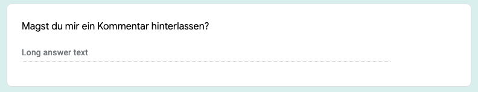

class: title-slide

```{r child = "../setup.Rmd"}

```

```{r}

library(dplyr)
library(ggplot2)
library(readr)
library(tidyr)
library(forcats)
library(knitr)
library(gt)

```


# `r rmarkdown::metadata$title`
## `r rmarkdown::metadata$subtitle` 

.bottom[

```{r, echo=FALSE}
p(rmarkdown::metadata$author)
p(rmarkdown::metadata$date)

```
]

---
# Rückblick - Woche 6 

- Erweiterte Vektoren
  - Faktoren
  - Datums- und Zeitwerte
  - Tibbles
- Daten importieren
  - `read_csv()`
  - `read_excel()`
- Tidy Data Konzept
- Daten drehen (pivoting) mit `{tidyr}`
  - `pivot_longer()`
  - `pivot_wider()`

---
class: middle, inverse

# .large[Hausaufgabe 6]

---
background-image: url(img/questions.jpg)
background-size: contain
background-position: right
class: middle

# .large[Hausaufgabe 6]


---
# Hausaufgabe 6 - Lösungen

- **GitHub Organisation:** rstatsZH
    - https://github.com/rstatsZH/
- **Repo:** ha-06-treibhausgase
    - https://github.com/rstatsZH/ha-06-treibhausgase
- **R Markdown Datei:** ha-06-solutions.Rmd
    - https://github.com/rstatsZH/ha-06-treibhausgase/blob/main/ha-06-solutions.Rmd
    
---
# Ziele für diese Woche

Am Ende dieser Woche könnt ihr:

- Mehrere Dataframes zusammenfügen
- Tabellen mit verschiedenen Packages darstellen erstellen
- Eine eigene Funktion für ein `{ggplot2}` theme schreiben
- Mit den im Kurs erlernten Fähigkeiten selbstständig weiter arbeiten

---
class: middle, inverse

# .large[Mit mehreren Dataframes arbeiten]

---
class: middle

# .hand[Wir...]

.huge[.green[haben]] .hand[mehrere Dataframes]

.huge[.pink[wollen]] .hand[diese zusammenbringen]

```{r include=FALSE}
professions <- read_csv(here::here("slides/e1_d07-data-join/data/scientists/professions.csv"))
dates <- read_csv(here::here("slides/e1_d07-data-join/data/scientists/dates.csv"))
works <- read_csv(here::here("slides/e1_d07-data-join/data/scientists/works.csv"))
```

---
## Data: Women in science 

Informationen zu 10 Frauen in der Wissenschaft welche die Welt verändert haben

.small[
```{r echo=FALSE}
professions %>% select(name) %>% kable()
```
]


.footnote[
Quelle: [Discover Magazine](https://www.discovermagazine.com/the-sciences/meet-10-women-in-science-who-changed-the-world)
]

???
Daten kommen aus dem Discover Magazine. Daten aus dem Artikel herausgeholt. 

---
## Inputs - Drei Dataframes

.panelset[

.panel[.panel-name[professions]
```{r}
professions %>% 
  print(n = 10)
```
]


.panel[.panel-name[dates]
```{r}
dates %>% 
  print(n = 10)
```
]

.panel[.panel-name[works]
```{r}
works %>% 
  print(n = 10)
```
]

]

???
.small[
**Professions**
 
Hier sehen wir die berufsbezeichungen der 10 Wissenschatfler_innen welche in dem Artikelk auftauchen. So haben wir:

- Namen: Ada lovelace
- Profession (Berufsbezeichnung): Sie war Mathematikerin

**Dates**

Wir haben einen weiteren Dataframe mit dem Namen "dates" in welchem wir nur Info zu 8 der Wissenschaftlerinnen haben. 

Wir hätten zwar die zwei fehlenden nachschlagen können, aber in diesem Beispiel soll es darum gehen zu zeigen wie die Funktionen sich bei nicht vollständigen Daten verhalten. 

Wir sehen zwei NAs. Dies heisst nicht dass wir das Todesjahr nicht wissen, sondern dass diese Wissenschaftlerinenn noch leben. 

**Works**

Einen dritten Dataframe in welchem wir sehen wofür die Wissenschaftlerinnen bekannt waren. Zum Beispiel for Ada Lovelace wir sehen den ersten Computer algorhyhtmus.

] 
---
## Gewünschter Output

```{r echo=FALSE}
professions %>%
  left_join(dates) %>%
  left_join(works) %>% 
  print(n = 10)
```

???

Hier sehen wir unseren gewünschten Output. Das Ziel nachdem die drei Dataframes zusammengefügt wurden:

- name und profession aus dem ersten Dataframe
- name, birth_year und death_year aus dem zweiten Dataframe
- name und known_for aus dem dritten Dataframe

---
## Inputs als Erinnerung

.pull-left[
```{r, echo = TRUE}
names(professions)
names(dates)
names(works)
```
]

.pull-right[
```{r, echo=TRUE}
nrow(professions)
nrow(dates)
nrow(works)
```
]


???

- Name ist hier sozusagen der Schlüssel
- Professions hat die komplette Info während bei den anderen etwas fehlt 

---
class: middle, inverse

# .large[Dataframes zusammenfügen]

---

## Dataframes zusammenfügen

```{r eval=FALSE, echo=TRUE}
abcd_join(x, y)
```

- `left_join()`: alle Reihen aus x
- `right_join()`: alle Reihen aus y
- `full_join()`: alle Reihen aus x und y
- ...
 
---
## Beispiel 

Für die nächsten Folien

.pull-left[
```{r echo=FALSE}
tib_x <- tibble(
  id = c(1, 2, 3),
  var_x = c("x1", "x2", "x3")
  )
```
```{r}
tib_x
```
]
.pull-right[
```{r echo=FALSE}
tib_y <- tibble(
  id = c(1, 2, 4),
  var_y = c("y1", "y2", "y4")
  )
```
```{r}
tib_y
```
]

---

## `left_join()`

.pull-left[
```{r echo=FALSE, out.width="80%", out.extra ='style="background-color: #FDF6E3"'}
include_graphics("img/left-join.gif")
```
]
.pull-right[
```{r, echo=TRUE}
left_join(tib_x, tib_y)
```
]

---

## `left_join()`

```{r, echo=TRUE, eval=FALSE}
professions %>%
  left_join(dates) #<<
```


```{r, echo=FALSE, eval=TRUE}
professions %>%
  left_join(dates) %>% 
  print(n = 10)
```

---

## `right_join()`

.pull-left[
```{r echo=FALSE, out.width="80%", out.extra ='style="background-color: #FDF6E3"'}
include_graphics("img/right-join.gif")
```
]
.pull-right[
```{r, echo=TRUE}
right_join(tib_x, tib_y)
```
]

---

## `right_join()`


```{r, echo=TRUE, eval=FALSE}
professions %>%
  right_join(dates) #<<
```


```{r, echo=FALSE, eval=TRUE}
professions %>%
  right_join(dates) %>% 
  print(n = 10)
```

---

## `full_join()`

.pull-left[
```{r echo=FALSE, out.width="80%", out.extra ='style="background-color: #FDF6E3"'}
include_graphics("img/full-join.gif")
```
]
.pull-right[
```{r, echo=TRUE}
full_join(tib_x, tib_y)
```
]

---

## `full_join()`

```{r, echo=TRUE, eval=FALSE}
dates %>%
  full_join(works) #<<
```

```{r, echo=FALSE, eval=TRUE}
dates %>%
  full_join(works) %>% 
  print(n = 10)
```


???

---

## Alles in einer Code Sequenz

```{r, echo=TRUE, eval=FALSE}
professions %>%
  left_join(dates) %>%
  left_join(works)
```

```{r, echo=FALSE, eval=TRUE}
professions %>%
  left_join(dates) %>%
  left_join(works) %>% 
  print(n = 10)
```

---
.note[

# Praktikum 10 - Daten zusammenfügen 

## 2er Teams

1. **E-Mail**: Öffne deine Email und klicke auf den Link zu deinem persönlichen GitHub repo
2. **GitHub**: Klicke auf den grünen Button "Code" und kopiere den Link für das Repo in deine Zwischenablage
3. **RStudio Cloud**: Öffne deinen Arbeitsbereich für den Kurs in der RStudio Cloud
4. **RStudio Cloud / Projects**: Klicke auf "New Project from GitHub Repository" 

]


```{r}

einkaeufe <- read_csv("https://raw.githubusercontent.com/rstatsZH/data/main/data/raw/supermarkt/einkaeufe.csv")
preise <- read_csv("https://raw.githubusercontent.com/rstatsZH/data/main/data/raw/supermarkt/preise.csv")
kundenprofile <- read_csv("https://raw.githubusercontent.com/rstatsZH/data/main/data/raw/supermarkt/kundenprofile.csv")

```


---
## Inputs - Drei Dataframes

.panelset[

.panel[.panel-name[einkaeufe]
```{r}
einkaeufe %>% 
  print(n = 10)
```
]


.panel[.panel-name[preise]
```{r}
preise %>% 
  print(n = 10)
```
]

.panel[.panel-name[kundenprofile]
```{r}
kundenprofile %>% 
  print(n = 10)
```
]

]


---
## Gewünschter Output

```{r echo=FALSE}
einkaeufe %>%
  left_join(preise) %>%
  group_by(kunden_id) %>% 
  summarise(
    summe = sum(preis)
  ) %>% 
  left_join(kundenprofile) %>% 
  select(ends_with("name"), summe, email) %>% 
  gt::gt()
```

---
## Schritt 1 - Daten zusammenfügen

```{r, echo=TRUE, eval=FALSE}
einkaeufe_preise <- einkaeufe %>% 
  left_join(preise)

einkaeufe_preise
```

```{r, echo=FALSE}

einkaeufe_preise <- einkaeufe %>% 
  left_join(preise) %>% 
  print(n = 10)

```

---
## Schritt 2 - Daten zusammefassen

```{r, echo=TRUE, eval=FALSE}
einkaeufe_preise_sum <- einkaeufe_preise %>% 
  group_by(kunden_id) %>% 
  summarise(
    summe = sum(preis)
  )

einkaeufe_preise_sum
```

```{r, echo=FALSE}
einkaeufe_preise_sum <- einkaeufe_preise %>% 
  group_by(kunden_id) %>% 
  summarise(
    summe = sum(preis)
  ) %>% 
  print(n = 10)
```


---
## Schritt 3 - Daten zusammenfügen + eingrenzen

```{r, echo=TRUE, eval=FALSE}
kunden_tab <- einkaeufe_preise_sum %>% 
  left_join(kundenprofile) %>% 
  select(ends_with("name"), summe, email)

kunden_tab
```

```{r, echo=FALSE}
kunden_tab <- einkaeufe_preise_sum %>% 
  left_join(kundenprofile) %>% 
  select(ends_with("name"), summe, email) %>% 
  print(n = 10)
```

---
## Schritt 4 - Daten als Tabelle darstellen

```{r, echo=TRUE, eval=TRUE}
kunden_tab %>% 
  gt()
```

---
## Als eine Code Sequenz

```{r echo=TRUE}
einkaeufe %>%
  left_join(preise) %>%
  group_by(kunden_id) %>% 
  summarise(
    summe = sum(preis)
  ) %>% 
  left_join(kundenprofile) %>% 
  select(ends_with("name"), summe, email) %>% 
  gt()
```

---
class: middle, inverse

# .large[Funktionen]

---
class: middle, inverse

# .large[Funktionen - Bonusmaterial]

---
.note[

# Praktikum 11 - Funktionen 

## Live Coding 

1. **E-Mail**: Öffne deine Email und klicke auf den Link zu deinem persönlichen GitHub repo
2. **GitHub**: Klicke auf den grünen Button "Code" und kopiere den Link für das Repo in deine Zwischenablage
3. **RStudio Cloud**: Öffne deinen Arbeitsbereich für den Kurs in der RStudio Cloud
4. **RStudio Cloud / Projects**: Klicke auf "New Project from GitHub Repository" 

]

---
class: middle, inverse

# .large[The End]

---
class: middle, inverse

# .large[The End - Noch nicht ganz]


---
# Was habt ihr gelernt?

- Anwendung von Tidyverse Packages zum 
  - Importieren,
  - Aufräumen (Tidying),
  - Transformieren, 
  - Visualisieren, und
  - Kommunizieren von Daten.
- Kollaboration und Versionsverwaltung mit Git/GitHub
- Datenprojekte reproduzierbar publizieren mit GitHub
- Das Konzept von Tidy Data

---
class: middle, inverse

# .large[Wie geht's weiter?]

---
# Raus aus der RStudio Cloud

1. Installationen: https://github.com/rstatsZH/kochbuch/tree/main/01-Installation
2. Einmalig: Tidyverse Packages installieren
3. Danach: Tidyverse Packages laden
4. Packages ausserhalb des Tidyverse installieren und laden (e.g. `janitor`)

```{r, eval=FALSE, echo=TRUE}

# Einmalig in Konsole ausführen
install.packages("tidyverse")

# In jedem Skript
library(tidyverse)

```

---
class: middle

# Weiterführende Ressourcen - Üben + Vertiefen

https://rstatszh.github.io/website/posts/2021-04-30-woche07/

---
# Projektarbeit - Unterstützung bis Anfang Juli

**Hausaufgabe 6**

1. GitHub Repository erstellen und RStudio Projekt aufgleisen (Hausaufgabe 6)
2. Daten für das Projekt identifizieren

**Wie es weiter geht: Bericht mit R Markdown schreiben**

1. Daten importieren  
2. Daten (visuell) erkunden
3. Daten ggf. transformieren und dann erneut (visuell) erkunden
4. Fragen an den Datensatz formulieren
5. Versuchen zu Antworten zu kommen und dokumentieren
6. Immer wieder, git add, commit, push 


---
class: middle, inverse

# .big[Reflexion]

---
# Reflexion

## 5 min Nachdenken + Notizen, dann Austausch 2er Teams

.question[

1. Was sind die drei nützlichsten Dinge die du gelernt hast?
2. Welches Thema war besonders schwer zu folgen? 
3. Was hat dir gefehlt?

]

--
```{r}

```


---
class: middle, inverse

# .big[Feedback]


---
class: left
background-image: url(img/tor.jpg)
background-position: right
background-size: contain

# Ziele erreicht? 

Bitte ausfüllen: [kutt.it/rstatszh-eval](https://kutt.it/rstatszh-eval)

.pull-left[

.footnote[Photo by: [Virgil Cayasa](https://unsplash.com/@virgilcayasa)]

]

---
# Wie es für mich weiter geht

1. **Beratung:** Projektbezogener Support, Code Review, Coaching
2. **rstatsZH Kursleitung:** Info über den Kurs verbreiten
3. **Kurse zu vertiefenden Themen:** Entwicklung von 4-Stunden Workshops

Contact: [Lars@Lse.de](mailto:lars@lse.de)

---
# `r emo::ji("sunflower")` Danke 

Für die Aufmerksamkeit!

Für die R packages [{xaringan}](https://github.com/yihui/xaringan) und [{xaringanthemer}](https://github.com/gadenbuie/xaringanthemer) mit welchen die Folien geschrieben wurden.

Eine PDF Version der Folien kann hier heruntergeladen werden: https://github.com/rstatsZH/website/raw/master/slides/e1_d07-data-join/e1_d07-data-join.pdf

`r hr()`

Für [Data Science in a Box](https://datasciencebox.org/) und [Remaster the Tidyverse](https://github.com/rstudio-education/remaster-the-tidyverse), von welchen ich Materialien für diesen Kurs nutze und welche genau wie diese Folien mit [Creative Commons Attribution Share Alike 4.0 International](https://creativecommons.org/licenses/by-sa/4.0/) lizensiert sind.